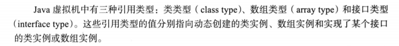

# 							Java虚拟机

# 1.Java虚拟机结构

## 1.1 Class文件

Class文件是一种平台中立的二进制文件(不依赖于特定硬件及操作系统)

## 1.2 数据类型

Java虚拟机可以操作的数据类型分两类：

### 1.2.1 primitive type (基本类型)	 

- primitive type (基本类型)	
  - primitive value (基本类型值)
- 虚拟机的字节码指令本身可以确定它的指定操作的类型是什么。
  - iadd
    - int
  - ladd
    - long
  - fadd
    - float
  - dadd
    - double

### 1.2.2 reference type (引用类型)

- reference type (引用类型)
  - reference value (引用值)

- 虚拟机中使用reference类型来表示某个对象的引用。
  - reference类型 类似于 指针。
  - 每一个对象可以有多个指向它的引用。
  - 对象的操作、传递和检查都通过reference类型的数据来进行。

## 1.3 原始类型与值

Java虚拟机支持的原始数据类型包括以下三种：

### 1.3.1  数值类型

- ### 数值类型
  
  - 整数类型
    - byte      8位 二进制            -128 ~ 127   
    - short    16位二进制		   -32768~32767
    - char      16位二进制           0 ~ 65535
    - int          32位二进制          -2147483648 ~ 2147483647
    - long       64位二进制          -9223372036854775808~ 9223372036854775807      
  - 浮点数类型
    - float		32位
    - double    6位 
    - 浮点数中5个特殊元素
      - 负无穷
      - 负数零
      - 整数零
      - 正无穷
      - NaN
        - NaN值用于表示某些无效的运算操作，例如 0 除以 0 的情况
        - NaN是无序的，任何数字与NaN进行比较,都会返回false

### 1.3.2 boolean类型

- ### boolean类型

  

### 1.3.3 returnAddress类型

- ### returnAddress类型

  - returnAddress类型是指向某个操作码（opcode）的指针。
    - 操作码与虚拟机指令相对应
  - 所有的基本数据类型中，只有 returnAddress 类型是不能直接与Java语言的数据类型相对应的。
  - JDK7以名存实亡了

## 1.4 引用类型与值

### 1.4.1 类类型 （class type）

​	

### 1.4.2 数组类型

### 1.4.3 接口类型

### 1.4.4 引用类型中的特殊值

