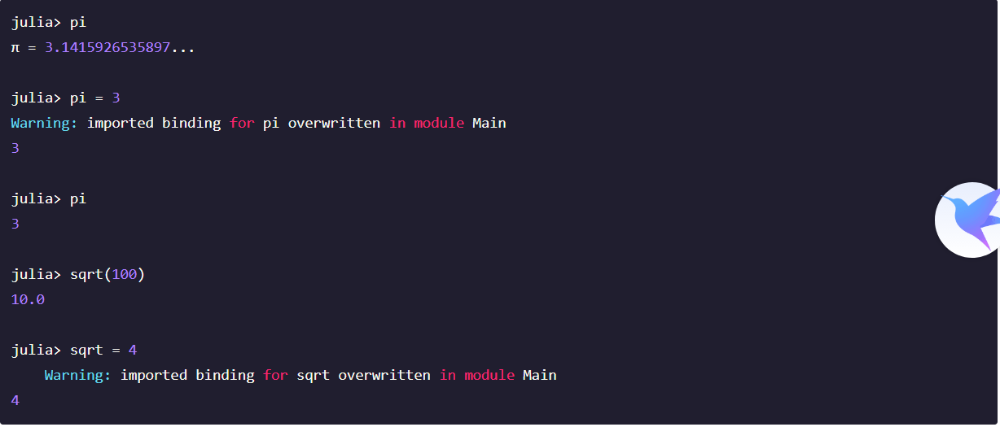

# 1.简介

Julia 是个灵活的动态语言，适合科学和数值计算，性能可与传统静态类型语言媲美。

由于 Julia 的编译器与像 Python 或者 R 语言的解释器不同，你可能首先会发现 Julia 的性能并不那么直观。如果你发现哪些地方比较慢， 我们强烈建议你在做任何尝试之前通读一下[代码性能优化](https://www.w3cschool.cn/julia/7te41jga.html)章节。一旦你明白了 Julia 是如何工作的，你就可以写出来速度媲美 C 语言的代码。

通过使用类型推断和[即时(JIT)编译](http://zh.wikipedia.org/zh-cn/即時編譯) ，以及 [LLVM](http://zh.wikipedia.org/wiki/LLVM) ，Julia 具有可选的类型声明，重载，高性能等特性。Julia 是多编程范式的，包含指令式、函数式和面向对象编程的特征。 它提供了简易和简洁的高等数值计算，它类似于 R 、 MATLAB 和 Python ，支持一般用途的编程。 为了达到这个目的，Julia 在数学编程语言的基础上，参考了不少流行动态语言：[Lisp](http://zh.wikipedia.org/zh-cn/LISP) 、 [Perl](http://zh.wikipedia.org/zh-cn/Perl) 、 [Python](http://zh.wikipedia.org/zh-cn/Python) 、 [Lua](http://zh.wikipedia.org/zh-cn/Lua) 和 [Ruby](http://zh.wikipedia.org/zh-cn/Ruby)。

Julia 与传统动态语言最大的区别是：

- 核心语言很小；标准库是用 Julia 本身写的，如整数运算在内的基础运算
- 完善的类型，方便构造对象和做类型声明
- 基于参数类型进行函数[重载](http://en.wikipedia.org/wiki/Multiple_dispatch) 
- 参数类型不同，自动生成高效、专用的代码
- 高性能，接近静态编译语言，如 C 语言

动态语言是有类型的：每个对象，不管是基础的还是用户自定义的，都有类型。许多动态语言没有类型声明，意味着它不能告诉编译器值的类型，也就不能准确的判断出类型。静态语言必须告诉编译器值的类型，类型仅存在于编译时，在运行时则不能更改。在 Julia 中，类型本身就是运行时对象，同时它也可以把信息传递给编译器。

重载函数由参数（参数列表）的类型来区别，调用函数时传入的参数类型，决定了选取哪个函数来进行调用。对于数学领域的程序设计来说，这种方式比起传统面向对象程序设计中操作属于某个对象的方法的方式更显自然。在 Julia 中运算符仅仅是函数的别名。程序员可以为新数据类型定义 “+” 的新方法，原先的代码就可以无缝地重载到新数据类型上。

因为运行时类型推断（得益于可选的类型声明），以及从开始就看重性能，Julia 的计算性能超越了其他动态语言，甚至可与静态编译语言媲美。在大数据处理的问题上，性能一直是决定性的因素：在刚刚过去的十年中，数据量还在以摩尔定律增长着。

Julia 想要变成一个前所未有的集易用、强大、高效于一体的语言。除此之外，Julia 的优势还在于：

- 免费开源（[MIT 协议](https://github.com/JuliaLang/julia/blob/master/LICENSE.md) ）
- 自定义类型与内置类型同样高效、紧凑
- 不需要把代码向量化；非向量化的代码跑得也很快
- 为并行和分布式计算而设计
- 轻量级“绿色”线程（[协程](http://zh.wikipedia.org/zh-cn/协程) ）
- 低调又牛逼的类型系统
- 优雅、可扩展的类型转换
- 高效支持 [Unicode](http://zh.wikipedia.org/zh-cn/Unicode), 包括且不只 [UTF-8](http://zh.wikipedia.org/zh-cn/UTF-8)
- 直接调用 C 函数（不需封装或 API）
- 像 Shell 一样强大的管理其他进程的能力
- 像 Lisp 一样的宏和其他元编程工具


# 2. 安装

安装教程 参考一下博客

https://blog.csdn.net/amusi1994/article/details/81632817


# 3. 变量

## 3.0 变量命名

### 1.变量名区分大小写。


### 2.可以使用 Unicode 字符（UTF-8 编码）来命名：


### 3.可以通过输入反斜杠符号名称后再输入标签来键入很多 Unicode 数学符号。

​		例如，变量名 `δ` 可以通过键入 `\delta` 键入，甚至可以通过输入 `\alpha` - *tab* - `\hat` - *tab* - `\_2` - *tab* 输入 `α̂₂` 。


### 4.甚至允许重新定义内置的常数和函数：




### 5. 注意

随便变量名限制很少  但最好还是遵循一定的规则

- 变量名使用小写字母
- 单词间使用下划线 (`'_'`) 分隔，但不鼓励
- 类型名首字母大写, 单词间使用驼峰式分隔.
- 函数名和宏名使用小写字母, 不使用下划线分隔单词.
- 修改参数的函数结尾使用 `!` . 这样的函数被称为 mutating functions 或 in-place functions


## 3.1 整数


## 3.2 浮点数


## 3.3 复数


## 3.4 分数


## 3.5 字符串


# 4. 运算符

## 4.1 算术运算符

下面的[算术运算符](http://zh.wikipedia.org/zh-cn/算术#.E7.AE.97.E8.A1.93.E9.81.8B.E7.AE.97)适用于所有的基本数值类型：

| 表达式  | 名称     | 描述             |
| :------ | :------- | :--------------- |
| `+x`    | 一元加法 | x 本身           |
| `-x`    | 一元减法 | 相反数           |
| `x + y` | 二元加法 | 做加法           |
| `x - y` | 二元减法 | 做减法           |
| `x * y` | 乘法     | 做乘法           |
| `x / y` | 除法     | 做除法           |
| `x \ y` | 反除     | 等价于 y / x     |
| `x ^ y` | 乘方     | x 的 y 次幂      |
| `x % y` | 取余     | 等价于 rem(x, y) |

以及 `Bool` 类型的非运算：

| 表达式 | 名称 | 描述               |
| :----- | :--- | :----------------- |
| `!x`   | 非   | true 和 false 互换 |


## 4.2 位运算符

下面的位运算符适用于所有整数类型：

| 表达式    | 名称                         |
| :-------- | :--------------------------- |
| `~x`      | 按位取反                     |
| `x & y`   | 按位与                       |
| `x \| y`  | 按位或                       |
| `x $ y`   | 按位异或                     |
| `x >>> y` | 向右 逻辑移位 （高位补 0 ）  |
| `x >> y`  | 向右 算术移位 （复制原高位） |
| `x << y`  | 向左逻辑/算术移位            |


## 4.3 复合赋值运算符

二元算术和位运算都有对应的复合赋值运算符，即运算的结果将会被赋值给左操作数。在操作符的后面直接加上 `=` 就组成了复合赋值运算符。例如, `x += 3` 相当于 `x = x + 3` ：

```
julia> x = 1
1

julia> x += 3
4

julia> x
4
```

复合赋值运算符有：

```
+=  -=  *=  /=  \=  %=  ^=  &=  |=  $=  >>>=  >>=  <<=
```


## 4.4 数值比较

所有的基础数值类型都可以使用比较运算符：

| 运算符 | 名称     |
| :----- | :------- |
| `==`   | 等于     |
| `!=`   | 不等于   |
| `<`    | 小于     |
| `<=`   | 小于等于 |
| `>`    | 大于     |
| `>=`   | 大于等于 |

整数是按位比较的。浮点数是 [IEEE 754](http://zh.wikipedia.org/zh-cn/IEEE_754) 标准 比较的：

- 有限数按照正常方式做比较。
- 正数的零等于但不大于负数的零。
- `Inf` 等于它本身，并且大于所有数, 除了 `NaN`。
- `-Inf` 等于它本身，并且小于所有数, 除了 `NaN`。
- `NaN` 不等于、不大于、不小于任何数，包括它本身。

上面最后一条是关于 `NaN` 的性质，值得留意：


## 4.5运算优先级

Julia 运算优先级从高至低依次为：

| 类型 | 运算符                                                       |
| :--- | :----------------------------------------------------------- |
| 语法 | `.` 跟随 `::`                                                |
| 幂   | `^` 和 `.^` 等效                                             |
| 分数 | `//` 和 `.//`                                                |
| 乘除 | `/ % & \`和 `.* ./ .% .\`                                    |
| 位移 | `<< >> >>>` 和 `.<< .>> .>>>`                                |
| 加减 | `+ - | $` 和 `.+ .-`                                         |
| 语法 | `: ..` 跟随于 `|>`                                           |
| 比较 | `> < >= <= == === != !== <:` 和 `.> .< .>= .<= .== .!=`      |
| 逻辑 | `&&` 跟随于 `||` 跟随于 `?`                                  |
| 赋值 | `= += -= *= /= //= \= ^= %= \|= &= $= <<= >>= >>>=` 及 `.+= .-= .*= ./= .//= .\= .^= .%=` |


# 5. 函数

Julia 提供了一系列数学函数和运算符：

## 5.1 舍入函数

| 函数        | 描述                  | 返回类型      |
| :---------- | :-------------------- | :------------ |
| `round(x)`  | 把 x 舍入到最近的整数 | FloatingPoint |
| `iround(x)` | 把 x 舍入到最近的整数 | Integer       |
| `floor(x)`  | 把 x 向 -Inf 取整     | FloatingPoint |
| `ifloor(x)` | 把 x 向 -Inf 取整     | Integer       |
| `ceil(x)`   | 把 x 向 +Inf 取整     | FloatingPoint |
| `iceil(x)`  | 把 x 向 +Inf 取整     | Integer       |
| `trunc(x)`  | 把 x 向 0 取整        | FloatingPoint |
| `itrunc(x)` | 把 x 向 0 取整        | Integer       |

### 5.2 除法函数

| 函数          | 描述                                                  |
| :------------ | :---------------------------------------------------- |
| `div(x,y)`    | 截断取整除法；商向 0 舍入                             |
| `fld(x,y)`    | 向下取整除法；商向 -Inf 舍入                          |
| `cld(x,y)`    | 向上取整除法; 商向 +Inf 舍入                          |
| `rem(x,y)`    | 除法余数；满足 x == div(x,y)*y + rem(x,y) ，与 x 同号 |
| `divrem(x,y)` | 返回 (div(x,y),rem(x,y))                              |
| `mod(x,y)`    | 取模余数；满足 x == fld(x,y)*y + mod(x,y) ，与 y 同号 |
| `mod2pi(x)`   | 对 2pi 取模余数； 0 <= mod2pi(x) < 2pi                |
| `gcd(x,y...)` | x, y, ... 的最大公约数，与 x 同号                     |
| `lcm(x,y...)` | x, y, ... 的最小公倍数，与 x 同号                     |

### 5.3 符号函数和绝对值函数

| 函数            | 描述                                       |
| :-------------- | :----------------------------------------- |
| `abs(x)`        | x 的幅值                                   |
| `abs2(x)`       | x 的幅值的平方                             |
| `sign(x)`       | x 的正负号，返回值为 -1, 0, 或 +1          |
| `signbit(x)`    | 是否有符号位，有 (true) 或者 无 (false)    |
| `copysign(x,y)` | 返回一个数，它具有 x 的幅值， y 的符号位   |
| `flipsign(x,y)` | 返回一个数，它具有 x 的幅值， x*y 的符号位 |


### 5.4 乘方，对数和开方

| 函数                                         | 描述                                                         |
| :------------------------------------------- | :----------------------------------------------------------- |
| `sqrt(x)`                                    | √x x 的平方根                                                |
| `cbrt(x)`                                    | ?x x 的立方根                                                |
| `hypot(x,y)`                                 | 误差较小的 sqrt(x^2 + y^2)                                   |
| `exp(x)`                                     | 自然指数 e 的 x 次幂                                         |
| `expm1(x)`                                   | 当 x 接近 0 时，精确计算 exp(x)-1                            |
| `ldexp(x,n)` |当 n 为整数时，高效计算`x*2^n` |                                                              |
| `log(x)`                                     | x 的自然对数                                                 |
| `log(b,x)`                                   | 以 b 为底 x 的对数                                           |
| `log2(x)`                                    | 以 2 为底 x 的对数                                           |
| `log10(x)`                                   | 以 10 为底 x 的对数                                          |
| `log1p(x)`                                   | 当 x 接近 0 时，精确计算 log(1+x)                            |
| `exponent(x)`                                | trunc(log2(x))                                               |
| `significand(x)`                             | returns the binary significand (a.k.a. mantissa) of a floating-point number x |

为什么要有 `hypot`, `expm1`, `log1p` 等函数，参见 John D. Cook 的博客： [expm1](http://www.johndcook.com/blog/2010/06/07/math-library-functions-that-seem-unnecessary/), [log1p](http://www.johndcook.com/blog/2010/06/07/math-library-functions-that-seem-unnecessary/), [erfc](http://www.johndcook.com/blog/2010/06/07/math-library-functions-that-seem-unnecessary/) 和 [hypot](http://www.johndcook.com/blog/2010/06/02/whats-so-hard-about-finding-a-hypotenuse/) 。


### 5.5 三角函数和双曲函数

Julia 内置了所有的标准三角函数和双曲函数

```
sin    cos    tan    cot    sec    csc
sinh   cosh   tanh   coth   sech   csch
asin   acos   atan   acot   asec   acsc
asinh  acosh  atanh  acoth  asech  acsch
sinc   cosc   atan2
```

除了 [atan2](http://zh.wikipedia.org/zh-cn/Atan2) 之外，都是单参数函数。 `atan2` 给出了 `x` 轴，与由 `x` 、 `y` 确定的点之间的[弧度](http://zh.wikipedia.org/zh-cn/弧度) 。

另外，`sinpi(x)`和 `cospi(x)`各自被提供给更准确的 `sin(pi*x)`和 `cos(pi*x)`的计算。

如果想要以度，而非弧度，为单位计算三角函数，应使用带 d 后缀的函数。例如，sind(x) 计算 x 的正弦值，这里 x 的单位是度。以下的列表是全部的以度为单位的三角函数：

```
sind   cosd   tand   cotd   secd   cscd
asind  acosd  atand  acotd  asecd  acscd
```


### 5.6特殊函数

| 函数                                          | 描述                                                         |
| :-------------------------------------------- | :----------------------------------------------------------- |
| `erf(x)`                                      | x 处的 误差函数                                              |
| `erfc(x)`                                     | 补误差函数。当 x 较大时，精确计算 1-erf(x)                   |
| `erfinv(x)`                                   | erf 的反函数                                                 |
| `erfcinv(x)`                                  | erfc 的反函数                                                |
| `erfi(x)`                                     | 将误差函数定义为 -im *erf(x* im) ，其中 im 是虚数单位        |
| `erfcx(x)`                                    | 缩放的互补误差函数，即对较大的 x 值的准确的 exp（x ^ 2）* erfc（x） |
| `dawson(x)`                                   | 缩放虚误差函数，又名道森函数，即对较大的 x 值求精确的 exp(-x^2)*erfi(x)* sqrt(pi) / 2 |
| `gamma(x)`                                    | x 处的 gamma 函数                                            |
| `lgamma(x)`                                   | 当 x 较大时，精确计算 log(gamma(x))                          |
| `lfact(x)`                                    | 对较大的 x 求精确的 log(factorial(x)); 与对大于 1 的 x 值求 lgamma(x+1) 相等, 否则等于 0 |
| `digamma(x)`                                  | x 处的 digamma 函数，即导数的衍生                            |
| `beta(x,y)`                                   | 在（x,y）处的 beta 函数                                      |
| `lbeta(x,y)`                                  | 对较大的 x 或 y 值求准确的 log(beta(x,y))                    |
| `eta(x)`                                      | x 处的 Dirichlet eta 函数                                    |
| `zeta(x)`                                     | x 处的 Riemann zeta 函数                                     |
| `airy(z)`, `airyai(z)`, `airy(0,z)`           | z 处的 Airy Ai 函数                                          |
| `airyprime(z)`, `airyaiprime(z)`, `airy(1,z)` | Airy Ai 函数在 z 处的导数                                    |
| `airybi(z)`, `airy(2,z)`                      | z 处的 Airy Bi 函数                                          |
| `airybiprime(z)`, `airy(3,z)`                 | Airy Bi 函数在 z 处的导数                                    |
| `airyx(z)`, `airyx(k,z)`                      | 缩放 Airy Ai 函数 以及 k 对 z 的导数                         |
| `besselj(nu,z)`                               | 对 z 中一阶 nu 的贝塞尔函数                                  |
| `besselj0(z)`                                 | besselj(0,z)                                                 |
| `besselj1(z)`                                 | besselj(1,z)                                                 |
| `besseljx(nu,z)`                              | 对 z 中一阶 nu 的缩放贝塞尔函数                              |
| `bessely(nu,z)`                               | 对 z 中二阶 nu 的贝塞尔函数                                  |
| `bessely0(z)`                                 | bessely(0,z)                                                 |
| `bessely1(z)`                                 | bessely(1,z)                                                 |
| `besselyx(nu,z)`                              | 对 z 中二阶 nu 的缩放贝塞尔函数                              |
| `besselh(nu,k,z)`                             | 对 z 中三阶 nu （例如汉克尔函数）的贝塞尔函数； k 必须为 1 或 2 |
| `hankelh1(nu,z)`                              | besselh(nu, 1, z)                                            |
| `hankelh1x(nu,z)`                             | 缩放 besselh(nu, 1, z)                                       |
| `hankelh2(nu,z)`                              | besselh(nu, 2, z)                                            |
| `hankelh2x(nu,z)`                             | 缩放 besselh(nu, 2, z)                                       |
| `besseli(nu,z)`                               | 对 z 中一阶 nu 的修正贝塞尔函数                              |
| `besselix(nu,z)`                              | 对 z 中一阶 nu 的缩放修正贝塞尔函数                          |
| `besselk(nu,z)`                               | 对 z 中二阶 nu 的修正贝塞尔函数                              |
| `besselkx(nu,z)`                              | 对二阶 o 的缩放修正贝塞尔函数                                |


// TODO  待开始

