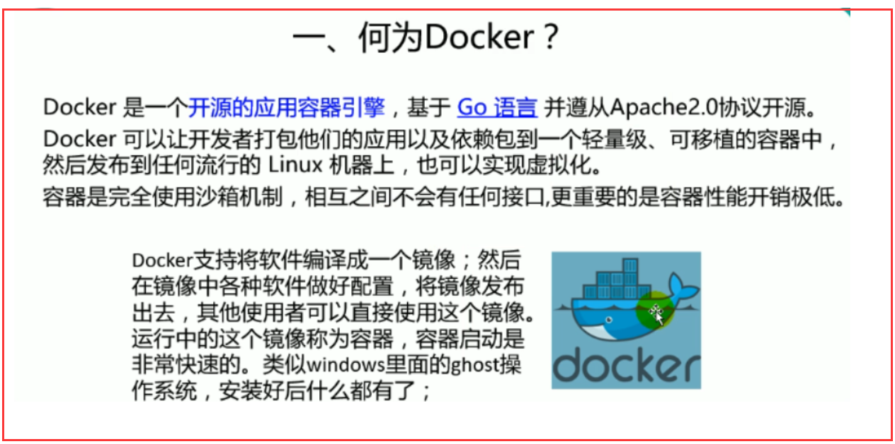
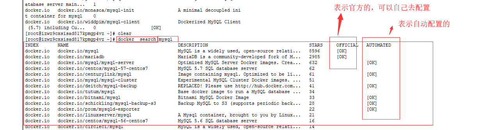
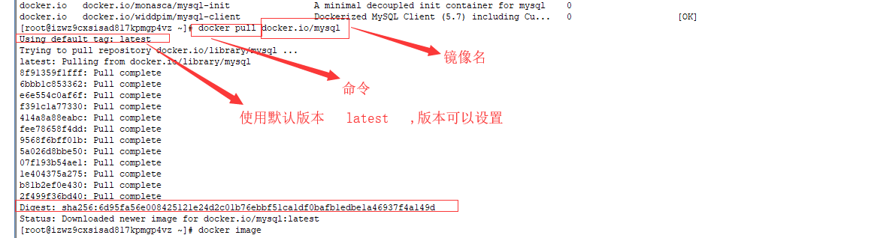
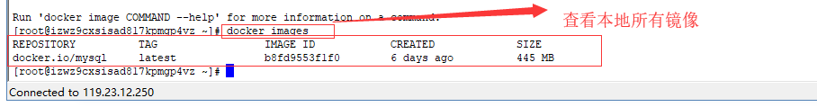
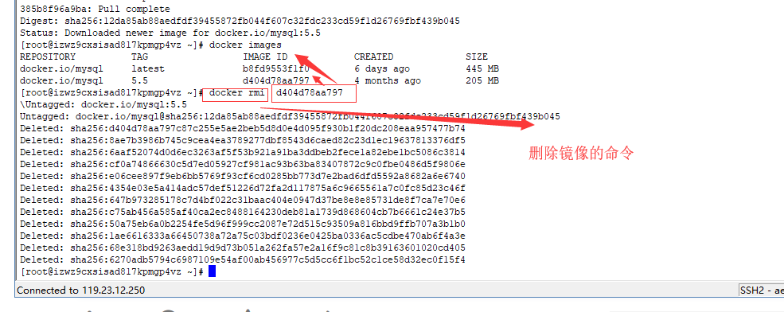

# 1.概述

## 1.1 概述

## 1.2 术语

- **docker镜像（Images）**: Docker 镜像是用于创建Docker容器的模板。
- **docker容器（Container）**:容器是独立运行的一个或一组应用。
- **docker客户端（client）**: 客户端通过命令行或者其他工具使用Docker API 与 Docker的守护进程通信.
- **docker主机（Host）**:一个物理或者虚拟的机器用于只需Docker守护进程和容器。
- **docker仓库（Registry）**：Docker仓库用来保存镜像，可以理解为代码控制中的代码仓库。
  - DockerHub （Https://hub.docker.com） 提供了庞大的镜像集合供使用。

## 1.3 使用步骤

1.安装Docker

2.去Docker仓库中找到这个软件对应的镜像

3.使用Docker运行这个镜像，这个镜像就会生成一个Docker容器

4.对容器的启动停止就是对软件的停止

# 2.使用Docker

## 2.1 安装Docker

- **查看centos版本**
  - uname  -r
  - Docker要求CentOS系统的内核版本高于 3.10
- **升级软件包及内核**（内核低于3.10时需要）
  - yum update
- **安装docker**
  - yum  install docker
- **启动docker**
  - systemctl  start  docker
- **将docker服务器设置为开机启动**
  - systemctl  enable  docker

**停止docker**

​	systemctl  stop docker

## 2.2 镜像操作

### 2.2.1在client检索镜像

docker  search 镜像名	

### 2.2.2拉取镜像

docker  pull  镜像:版本号 

### 2.2.3查询本地镜像

docker  images

### 2.2.4删除本地镜像

docker  rmi  镜像id

## 2.3容器操作

### **2.3.1 搜索镜像**

[root@localhost ~]# docker search tomcat

### 2.3.2拉取镜像

[root@localhost ~]# docker pull tomcat

### 2.3.3根据镜像启动容器

docker run --name mytomcat -d tomcat:latest

### 2.3.4查看运行中的容器

docker ps 

### 2.3.5停止运行中的容器

docker stop  容器的id

### 2.3.6查看所有的容器

docker ps -a

### 2.3.7启动容器

docker start 容器id

### 2.3.8删除一个容器

 docker rm 容器id

### 2.3.9查看容器的日志

docker logs container-name/container-id

### 2.3.10关闭linux的防火墙

service firewalld status ；查看防火墙状态

service firewalld stop：关闭防火墙

### 2.3.11 例子

#### **2.3.11.1启动一个做了端口映射的tomcat**

[root@localhost ~]# docker run -d -p 8888:8080 tomcat

-d：后台运行

-p: 将主机的端口映射到容器的一个端口   主机端口:容器内部的端口

更多命令参看

https://docs.docker.com/engine/reference/commandline/docker/

可以参考每一个镜像的文档

