# 1.ElasticSearch介绍

## 1.1 介绍


## 1.2 官方访问地址

官方网址：https://www.elastic.co/cn/products/elasticsearch 

Github：https://github.com/elastic/elasticsearch 


## 1.3 总结

总结： 

1、elasticsearch是一个基于Lucene的高扩展的分布式搜索服务器，支持开箱即用。 

2、elasticsearch隐藏了Lucene的复杂性，对外提供Restful 接口来操作索引、搜索


## 1.4 突出优点

突出优点：

1.扩展性好，可部署上百台服务器集群，处理PB级数据。 

2.近实时的去索引数据、搜索数据。 


## 1.5 solr与 ElasticSearch 的选择

es和solr选择哪个？ 

1.如果你公司现在用的solr可以满足需求就不要换了。 

2.如果你公司准备进行全文检索项目的开发，建议优先考虑elasticsearch，因为像Github这样大规模的搜索都在用它。


# 2.原理

## 2.1索引结构

下图是ElasticSearch的索引结构，下边黑色部分是物理结构，上边黄色部分是逻辑结构，逻辑结构也是为了更好的去描述ElasticSearch的工作原理及去使用物理结构中的索引文件。 


## 2.2 结构简介

逻辑结构部分是一个倒排索引表： 

1、将要搜索的文档内容分词，所有不重复的词组成分词列表。 

2、将搜索的文档最终以Document方式存储起来。 

3、每个词和docment都有关联。 	

如下：


现在，如果我们想搜索  ，我们只需要查找包含每个词条的文档： 


两个文档都匹配，但是第一个文档比第二个匹配度更高。如果我们使用仅计算匹配词条数量的简单 相似性算法 ， 

那么，我们可以说，对于我们查询的相关性来讲，第一个文档比第二个文档更佳。


## 2.3 应用流程

如何使用es？ 

Elasticsearch提供 RESTful Api接口进行索引、搜索，并且支持多种客户端。


下图是es在项目中的应用方式：


1）用户在前端搜索关键字 

2）项目前端通过http方式请求项目服务端 

3）项目服务端通过Http RESTful方式请求ES集群进行搜索 

4）ES集群从索引库检索数据。


# 3.ElasticSearch安装

## 3.1 安装

安装配置： 

1、新版本要求至少jdk1.8以上。 

2、支持tar、zip、rpm等多种安装方式。 

***在windows下开发建议使用ZIP安装方式。*** 

3、支持docker方式安装 

详细参见：https://www.elastic.co/guide/en/elasticsearch/reference/current/install-elasticsearch.html 

下载ES: Elasticsearch 6.2.1 

https://www.elastic.co/downloads/past-releases 

解压 elasticsearch-6.2.1.zip 


## 3.2windows下解压后的目录


bin：脚本目录，包括：启动、停止等可执行脚本 

confifig：配置文件目录 

data：索引目录，存放索引文件的地方 

logs：日志目录 

modules：模块目录，包括了es的功能模块 

plugins :插件目录，es支持插件机制 


# 4.配置文件

## 4.1 配置文件所在位置

1. ES的配置文件的地址根据安装形式的不同而不同： 

  1.1 使用zip、tar安装，配置文件的地址在安装目录的confifig下。 

  1.2 使用RPM安装，配置文件在/etc/elasticsearch下。 

  1.3 使用MSI安装，配置文件的地址在安装目录的confifig下，并且会自动将confifig目录地址写入环境变

​        量ES_PATH_CONF。


2. 本教程使用的zip包安装，配置文件在ES安装目录的confifig下。 

配置文件如下： 

 ***elasticsearch.yml ： 用于配置Elasticsearch运行参数***

 ***jvm.options ： 用于配置Elasticsearch JVM设置*** 

 ***log4j2.properties： 用于配置Elasticsearch日志*** 


## 4.2 elasticsearch.yml

配置格式是YAML，可以采用如下两种方式： 

方式1：层次方式 

path: 

  data:  /var/lib/elasticsearch

  logs:  /var/log/elasticsearch 

方式2：属性方式 

path.data: /var/lib/elasticsearch 

path.logs: /var/log/elasticsearch 


以下为方式2的例子


注意path.data和path.logs路径配置正确。 


常用的配置项如下： 

**cluster.name:**  

​	配置elasticsearch的集群名称，默认是elasticsearch。建议修改成一个有意义的名称。 

**node.name:** 

​	节点名，通常一台物理服务器就是一个节点，es会默认随机指定一个名字，建议指定一个有意义的名 称，方便管理一个或多个节点组成一个cluster集群，集群是一个逻辑的概念，节点是物理概念，后边章节会详细介绍。 

**path.conf:**

​	 设置配置文件的存储路径，tar或zip包安装默认在es根目录下的confifig文件夹，

​	 rpm安装默认在/etc/ elasticsearch 

**path.data:** 

​     设置索引数据的存储路径，默认是es根目录下的data文件夹，可以设置多个存储路径， 

用逗号隔开。

**path.logs:** 

​	设置日志文件的存储路径，默认是es根目录下的logs文件夹

**path.plugins:** 

 	设置插件的存放路径，默认是es根目录下的plugins文件夹 

**bootstrap.memory_lock:  true**

 	设置为true可以锁住ES使用的内存，避免内存与swap分区交换数据。 

**network.host:** 

​	设置绑定主机的ip地址，设置为0.0.0.0表示绑定任何ip，允许外网访问，生产环境建议设置为具体 

的ip。 

**http.port: 9200** 

​	设置对外服务的http端口，默认为9200。 

**transport.tcp.port: 9300** 

​	集群结点之间通信端口 

**node.master:** 

​	指定该节点是否有资格被选举成为master结点，默认是true，如果原来的master宕机会重新选举新 

的master。 

**node.data:** 

​	指定该节点是否存储索引数据，默认为true。 

**discovery.zen.ping.unicast.hosts: ["host1:port", "host2:port", "..."]** 

​	设置集群中master节点的初始列表。 

**discovery.zen.ping.timeout: 3s** 

​	设置ES自动发现节点连接超时的时间，默认为3秒，如果网络延迟高可设置大些。 

**discovery.zen.minimum_master_nodes:** 

​	主结点数量的最少值 ,此值的公式为：(master_eligible_nodes / 2) + 1 ，比如：有3个符合要求的主结点，那么这里要设置为2。 

**node.max_local_storage_nodes:** 

​	单机允许的最大存储结点数，通常单机启动一个结点建议设置为1，开发环境如果单机启动多个节点可设置

​	大于1. 


## 4.3 **jvm.options** 

设置最小及最大的JVM堆内存大小： 

在jvm.options中设置 -Xms和-Xmx： 

1） 两个值设置为相等 

2） 将 Xmx 设置为不超过物理内存的一半。 


## 4.**4 log4j2.properties** 

日志文件设置，ES使用log4j，注意日志级别的配置。 


## 4.5 系统设置

1.方式一：在linux上根据系统资源情况，可将每个进程最多允许打开的文件数设置大些。 

su limit -n 查询当前文件数

使用命令设置limit: 

先切换到root，设置完成再切回elasticsearch用户。 


2.方式二：也可通过下边的方式修改文件进行持久设置 

/etc/security/limits.conf 

将下边的行加入此文件： 


# 5.启动ES

进入bin目录，在cmd下运行：elasticsearch.bat 


 浏览器输入：http://localhost:9200 

显示结果如下（配置不同内容则不同）说明ES启动成功： 


# 6.ES可视化插件


## 6.1 head插件

head插件是ES的一个可视化管理插件，用来监视ES的状态，并通过head客户端和ES服务进行交互，比如创建映 

射、创建索引等，head的项目地址在https://github.com/mobz/elasticsearch-head 。 

从ES6.0开始，head插件支持使得node.js运行。 

### 1、安装node.js 

### 2、下载head并运行 

git clone git://github.com/mobz/elasticsearch-head.git

cd elasticsearch-head 

npm install 

npm run start open 

HTTP：//本地主机：9100 / 

### 3、运行 


### 注意：打开浏览器调试工具发现报错： 

Origin null is not allowed by Access-Control-Allow-Origin. 

原因是：head插件作为客户端要连接ES服务（localhost:9200），此时存在跨域问题，elasticsearch默认不允许跨 

域访问。 

### 解决方案： 

设置elasticsearch允许跨域访问。 

在confifig/elasticsearch.yml 后面增加以下参数： 

\#开启cors跨域访问支持，默认为false

 http.cors.enabled: true 

\#跨域访问允许的域名地址，(允许所有域名)以上使 用正则 

http.cors.allow-origin: /.*/ 

注意：将confifig/elasticsearch.yml另存为utf-8编码格式。 

成功连接ES 


## 6.2 kibana 插件


# 7.ES快速入门

ES作为一个索引及搜索服务，对外提供丰富的REST接口，快速入门部分的实例使用head插件来测试，目的是对ES 

的使用方法及流程有个初步的认识。

## 7.1创建索引库	

ES的索引库是一个逻辑概念，它包括了分词列表及文档列表，同一个索引库中存储了相同类型的文档。它就相当于MySQL中的表，或相当于Mongodb中的集合。 

关于索引这个语： 

索引（名词）：ES是基于Lucene构建的一个搜索服务，它要从索引库搜索符合条件索引数据。 

索引（动词）：索引库刚创建起来是空的，将数据添加到索引库的过程称为索引。 

下边介绍两种创建索引库的方法，它们的工作原理是相同的，都是客户端向ES服务发送命令。 

1）使用postman或curl这样的工具创建： 

put http://localhost:9200/索引库名称 


number_of_shards：设置分片的数量，在集群中通常设置多个分片，表示一个索引库将拆分成多片分别存储不同 

的结点，提高了ES的处理能力和高可用性，入门程序使用单机环境，这里设置为1。 


### 7.1.2  postman例子

number_of_replicas：设置副本的数量，设置副本是为了提高ES的高可靠性，单机环境设置为0. 

如下是创建的例子，创建xc_course索引库，共1个分片，0个副本：


### 7.1.3 head插件例子


## 7.2 创建映射

### 7.2.1 概述说明

在索引中每个文档都包括了一个或多个fifield，创建映射就是向索引库中创建fifield的过程，下边是document和fifield 

与关系数据库的概念的类比： 

文档（Document）----------------Row记录 

字段（Field）-------------------Columns 列 

注意：6.0之前的版本有type（类型）概念，type相当于关系数据库的表，ES官方将在ES9.0版本中彻底删除type。 

上边讲的创建索引库相当于关系数据库中的数据库还是表？ 

1、如果相当于数据库就表示一个索引库可以创建很多不同类型的文档，这在ES中也是允许的。 

2、如果相当于表就表示一个索引库只能存储相同类型的文档，***ES官方建议 在一个索引库中只存储相同类型的文*** 

***档。***


### 7.2.2 创建映射

我们要把课程信息存储到ES中，这里我们创建课程信息的映射，先来一个简单的映射，如下： 

发送：post http://localhost:9200/索引库名称/类型名称/_mapping 

创建类型为xc_course的映射，共包括三个字段：name、description、studymondel 

由于ES6.0版本还没有将type彻底删除，所以暂时把type起一个没有特殊意义的名字。 

post 请求：http://localhost:9200/xc_course/doc/_mapping 

表示：在xc_course索引库下的doc类型下创建映射。doc是类型名，可以自定义，在ES6.0中要弱化类型的概念， 

给它起一个没有具体业务意义的名称。


映射创建成功，查看head界面：


## 7.3 创建文档

ES中的文档相当于MySQL数据库表中的记录。 

发送：put 或Post http://localhost:9200/xc_course/doc/id值 

（如果不指定id值ES会自动生成ID） 

http://localhost:9200/xc_course/doc/4028e58161bcf7f40161bcf8b77c0000 


使用postman测试： 


通过head查询数据： 


## 7.4 搜索文档

### 1、根据课程id查询文档 

发送：get http://localhost:9200/xc_course/doc/4028e58161bcf7f40161bcf8b77c0000 

使用postman测试：


### 2、查询所有记录  无条件

发送 get http://localhost:9200/xc_course/doc/_search 

### 3、查询名称中包括spring 关键字的的记录  模糊查询

发送：get http://localhost:9200/xc_course/doc/_search?q=name:bootstrap 

### 4、查询学习模式为201001的记录  等值查询

发送 get http://localhost:9200/xc_course/doc/_search?q=studymodel:201001 


### 5.查询结果解析

分析上边查询结果： 


took：本次操作花费的时间，单位为毫秒。 

timed_out：请求是否超时 

_shards：说明本次操作共搜索了哪些分片 

hits：搜索命中的记录 

hits.total ： 符合条件的文档总数 hits.hits ：匹配度较高的前N个文档 

hits.max_score：文档匹配得分，这里为最高分 

_score：每个文档都有一个匹配度得分，按照降序排列。 

_source：显示了文档的原始内容。 


# 8.IK分词器

## 8.1 测试分词器

在添加文档时会进行分词，索引中存放的就是一个一个的词（term），当你去搜索时就是拿关键字去匹配词，最终找到词关联的文档。 

测试当前索引库使用的分词器： 

post 发送：localhost:9200/_analyze 

{"text":"测试分词器，后边是测试内容：spring cloud实战"} 

结果如下： 


会发现分词的效果将 “测试” 这个词拆分成两个单字“测”和“试”，这是因为当前索引库使用的分词器对中文就是单字 

分词。 


## 8.2 安装IK分词器

使用IK分词器可以实现对中文分词的效果。 

下载IK分词器：（Github地址：https://github.com/medcl/elasticsearch-analysis-ik） 

下载zip： 


解压，并将解压的文件拷贝到ES安装目录的plugins下的ik目录下


测试分词效果： 

发送：post localhost:9200/_analyze 

{"text":"测试分词器，后边是测试内容：spring cloud实战","analyzer":"ik_max_word" }


## 8.3 分词器的两种模式

ik分词器有两种分词模式：ik_max_word和ik_smart模式。 

### 1、ik_max_word 

会将文本做最细粒度的拆分，比如会将“中华人民共和国人民大会堂”拆分为“中华人民共和国、中华人民、中华、 

华人、人民共和国、人民、共和国、大会堂、大会、会堂等词语。 

### 2、ik_smart 

会做最粗粒度的拆分，比如会将“中华人民共和国人民大会堂”拆分为中华人民共和国、人民大会堂。 


测试两种分词模式：

发送：post localhost:9200/_analyze 

{"text":"中华人民共和国人民大会堂","analyzer":"ik_smart" }


## 8.4 自定义词库

如果要让分词器支持一些专有词语，可以自定义词库。 

iK分词器自带一个main.dic的文件，此文件为词库文件。 


在上边的目录中新建一个my.dic文件（注意文件格式为utf-8（不要选择utf-8 BOM）） 

可以在其中自定义词汇： 

比如定义： 

配置文件中配置my.dic，


重启ES，测试分词效果： 

发送：post localhost:9200/_analyze 

{"text":"测试分词器，后边是测试内容：spring cloud实战","analyzer":"ik_max_word" } 


# 9.映射

上边章节安装了ik分词器，如果在索引和搜索时去使用ik分词器呢？如何指定其它类型的fifield，比如日期类型、数值类型等。 

本章节学习各种映射类型及映射维护方法。 


## 9.1 映射维护方法

### 1、查询所有索引的映射： 

GET： http://localhost:9200/_mapping 

### 2、创建映射 

post 请求：http://localhost:9200/xc_course/doc/_mapping

一个例子： 


### 3、更新映射 

映射创建成功可以添加新字段，已有字段不允许更新。 

### 4、删除映射 

通过删除索引来删除映射。 


## 9.2常用映射类型

### 9.2.1 核心字段类型

下图是ES6.2核心的字段类型如下： 


字符串包括text和keyword两种类型： 

### 9.2.2 text 

1）analyzer 

通过analyzer属性指定分词器。 

下边指定name的字段类型为text，使用ik分词器的ik_max_word分词模式。 


上边指定了analyzer是指在索引和搜索都使用ik_max_word，如果单独想定义搜索时使用的分词器则可以通过 

search_analyzer属性。 

对于ik分词器建议是索引时使用ik_max_word将搜索内容进行细粒度分词，搜索时使用ik_smart提高搜索精确性。 


2）index 

通过index属性指定是否索引。 

默认为index=true，即要进行索引，只有进行索引才可以从索引库搜索到。 

但是也有一些内容不需要索引，比如：商品图片地址只被用来展示图片，不进行搜索图片，此时可以将index设置 

为false。 

删除索引，重新创建映射，将pic的index设置为false，尝试根据pic去搜索，结果搜索不到数据 


3）store 


#### 9.2.2.1 测试

删除xc_course/doc下的映射 

创建新映射：Post http://localhost:9200/xc_course/doc/_mapping


插入文档： 

http://localhost:9200/xc_course/doc/4028e58161bcf7f40161bcf8b77c0000


查询测试： 

Get http://localhost:9200/xc_course/_search?q=name:开发 

Get http://localhost:9200/xc_course/_search?q=description:开发 

Get http://localhost:9200/xc_course/_search? 

q=pic:group1/M00/00/01/wKhlQFqO4MmAOP53AAAcwDwm6SU490.jpg 

Get http://localhost:9200/xc_course/_search?q=studymodel:201002 

通过测试发现：name和description都支持全文检索，pic不可作为查询条件。


### 9.2.3 keyword关键字字段 

上边介绍的text文本字段在映射时要设置分词器，keyword字段为关键字字段，通常搜索keyword是按照整体搜 

索，所以创建keyword字段的索引时是不进行分词的，比如：邮政编码、手机号码、身份证等。keyword字段通常 

用于过虑、排序、聚合等

#### 9.2.3.1 测试

更改映射： 


插入文档： 


根据studymodel查询文档 

搜索：http://localhost:9200/xc_course/_search?q=name:java 

name是keyword类型，所以查询方式是精确查询。

### 9.2.4 date日期类型

日期类型不用设置分词器。 

通常日期类型的字段用于排序。 

1)format 

通过format设置日期格式 

例子： 

下边的设置允许date字段存储年月日时分秒、年月日及毫秒三种格式。 


插入文档： 

Post :http://localhost:9200/xc_course/doc/3 


### 9.2.5 数值类型

下边是ES支持的数值类型 


1、尽量选择范围小的类型，提高搜索效率 

2、对于浮点数尽量用比例因子，比如一个价格字段，单位为元，我们将比例因子设置为100这在ES中会按 分 存 

储，映射如下： 


由于比例因子为100，如果我们输入的价格是23.45则ES中会将23.45乘以100存储在ES中。 

如果输入的价格是23.456，ES会将23.456乘以100再取一个接近原始值的数，得出2346。 

使用比例因子的好处是整型比浮点型更易压缩，节省磁盘空间。 

如果比例因子不适合，则从下表选择范围小的去用：


更新已有映射，并插入文档： 

http://localhost:9200/xc_course/doc/3 


### 9.2.6 综合例子

创建如下映射 

post：http://localhost:9200/xc_course/doc/_mapping	


插入文档： 

Post: http://localhost:9200/xc_course/doc/1 

```json
{ 

	"name": "Bootstrap开发", 

	"description": "Bootstrap是由Twitter 

推出的一个前台页面开发框架，是一个非常流行的开发框架，此框架集成了多种页面效果。此开发框架包含了大量 

的CSS、JS程序代码，可以帮助开发者（尤其是不擅长页面开发的程序人员）轻松的实现一个不受浏览器限制的精 

美界面效果。", 

	"studymodel": "201002", 

	"price":38.6, 

	"timestamp":"2018-04-25 19:11:35", 

	"pic":"group1/M00/00/00/wKhlQFs6RCeAY0pHAAJx5ZjNDEM428.jpg" 

} 

```


# 10. 索引管理

## 10.1搭建工程

### 10.1.1 ES的客户端

ES提供多种不同的客户端： 

##### 1、TransportClient 

ES提供的传统客户端，官方计划8.0版本删除此客户端。 

##### 2、RestClient 

RestClient是官方推荐使用的，它包括两种：Java Low Level REST Client和 Java High Level REST Client。 

ES在6.0之后提供 Java High Level REST Client， 两种客户端官方更推荐使用 Java High Level REST Client，不过当前它还处于完善中，有些功能还没有。 

本教程准备采用 Java High Level REST Client，如果它有不支持的功能，则使用Java Low Level REST Client。 

添加依赖： 


### 10.1.2 创建搜索工程

##### 1.添加依赖

创建搜索工程（maven工程）：xc-service-search，添加RestHighLevelClient依赖及junit依赖。 

pom.xml 

```xml
<?xml version="1.0" encoding="UTF‐8"?> 
<project xmlns="http://maven.apache.org/POM/4.0.0" xmlns:xsi="http://www.w3.org/2001/XMLSchema‐instance"
         xsi:schemaLocation="http://maven.apache.org/POM/4.0.0 http://maven.apache.org/xsd/maven‐4.0.0.xsd"> <parent> <artifactId>xc‐framework‐parent</artifactId> <groupId>com.xuecheng</groupId> <version>1.0‐SNAPSHOT</version> <relativePath>../xc‐framework‐parent/pom.xml</relativePath> </parent> <modelVersion>4.0.0</modelVersion> <artifactId>xc‐service‐search</artifactId> <dependencies> <dependency> <groupId>com.xuecheng</groupId> <artifactId>xc‐framework‐model</artifactId> <version>1.0‐SNAPSHOT</version> </dependency> <dependency> <groupId>com.xuecheng</groupId> <artifactId>xc‐framework‐common</artifactId> <version>1.0‐SNAPSHOT</version> </dependency> <dependency> <groupId>com.xuecheng</groupId> <artifactId>xc‐service‐api</artifactId> <version>1.0‐SNAPSHOT</version> </dependency> <dependency> <groupId>org.springframework.boot</groupId> <artifactId>spring‐boot‐starter‐web</artifactId> </dependency> <dependency> <groupId>org.springframework.boot</groupId> <artifactId>spring‐boot‐starter‐web</artifactId> </dependency> <dependency> <groupId>org.elasticsearch.client</groupId> <artifactId>elasticsearch‐rest‐high‐level‐client</artifactId> <version>6.2.1</version> </dependency> <dependency> <groupId>org.elasticsearch</groupId> <artifactId>elasticsearch</artifactId> <version>6.2.1</version> </dependency> <dependency> <groupId>org.springframework.boot</groupId> <artifactId>spring‐boot‐starter‐test</artifactId> <scope>test</scope> </dependency> <dependency> <groupId>com.alibaba</groupId> <artifactId>fastjson</artifactId>
    </dependency> <dependency> <groupId>org.apache.commons</groupId> <artifactId>commons‐io</artifactId> </dependency> <dependency> <groupId>org.apache.commons</groupId> <artifactId>commons‐lang3</artifactId> </dependency> </dependencies> </project>
```

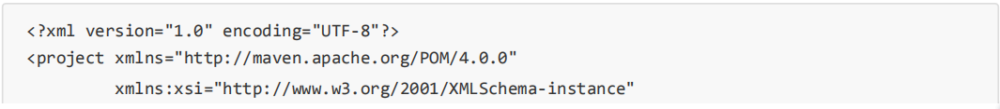

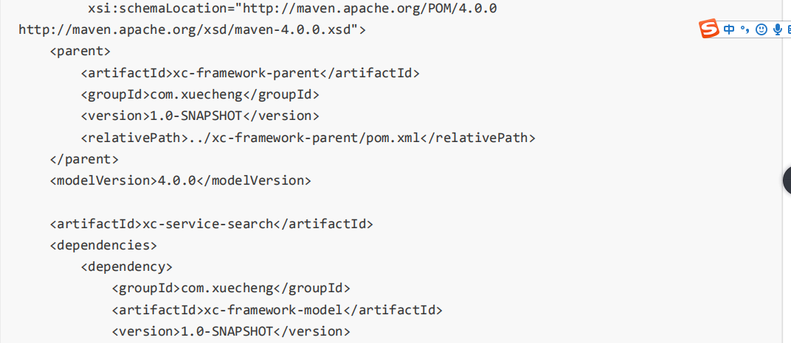

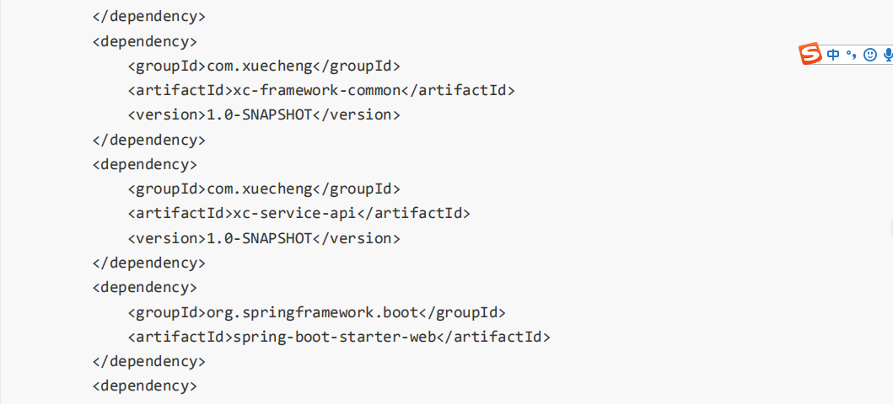

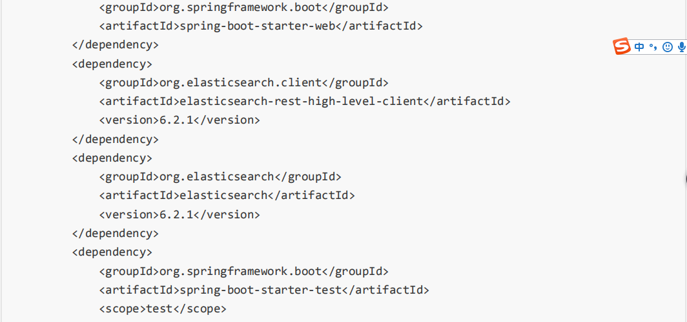


##### 2.配置文件


//可复制的代码块

```yml
server: 
	port: ${port:40100}
spring:
	application:
    	name: xc‐search‐service 
xuecheng: 
	elasticsearch:
    	hostlist: ${eshostlist:127.0.0.1:9200} #多个结点中间用逗号分隔
```

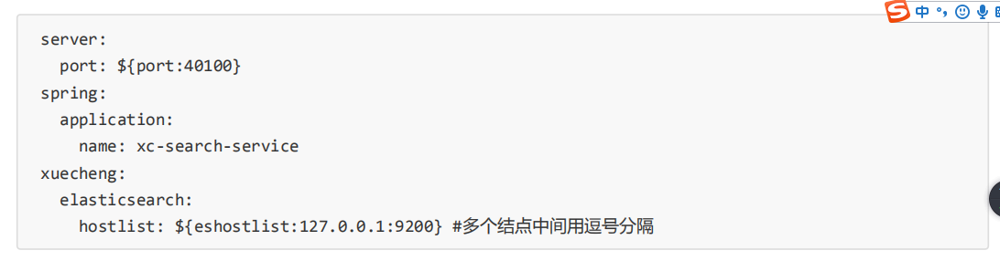


##### 3.配置类

创建com.xuecheng.search.confifig包 

在其下创建配置类 

```java
package com.xuecheng.search.config;
import org.apache.http.HttpHost; 
import org.elasticsearch.client.RestClient;
import org.elasticsearch.client.RestHighLevelClient;
import org.springframework.beans.factory.annotation.Value;
import org.springframework.context.annotation.Bean;
import org.springframework.context.annotation.Configuration;
@Configuration 
public class ElasticsearchConfig { 
    @Value("${xuecheng.elasticsearch.hostlist}") 
    private String hostlist;
    @Bean public RestHighLevelClient restHighLevelClient(){
        //解析hostlist配置信息
        String[] split = hostlist.split(","); 
        //创建HttpHost数组，其中存放es主机和端口的配置信息 
        HttpHost[] httpHostArray = new HttpHost[split.length];
        for(int i=0;i<split.length;i++){
            String item = split[i];
            httpHostArray[i] = new HttpHost(item.split(":")[0], Integer.parseInt(item.split(":") [1]), "http");
        }
        //创建RestHighLevelClient客户端
        return new RestHighLevelClient(RestClient.builder(httpHostArray));
    }
    //项目主要使用RestHighLevelClient，对于低级的客户端暂时不用
    @Bean
    public RestClient restClient(){ 
        //解析hostlist配置信息 
        String[] split = hostlist.split(","); 
        //创建HttpHost数组，其中存放es主机和端口的配置信息 
        HttpHost[] httpHostArray = new HttpHost[split.length];
        for(int i=0;i<split.length;i++){ 
            String item = split[i];
            httpHostArray[i] = new HttpHost(item.split(":")[0], Integer.parseInt(item.split(":") [1]), "http"); 
        }
        return RestClient.builder(httpHostArray).build();
    } 
}
```

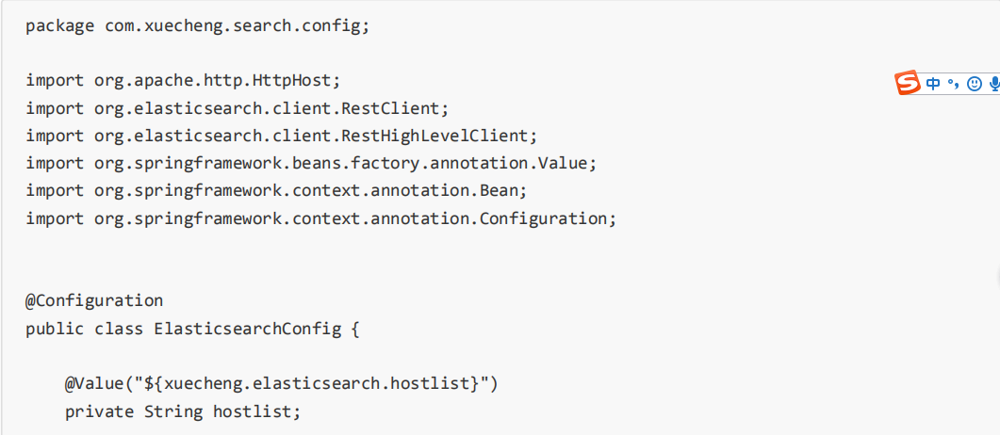


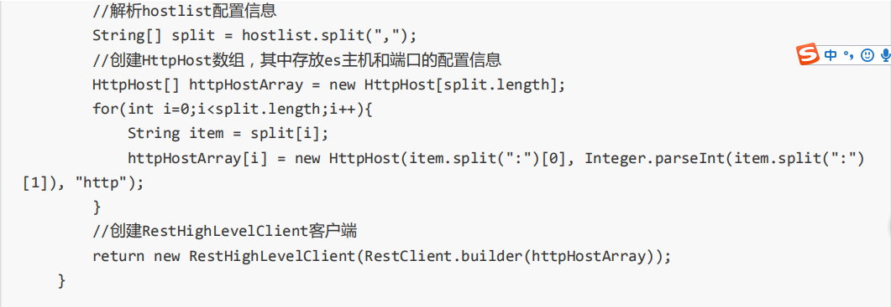

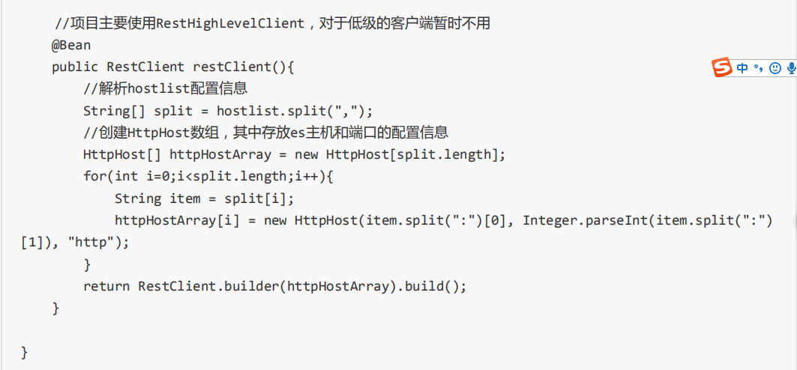


##### 4.启动类

```java
@SpringBootApplication 
//扫描实体类
@EntityScan("com.xuecheng.framework.domain.search")
//扫描接口
@ComponentScan(basePackages={"com.xuecheng.api"})
//扫描本项目下的所有类
@ComponentScan(basePackages={"com.xuecheng.search"})
//扫描common下的所有类 
@ComponentScan(basePackages={"com.xuecheng.framework"})
public class SearchApplication { 
    public static void main(String[] args) throws Exception { 
        SpringApplication.run(SearchApplication.class, args); 
    }
}
```

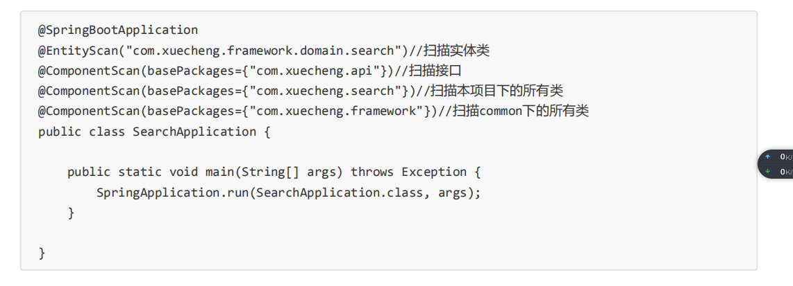


## 10.2 创建索引库

### 10.2.1 API

创建索引： 

put http://localhost:9200/索引名称

```xml
{ 
	"settings":{
    	"index":{
    		"number_of_shards":1,#分片的数量
       		"number_of_replicas":0#副本数量 
		} 
	}
}
```

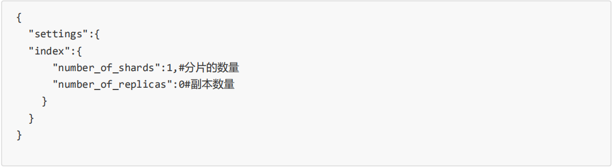


创建映射： 

发送：put http://localhost:9200/索引库名称/类型名称/_mapping 

创建类型为xc_course的映射，共包括三个字段：name、description、studymodel 

http://localhost:9200/xc_course/doc/_mapping

```
{ "properties": { "name": { "type": "text", "analyzer":"ik_max_word", "search_analyzer":"ik_smart" },"description": { "type": "text", "analyzer":"ik_max_word", "search_analyzer":"ik_smart" },"studymodel": { "type": "keyword" },"price": { "type": "float" },"timestamp": { "type": "date", "format": "yyyy‐MM‐dd HH:mm:ss||yyyy‐MM‐dd||epoch_millis" } } }
```


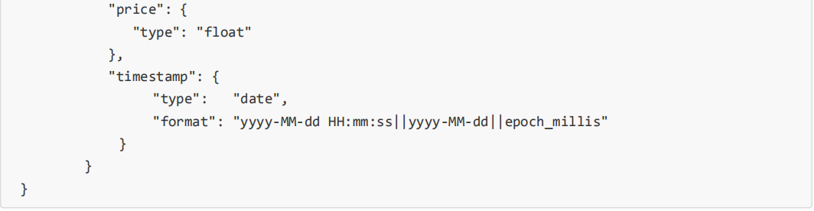


### 10.2.2 Java Client

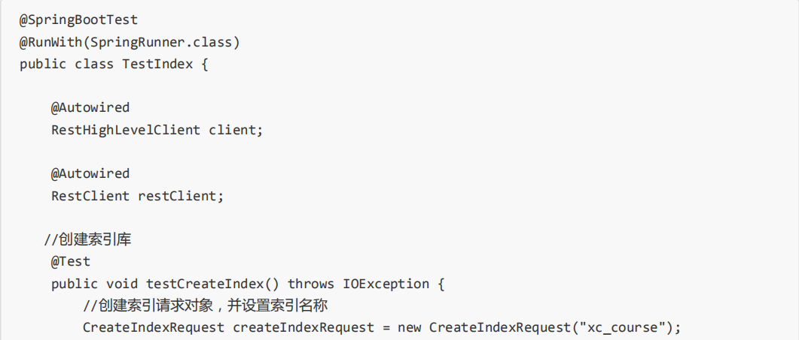

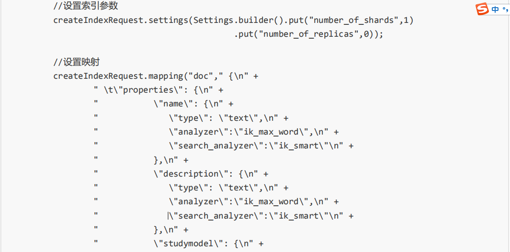

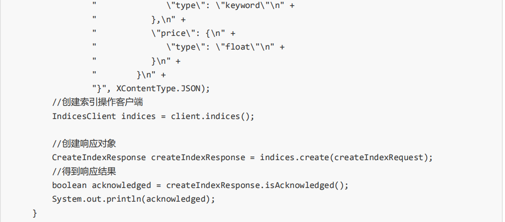

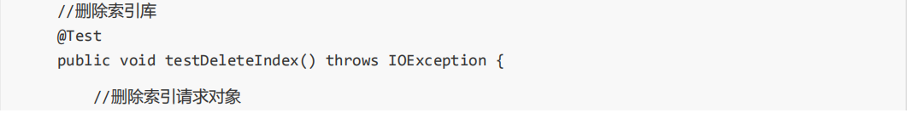

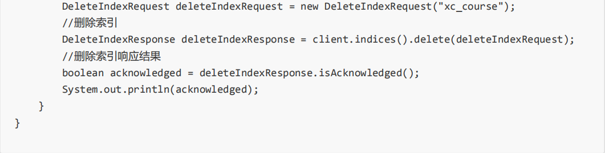


## 10.3 添加文档

### 10.3.1 API

格式如下： PUT /{index}/{type}/{id} { "fifield": "value", ... } 

如果不指定id，ES会自动生成。 

一个例子： 

put http://localhost:9200/xc_course/doc/3 

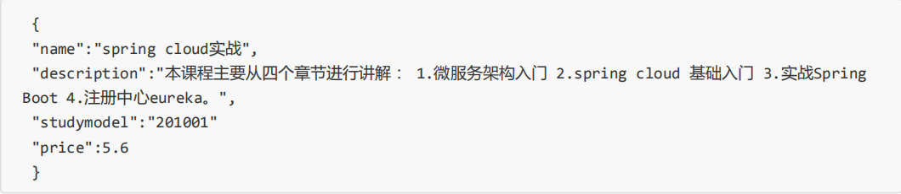


### 10.3.2 Java  Client

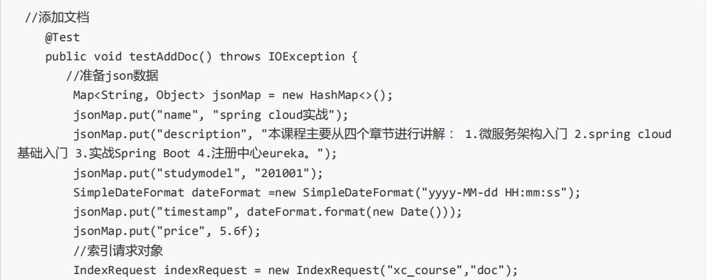

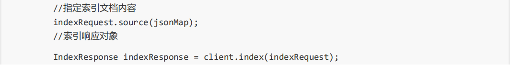


## 10.4  查询文档

### 10.4.1 API

格式如下： GET /{index}/{type}/{id} 

### 10.4.2 Java Client	

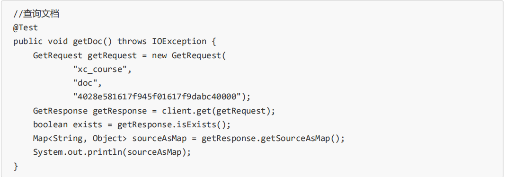


## 10.5 更新文档

### 10.5.1 API

ES更新文档的顺序是：先检索到文档、将原来的文档标记为删除、创建新文档、删除旧文档，创建新文档就会重建 

索引。 

通过请求Url有两种方法： 

1、完全替换 

Post：http://localhost:9200/xc_test/doc/3 

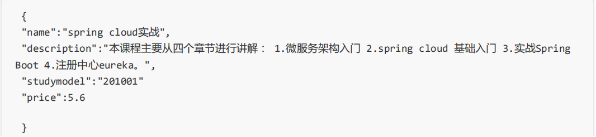

2.局部更新

下边的例子是只更新price字段。 

post: http://localhost:9200/xc_test/doc/3/_update


### 10.5.2 Java Client 

使用 Client Api更新文档的方法同上边第二种局部更新方法。 

可以指定文档的部分字段也可以指定完整的文档内容。 

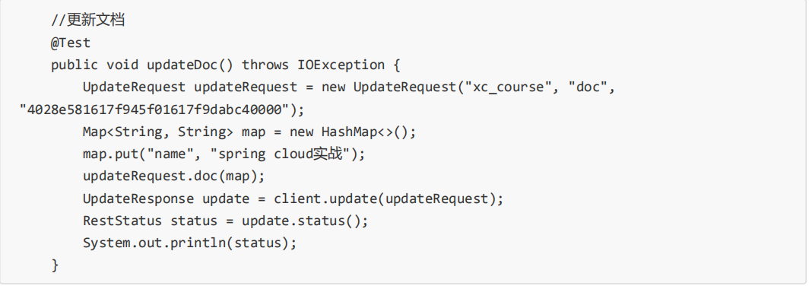

​	

## 10.6 删除文档

### 10.6.1 Api 

根据id删除，格式如下： 

DELETE /{index}/{type}/{id} 

搜索匹配删除，将搜索出来的记录删除，格式如下： 

POST /{index}/{type}/_delete_by_query 

下边是搜索条件例子： 


上边例子的搜索匹配删除会将studymodel为201001的记录全部删除。 


### 10.6.2 Java Client 

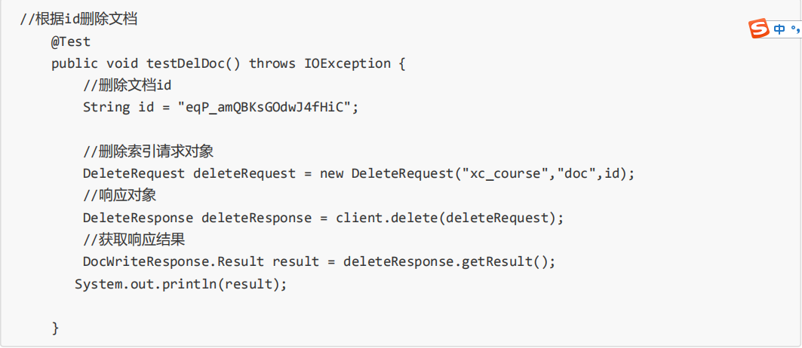


搜索匹配删除还没有具体的api，可以采用先搜索出文档id，根据文档id删除。


# 11.搜索管理

## 11.1 准备环境

### 11.1.1 创建映射

创建xc_course索引库。 

创建如下映射 

post：http://localhost:9200/xc_course/doc/_mapping

参考 “资料”--》搜索测试-初始化数据.txt


### 11.1.2 插入原始数据

向xc_course/doc中插入以下数据： 

参考 “资料”--》搜索测试-初始化数据.txt 

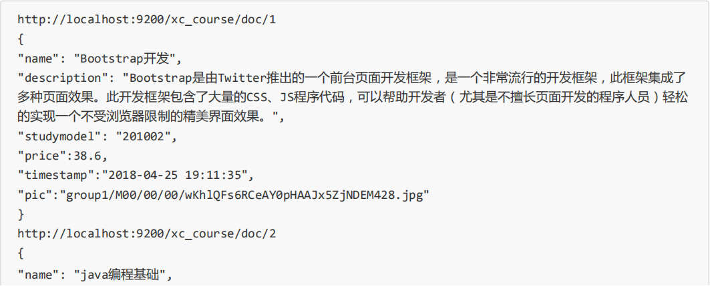

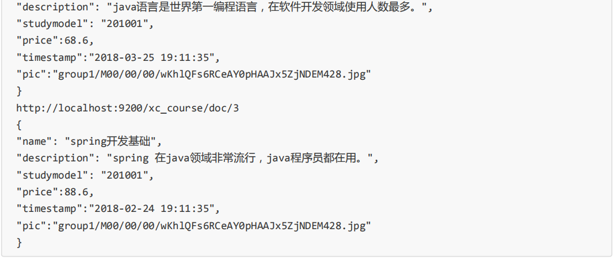


### 11.1.3  简单搜索

简单搜索就是通过url进行查询，以get方式请求ES。 

格式：get ../_search?q=..... 

q：搜索字符串。 

例子： 

?q=name:spring 搜索name中包括spring的文档。 


## 11.2 DSL搜索

DSL(Domain Specifific Language)是ES提出的基于json的搜索方式，在搜索时传入特定的json格式的数据来完成不 

同的搜索需求。 

DSL比URI搜索方式功能强大，在项目中建议使用DSL方式来完成搜索。 


### 11.2.1 查询所有文档

查询所有索引库的文档。 

发送：post http://localhost:9200/_search 

查询指定索引库指定类型下的文档。（通过使用此方法） 

发送：post http://localhost:9200/xc_course/doc/_search 

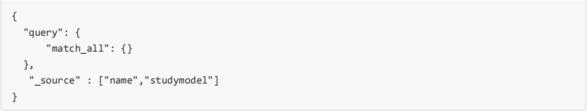

_source：source源过虑设置，指定结果中所包括的字段有哪些。

结果说明： 

took：本次操作花费的时间，单位为毫秒。 

timed_out：请求是否超时 

_shards：说明本次操作共搜索了哪些分片 

hits：搜索命中的记录 

hits.total ： 符合条件的文档总数 hits.hits ：匹配度较高的前N个文档 

hits.max_score：文档匹配得分，这里为最高分 

_score：每个文档都有一个匹配度得分，按照降序排列。 

_source：显示了文档的原始内容。 


JavaClient：

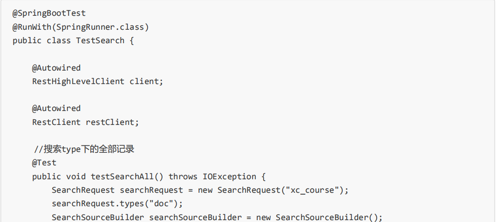

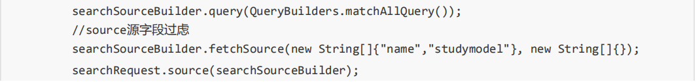

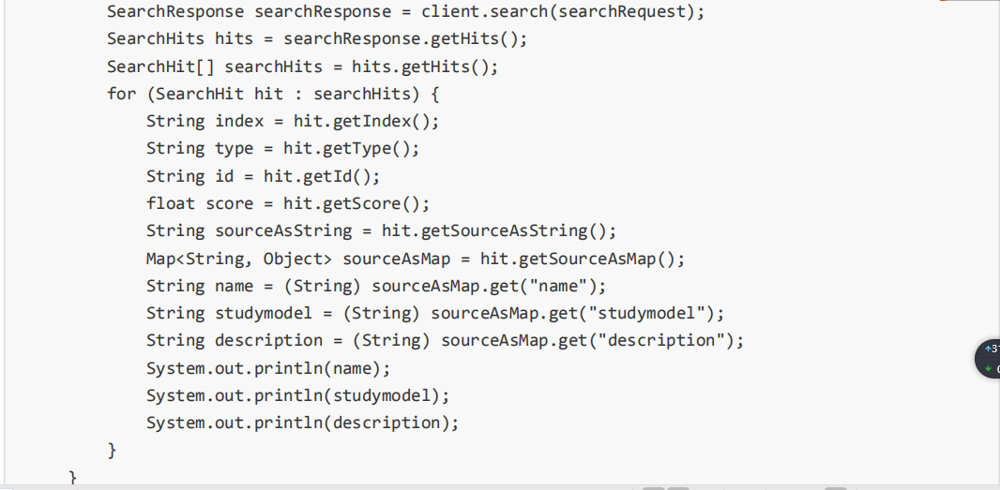


### 11.2.2 分页查询

ES支持分页查询，传入两个参数：from和size。 

form：表示起始文档的下标，从0开始。 

size：查询的文档数量。 

发送：post http://localhost:9200/xc_course/doc/_search 

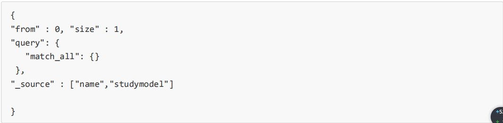


JavaClient 

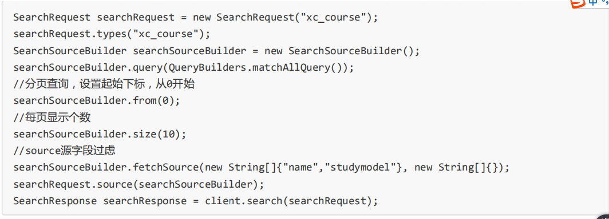


### 11.2.3 Term Query 

Term Query为精确查询，在搜索时会整体匹配关键字，不再将关键字分词。 

发送：post http://localhost:9200/xc_course/doc/_search


上边的搜索会查询name包括“spring”这个词的文档。 

JavaClient： 

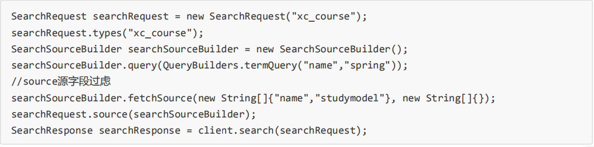


### 11.2.4 根据id精确匹配

ES提供根据多个id值匹配的方法： 

测试：

post： http://127.0.0.1:9200/xc_course/doc/_search

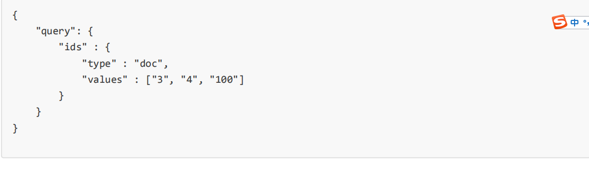

JavaClient: 

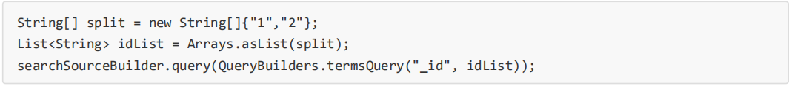


### 11.2.5 **match Query** 

1、基本使用 

match Query即全文检索，它的搜索方式是先将搜索字符串分词，再使用各各词条从索引中搜索。 

match query与Term query区别是match query在搜索前先将搜索关键字分词，再拿各各词语去索引中搜索。 

发送：post http://localhost:9200/xc_course/doc/_search 

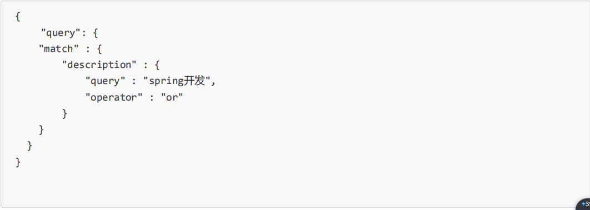

query：搜索的关键字，对于英文关键字如果有多个单词则中间要用半角逗号分隔，而对于中文关键字中间可以用 

逗号分隔也可以不用。 

operator：or 表示 只要有一个词在文档中出现则就符合条件，and表示每个词都在文档中出现则才符合条件。 

上边的搜索的执行过程是： 

1、将“spring开发”分词，分为spring、开发两个词 

2、再使用spring和开发两个词去匹配索引中搜索。 

3、由于设置了operator为or，只要有一个词匹配成功则就返回该文档。 


JavaClient：


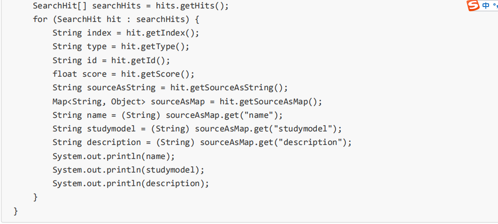


2、minimum_should_match 

上边使用的operator = or表示只要有一个词匹配上就得分，如果实现三个词至少有两个词匹配如何实现？ 

使用minimum_should_match可以指定文档匹配词的占比： 

比如搜索语句如下：

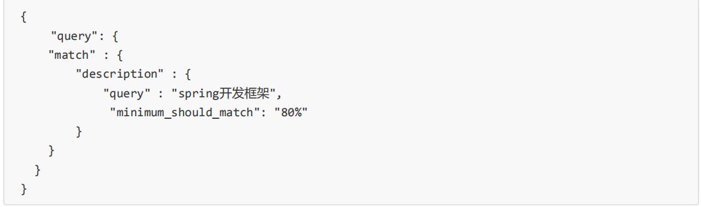

“spring开发框架”会被分为三个词：spring、开发、框架 

设置"minimum_should_match": "80%"表示，三个词在文档的匹配占比为80%，即3*0.8=2.4，向上取整得2，表 

示至少有两个词在文档中要匹配成功。 

对应的RestClient如下：

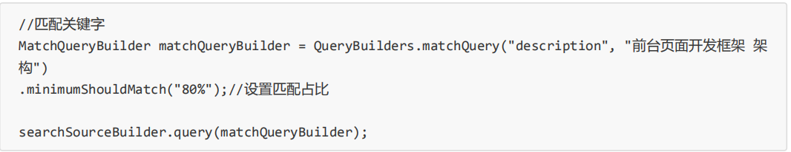


### 11.2.6 multi Query 

上边学习的termQuery和matchQuery一次只能匹配一个Field，本节学习multiQuery，一次可以匹配多个字段。 

1、基本使用 

单项匹配是在一个fifield中去匹配，多项匹配是拿关键字去多个Field中匹配。 

例子： 

发送：post http://localhost:9200/xc_course/doc/_search 

拿关键字 “spring css”去匹配name 和description字段。 

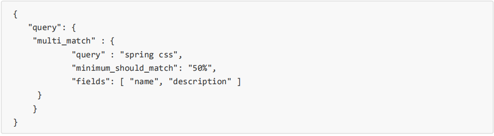

2、提升boost 

匹配多个字段时可以提升字段的boost（权重）来提高得分 

例子： 

提升boost之前，执行下边的查询： 

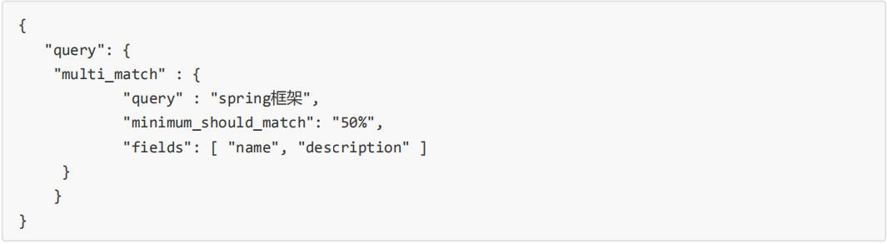

通过查询发现Bootstrap排在前边。 

提升boost，通常关键字匹配上name的权重要比匹配上description的权重高，这里可以对name的权重提升。 


“name^10” 表示权重提升10倍，执行上边的查询，发现name中包括spring关键字的文档排在前边。 

JavaClient: 

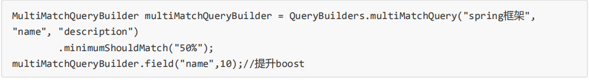


### 11.2.7  布尔查询

布尔查询对应于Lucene的BooleanQuery查询，实现将多个查询组合起来。 

三个参数： 

must：文档必须匹配must所包括的查询条件，相当于 “AND” should：文档应该匹配should所包括的查询条件其 

中的一个或多个，相当于 "OR" must_not：文档不能匹配must_not所包括的该查询条件，相当于“NOT”

分别使用must、should、must_not测试下边的查询： 

发送：POST http://localhost:9200/xc_course/doc/_search 

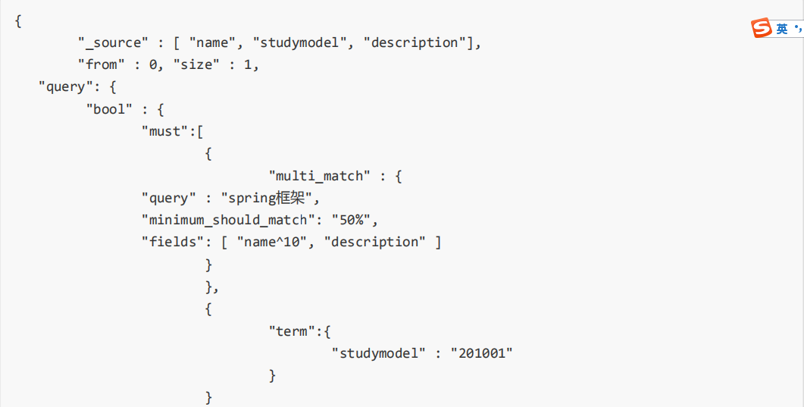


must：表示必须，多个查询条件必须都满足。（通常使用must） 

should：表示或者，多个查询条件只要有一个满足即可。 

must_not：表示非。


JavaClient： 


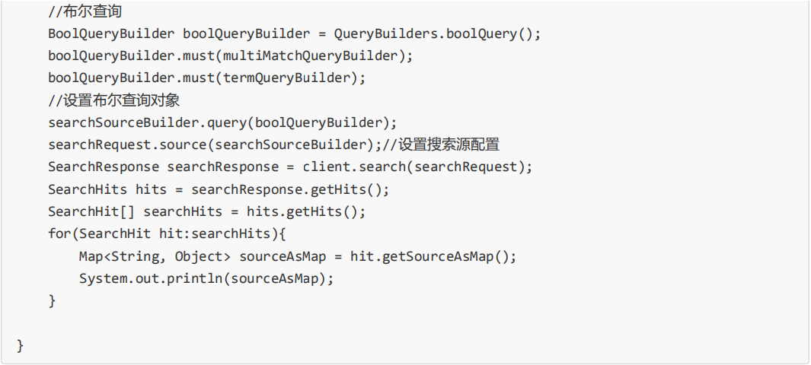


### 11.2.8 过滤器

过虑是针对搜索的结果进行过虑，过虑器主要判断的是文档是否匹配，不去计算和判断文档的匹配度得分，所以过 

虑器性能比查询要高，且方便缓存，推荐尽量使用过虑器去实现查询或者过虑器和查询共同使用。 

过虑器在布尔查询中使用，下边是在搜索结果的基础上进行过虑： 

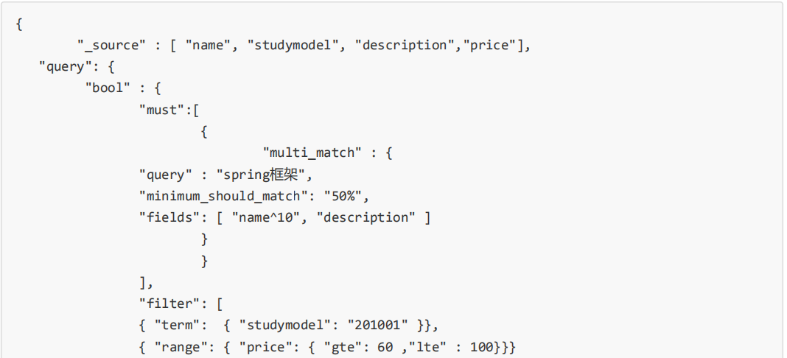


range：范围过虑，保留大于等于60 并且小于等于100的记录。

term：项匹配过虑，保留studymodel等于"201001"的记录。 

注意：range和term一次只能对一个Field设置范围过虑。

client： 

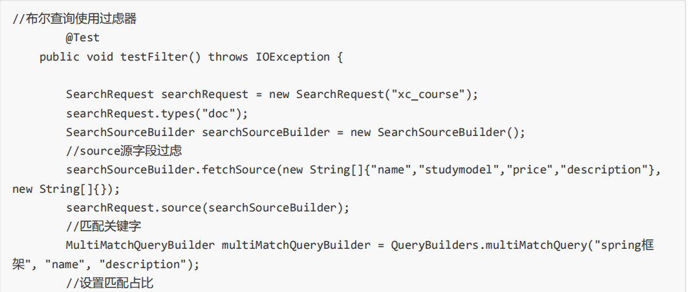

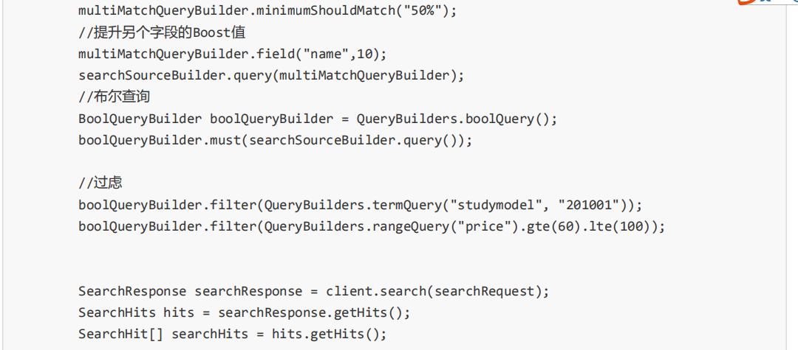

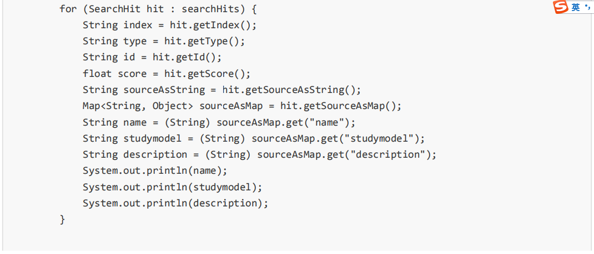


### 11.2.9 排序

可以在字段上添加一个或多个排序，支持在keyword、date、flfloat等类型上添加，text类型的字段上不允许添加排 

序。

发送 POST http://localhost:9200/xc_course/doc/_search 

过虑0--10元价格范围的文档，并且对结果进行排序，先按studymodel降序，再按价格升序

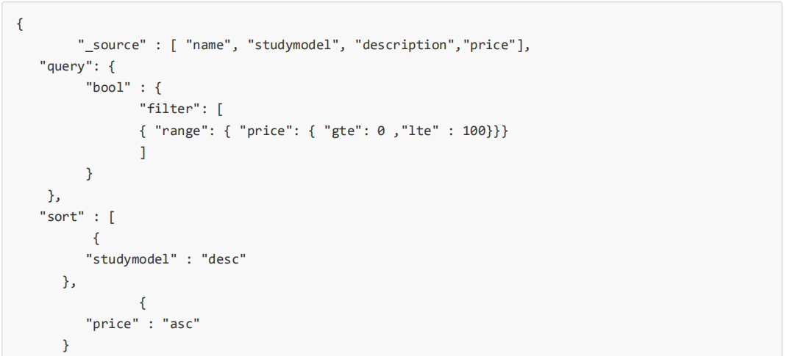


client： 

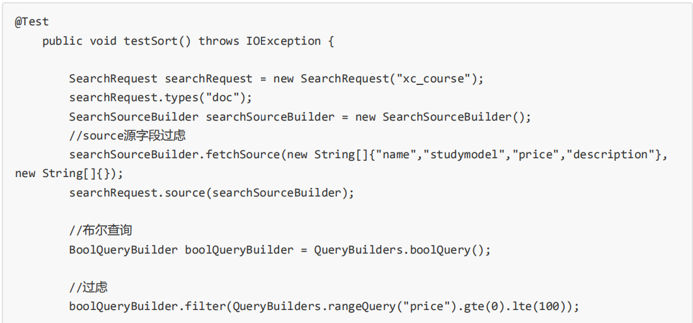

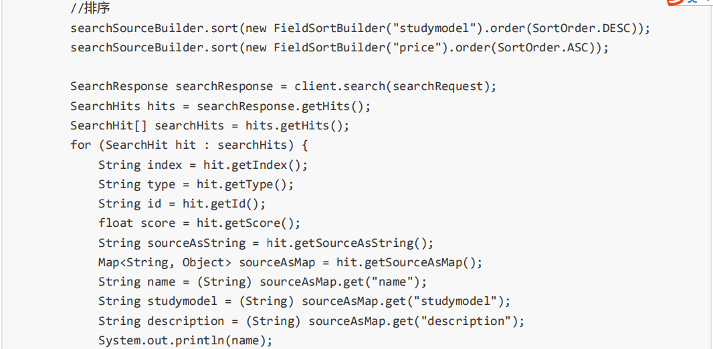


### 11.2.10 高亮显示

高亮显示可以将搜索结果一个或多个字突出显示，以便向用户展示匹配关键字的位置。 

在搜索语句中添加highlight即可实现，如下： 

Post： http://127.0.0.1:9200/xc_course/doc/_search 

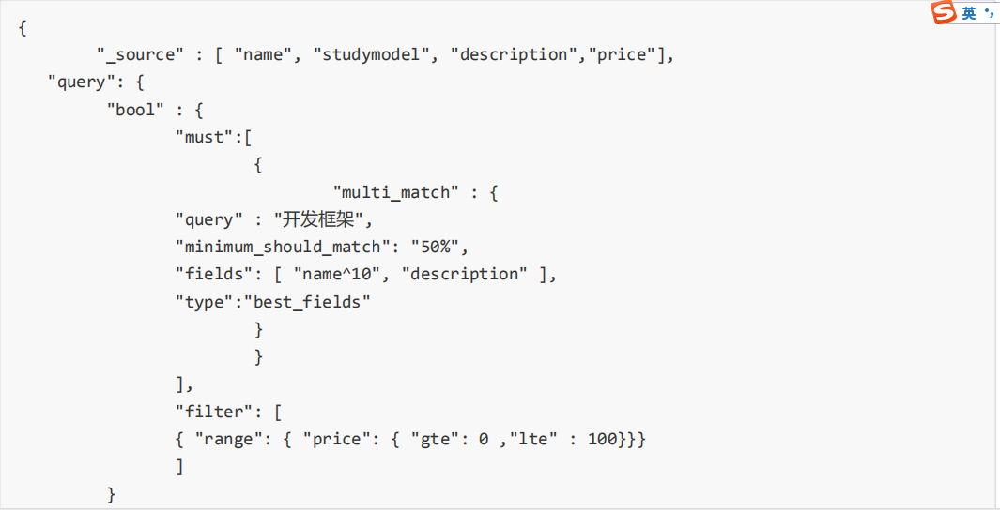

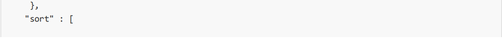


client代码如下： 

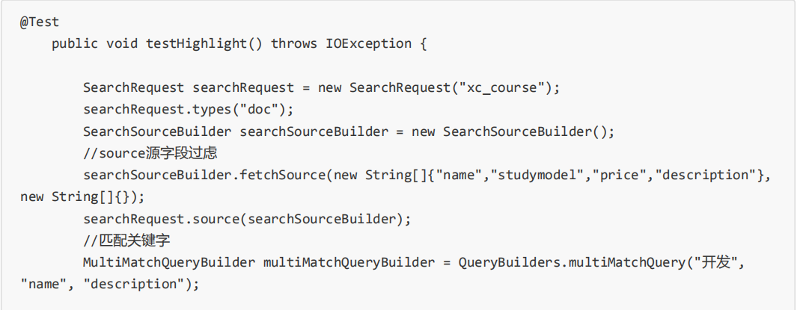

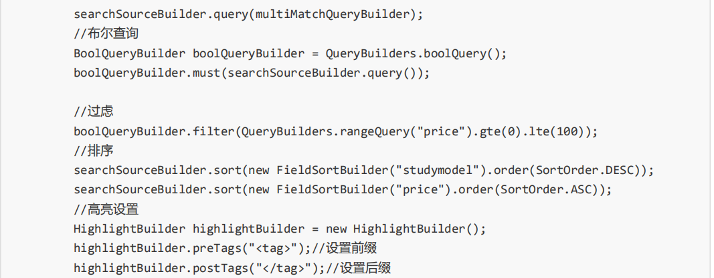

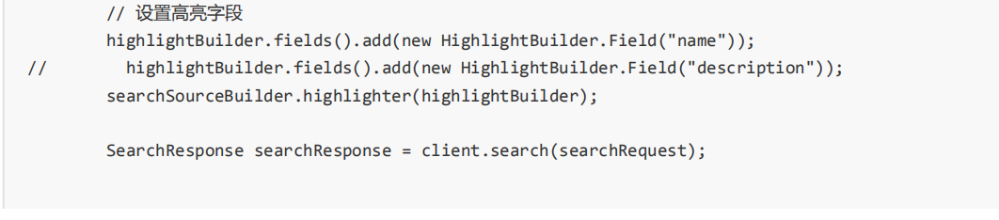

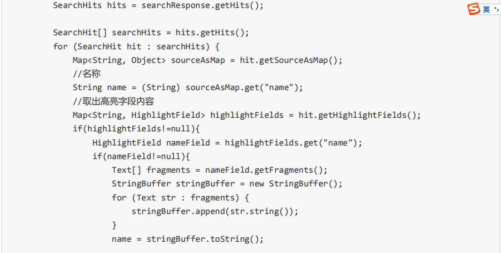

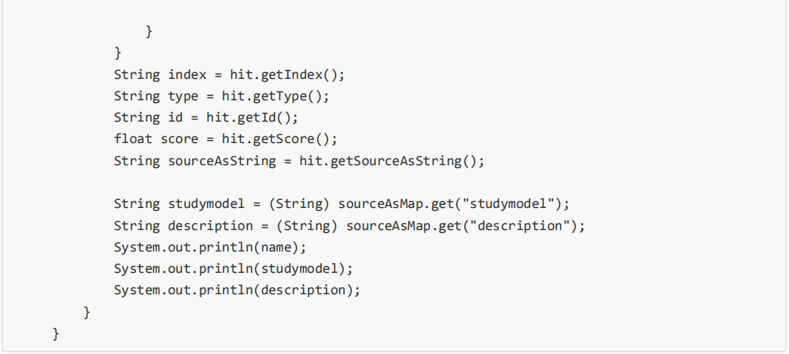


# 12.集群管理

## 12.1 集群结构

ES通常以集群方式工作，这样做不仅能够提高 ES的搜索能力还可以处理大数据搜索的能力，同时也增加了系统的 

容错能力及高可用，ES可以实现PB级数据的搜索。 

下图是ES集群结构的示意图： 

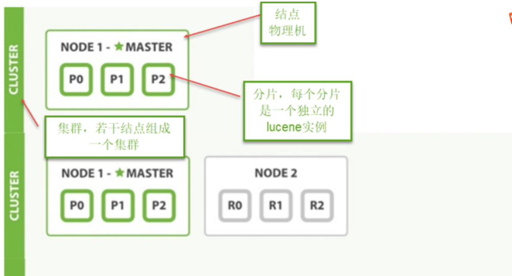

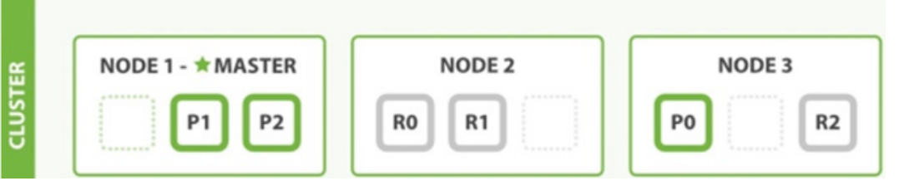


从上图总结以下概念： 

1、结点 

ES集群由多个服务器组成，每个服务器即为一个Node结点(该服务只部署了一个ES进程)。 

2、分片 

当我们的文档量很大时，由于内存和硬盘的限制，同时也为了提高ES的处理能力、容错能力及高可用能力，我们将 

索引分成若干分片，每个分片可以放在不同的服务器，这样就实现了多个服务器共同对外提供索引及搜索服务。 

一个搜索请求过来，会分别从各各分片去查询，最后将查询到的数据合并返回给用户。 

3、副本 

为了提高ES的高可用同时也为了提高搜索的吞吐量，我们将分片复制一份或多份存储在其它的服务器，这样即使当 

前的服务器挂掉了，拥有副本的服务器照常可以提供服务。 

4、主结点 

一个集群中会有一个或多个主结点，主结点的作用是集群管理，比如增加节点，移除节点等，主结点挂掉后ES会重 

新选一个主结点。 

5、结点转发 

每个结点都知道其它结点的信息，我们可以对任意一个结点发起请求，接收请求的结点会转发给其它结点查询数 

据。


## 12.2 搭建集群

下边的例子实现创建一个2结点的集群，并且索引的分片我们设置2片，每片一个副本。

### 12.2.1 结点的三个角色

主结点：master节点主要用于集群的管理及索引 比如新增结点、分片分配、索引的新增和删除等。 数据结点： 

data 节点上保存了数据分片，它负责索引和搜索操作。 客户端结点：client 节点仅作为请求客户端存在，client的 

作用也作为负载均衡器，client 节点不存数据，只是将请求均衡转发到其它结点。 

通过下边两项参数来配置结点的功能： 

node.master: #是否允许为主结点 

node.data: #允许存储数据作为数据结点 

node.ingest: #是否允许成为协调节点， 

四种组合方式： 

master=true，data=true：即是主结点又是数据结点 

master=false，data=true：仅是数据结点 

master=true，data=false：仅是主结点，不存储数据 

master=false，data=false：即不是主结点也不是数据结点，此时可设置ingest为true表示它是一个客户端。 

### 12.2.2  创建节点1

解压elasticsearch-6.2.1.zip 到 F:\devenv\elasticsearch\es-cloud-1\elasticsearch-6.2.1 

结点1对外服务的http端口是：9200 

集群管理端口是9300 

配置elasticsearch.yml 

结点名：xc_node_1 

elasticsearch.yml内容如下

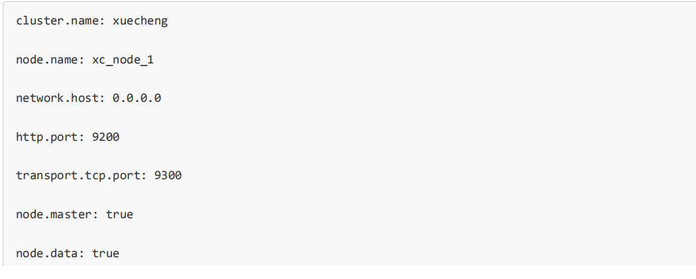

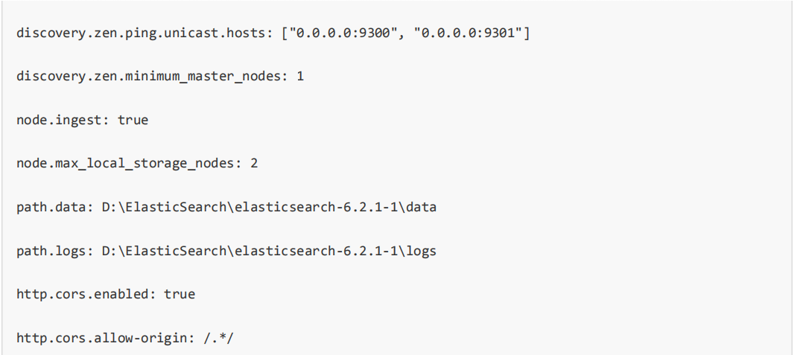

启动结点1

### 12.2.3 创建节点2 

解压elasticsearch-6.2.1.zip 到 F:\devenv\elasticsearch\es-cloud-2\elasticsearch-6.2.1 

结点1对外服务的http端口是：9201 

集群管理端口是9302 

结点名：xc_node_2 

elasticsearch.yml内容如下 

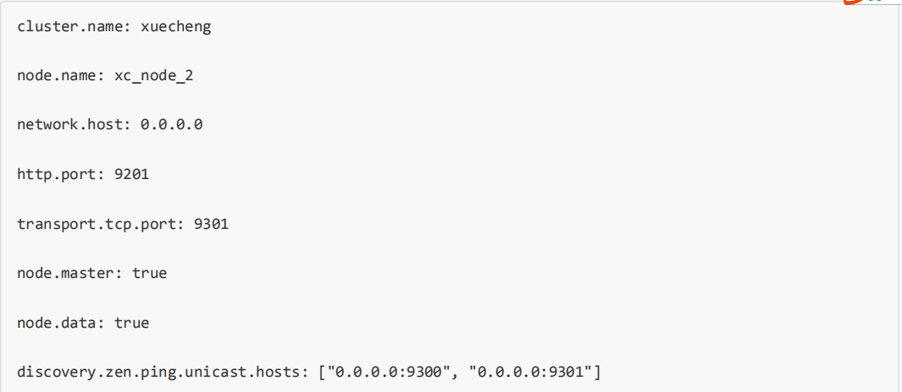 	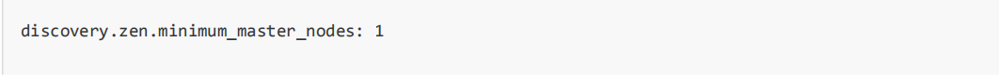

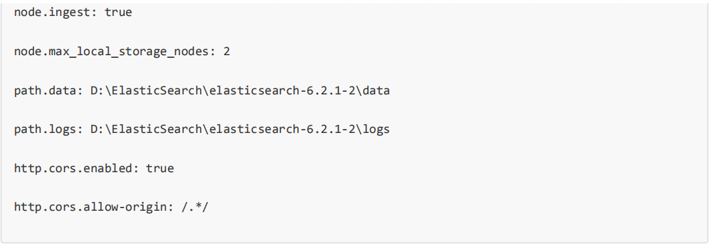

启动结点2 


### 12.2.4 创建索引库

1）使用head连上其中一个结点 

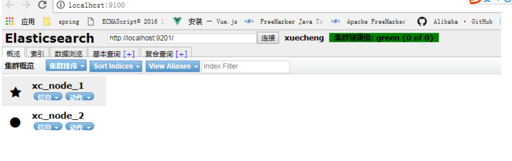

上图表示两个结点已经创建成功。 

2）下边创建索引库，共2个分片，每个分片一个副本。


创建成功，刷新head:

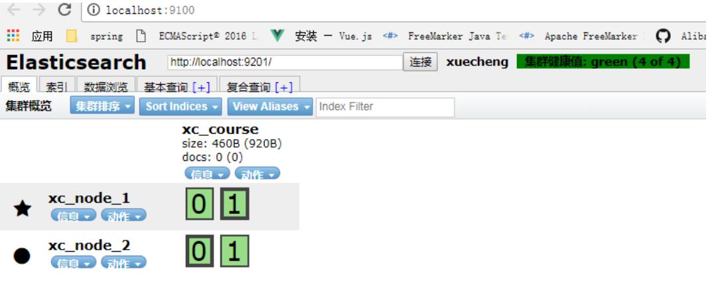

上图可以看到共有4个分片，其中两个分片是副本。 

3）每个结点安装IK分词器 

略

### 12.2.5 集群的健康

通过访问 GET /_cluster/health 来查看Elasticsearch 的集群健康情况。 

用三种颜色来展示健康状态： green 、 yellow 或者 red 。 

green：所有的主分片和副本分片都正常运行。 yellow：所有的主分片都正常运行，但有些副本分片运行不正常。 

red：存在主分片运行不正常。 

Get请求：http://localhost:9200/_cluster/health 

响应结果： 

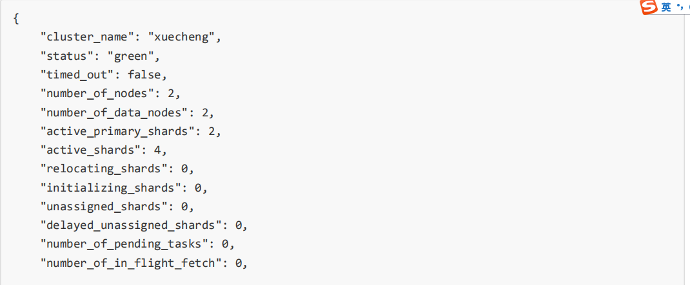

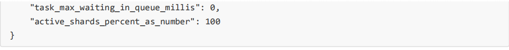


## 12.3 测试

#### 1）创建映射并写入文档 

连接 其中任意一台结点，创建映射写入文档。 

Post http://localhost:9200/xc_course/doc/3 

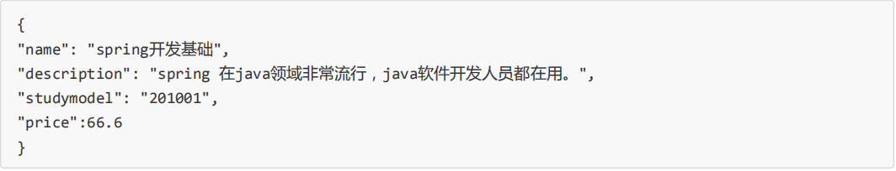

响应结果： 

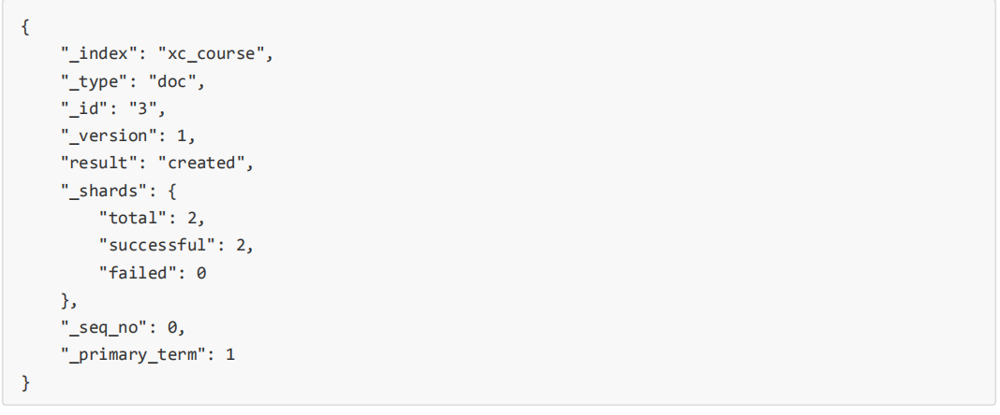

从上边的提示可看出，两个分片都保存成功。 

#### 2）搜索 

向其它一个结点发起搜索请求，查询全部数据。 

#### 3）关闭一个结点 

ES会重新选中一个主结点（前提在配置结点时允许它可以为主结点）

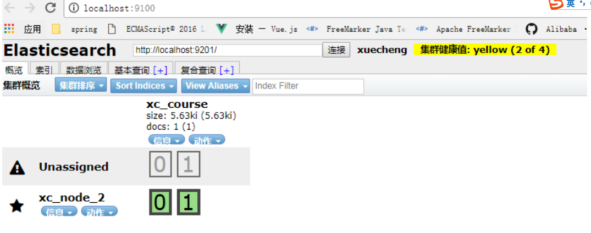

此时向活的结点发起搜索请求，仍然正常。 

#### 4）添加一个结点 

添加结点3，端口设置为： 

http端口是：9202 

集群管理端口是9302 

结点名：xc_node_3 

此结点的配置： 

node.master: false node.data: true 

启动结点3，刷新head，下图显示ES将分片分在了3个结点

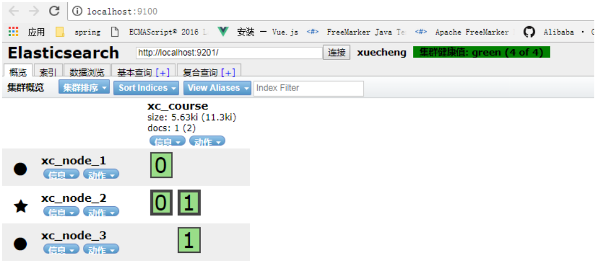

向结点3发起搜索请求： 

Get： http://127.0.0.1:9202/xc_course/doc/_search 

全部数据可被正常搜索到。