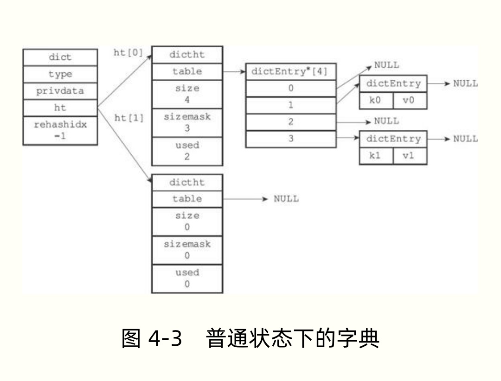

# 1.数据结构与对象

## 1.1 简单动态字符串 SDS

### 1.1.1 概述

SDS( simple dynamic string,SDS )


### 1.1.2  作用

- 保存数据库中的字符串值
- 用作缓存区（buffer）:AOF模块中的AOF缓存区，以及客户端状态中的输入缓冲区，


### 1.1.3 定义

```c
struct sdshdr {
    
    //记录buf数组中已使用字节的数量，等于SDS所保存字符串的长度
    int len;
    
    //字节数组，用于保存字符串
    char buf[];
    
    
    
}
```


### 1.1.4 特性

- 自动插入字符数组末尾插入‘\0’ 字符，不占用 len。
- 不以 ‘\0’ 作为结束标志。
- 动态分配字节数组的大小.
- 预分配空间，既分配空间时会多分配空闲空间。
- 惰性空间释放, 既一般通过减少 len的大小 ，达到释放空间的目的，在需要时才会真实的释放空间。
- 兼容部分 C 语言字符串的函数


## 1.2  链表

### 1.2.1 概述

​	链表（list）提供了高效的节点重排能力，以及顺序性的节点访问方式，并且可以通过赠删节点来灵活地调整链表的长度。


### 1.2.2 作用

- ​	列表的底层实现之一就是链表:

  ​             当一个列表键包含了数量比较多的元素，又或者列表中包含的元素都是比较长的字符串时，redis就会使用链表作为列表键的底层实现

- 发布订阅

- 慢查询

- 监视器

- redis用链表来构建客户端输出缓冲区（output buffer ）


### 1.2.3 实现

```c
typedef struct listNode{
    //前置节点
    struct listNode *prev;
    
    //后置节点
    struct listNode *next;
    
    //节点的值
    void  * value;
    
}listNode;
```

```c
typedef struct list{
    //表头节点
    listNode *head;
    
    //后置节点
    listNode *tail;
    
    //链表所包含的节点数量
    unsigned long len;
    
    //节点值赋值函数
    void *(*dup)(void *ptr);
    
    //节点值释放函数
    void *(*free)(void *ptr);
    
    //节点值对比函数
    int  (*match)(void *ptr,void *key);
    
}list;
```

虽然仅仅使用多个listNode结构就可以组成链表，但使用list来持有链表，操作会更方便。

### 1.2.4 特性

- 双端
- 无环：表头节点的prev指针和表尾节点的next指针都指向NULL，对链表的访问以NULL为终点。
- 可直接操作表头指针
- 可直接操作表尾指针
- 带链表长度计数器
- 多态：链表节点使用 void* 指针来保存节点值，并且可以通过list结构的 dup、free、match三个属性为节点值设置类型特定函数，所以链表可以用于保存各种不同类型的值。


## 1.3 字典

### 1.3.1 概述

字典，又称为符号表（symbol table）、关联数组 （ associative array ）或映射（map）, 是一种用于保存键值对（key-value pair）的抽象数据结构。


哈希节点：键值对

哈希表：数组+链表  

字典：对哈希表进一步封装


### 1.3.2  作用

- **Redis的数据库就是使用字典来作为底层实现的**：对数据库的增、删、查、改操作也是构建在对字典的操作之上的，简单的说保存在redis的数据是以键值对的形式保存在名为“数据库”的字典里。
- **字典还是哈希键的底层实现之一**：当一个哈希键包含的键值对比较多，又或者键值对中的元素都是比较长的字符串时，Redis就会使用字典作为哈希键的底层实现。


### 1.3.3 实现





哈希表

```c
typedef struct dictht{
    
    //哈希表数组
    dictEnty **table;
    
    //哈希表大小
    unsigned long size;
    
    //哈希表大小掩码，用于计算索引值 总是等于 size-1
    unsigned long sizemask;
    
    //该哈希表已有节点的数量
    unsigned long used;
    
}dictht;
```


table 属性是一个数组，数组中的每个元素都是一个指向 dict.h/dictEntry 结构的指针，每个dictEntry结构保存着一个键值对。


哈希表节点

```c
typedef struct dictEntry{
    
    //键
    void *key;
    
    //值
    union{
        void *val;
        uint64_tu64;
        int64_ts64;
    }v;
    
    //指向下个哈希表节点，形成链表
    struct dictEntry *next;
     
}dictEntry;
```


v属性保存着键值对中的值，其中键值对的值可以是一个指针，或者是一个uint64_t整数，又或者是一个int64_t整数

next 属性是指向另一个哈希表节点的指针，这个指针可以将多个哈希值相同的键值对连接在一起，以此来解决键冲突（collision）的问题。


字典

```c
typedef struct dict{
    
    //类型特定函数
    dictType *type;
    
    //私有数据
    void *privdata;
    
    //哈希表
    dictht ht[2];
    
    //索引  当rehash 不在进行时，值为-1
    int rehashidx;
    
}dict;
```


type属性和privdata属性是针对不同类型的键值对，为创建多态字典而设置的：

​		type 属性是一个指向dictType结构的指针，每个dictType结构保存了一簇用于操作特定类型键值对的函数，Redis 会为用途不同的字典设置不同的类型特定函数。

​		privdata属性则保存了需要传给哪些类型特定函数的可选参数。


```c
typedef struct dictType {
    
    //计算哈希值的函数
    unsigned  int (*hashFunction)(const void *key);
    
    //复制键的函数
    void *(keyDup)(void *privdata,const void *key);
    
    //复制值的函数
    void *(*valDup)(void *privdata,const void *obj);
    
    //对比键的函数
    int (*keyCompare)(void *privdata,const void *key1,const void *key2);
    
    //销毁键的函数
    void (*keyDestructor)(void *privdata,void *key);
    
    //销毁值的函数
    void (*valDestructor)(void *privdata,void *obj);
         
}dictType;
```


ht属性： ht属性是一个包含两个项的数组，数组中的每个项都是一个dictht哈希表，一般情况下，字典只使用ht[0]哈希表，ht[1]哈希表只会对ht[0]哈希表进行rehash时使用


rehash属性： 它记录了rehash目前的进度，如果目前没有在进行rehash，那么它的值为 -1。


### 1.3.4 rehash

为了让哈希表的负载因子（load factor） 维持在一个合理的范围之内，当哈希表保存的键值对数量太多或者太少时，程序需要对哈希表的大小进行相应的扩展或者收缩。


扩展和收缩哈希表的工作可以通过执行rehash（重新散列）操作来完成，Redis对字典的哈希表执行rehash的步骤如下：


#### 1.3.4.1 rehash步骤

1.  为字典的 ht[1] 哈希表分配空间，这个哈希表的空间大小取决于要执行的操作，以及ht[0]当前包含的键值对数量（也即是 ht[0].used属性的值）
   -   如果扩展，ht[1] 的大小为第一个大于等于ht[0].used*2 的2^n （2的n次方幂（mi））
   -   如果收缩，ht[1] 的大小为第一个小于等于ht[0].used的2^n.
2. 将保存在ht[0]中的所有键值对rehash到ht[1]上面：rehash指的是重新计算键的哈希值和索引值，然后将键值对放置到ht[1]哈希表的指定位置上。
3. 当ht[0]包含的所有键值对都迁移到了ht[1]之后（ht[0]变为空表），释放ht[0],将ht[1]设置为ht[0],并在ht[1]新创建一个空白哈希表，为下一次rehash做准备。


#### 1.3.4.2 rehash触发条件

当以下条件中的任意一个被满足时，程序会自动开始对哈希表执行扩展操作：

1. 服务器目前没有在执行 BGSAVE 命令或者 BGREWRITEAOF 命令，并且哈希表的负载因子大于等于 1。
2. 服务器目前正在执行 BGSAVE 命令或者 BGREWRITEAOF 命令，并且哈希表的负载因子大于等于 5。

负载因子计算方式：

​	load_factor = ht[0].used / ht[0].size;


根据 BGSAVE 命令或 BGREWRITEAOF 命令是否正在执行，服务器执行扩展操作所需的负载因子并不相同，这是因为在执行 BGSAVE 命令或者 BGREWRITEAOF 命令的过程中，Redis 需要创建当前服务器进程的子进程，而大多数操作系统都采用写时复制（ copy-on-write）技术来优化子进程的使用效率，所以在子进程存在期间，服务器会提高执行扩展操作所需的负载因子，从而尽可能地避免在子进程存在期间进行哈希表扩展操作，这可以避免不必要的内存写入操作，最大限度地节约内存。


另一方面，当哈希表的负载因子小于 0.1 时，程序自动开始对哈希表执行收缩操作。


####  1.3.4.3 渐进式rehash

扩展或收缩哈希表需要将 ht[0] 里面的所有键值对 rehash 到 ht[1]里面，但是，这个rehash动作并不是一次性完成的，而是分多次、渐进式地完成的。


## 1.4 跳跃表

有点难理解 ， 需要有懂的人，给予讲解


### 1.4.1  概述

跳跃表（skiplist）是一种有序数据结构，它通过在每个节点中维持多个指向其他节点的指针，从而达到快速访问节点的目的。


跳跃表支持平均 O(logN)、最坏O(N)复杂度的节点查找，还可以通过顺序性操作来批量处理节点。


在大部分情况下，跳跃表的效率可以和平衡树相媲美，并且因为跳跃表的实现比平衡树要来得更为简单，所以有不少程序都使用跳跃表来代替平衡树。


### 1.4.2   作用

- 有序集合键的底层实现之一：如果一个有序集包含的元素数量比较多，又或者有序集合中元素的成员（member）是比较长的字符串时，Redis 就会使用跳跃表来作为有序集合键的底层实现。
- Redis只在两个地方用到了跳跃表，一个是实现有序集合键，另一个是在集群节点中用作内部数据结构，除此之外，跳表在Redis里面没有其他用途。


### 1.4.3 实现

 Redis的跳跃表由 redis.h/zskiplistNode 和 redis.h/zskiplist 两个结构定义。

zskiplistNode 结构用于表示跳跃节点

zskiplist 结构则用于保存跳跃表节点的相关信息，比如节点的数量，以及指向表头节点和表位节点的指针等等。


#### 1.4.3.1***跳跃表节点***

```c
typedef struct zskiplistNode {
    
    //层
    struct  zskiplistLevel{
        
        //前进指针
        struct  zskiplistNode *forward;
        
        //跨度
        unsigned int span;
        
	}level[];
    
    //后退指针
    struct zskiplistNode *backward;
    
    //分值
    double  score;
    
    //成员对象
    robj *obj;
    
}zskiplistNode;
```

**1.层**

跳跃表节点的level数组可以包含多个元素，每个元素都包含一个指向其他节点的指针，程序可以通过这些层来加快访问其他节点的速度，一般来说，层的数量越多，访问其他节点的速度就越快。

每次创建一个新跳跃表节点的时候，程序都根据幂次定律（power law  ,越大的数出现的概率越小）随机生成一个介于1和32之间的值做为level数组的大小，这个大小就是层的“高度”。


**2.前进节点**

每个层都有一个指向表尾方向的前进指针（level[i].forward 属性），用于从表头向表尾方向访问节点。


**3.跨度**

层的跨度（level[i].span 属性）用于记录两个节点之间的距离：

- 两个节点之间的跨度越大，它们相距得就越远。
- 指向NULL的所有前进指针的跨度都为0，因为它们没有连向任何节点。


遍历操作只使用前进指针就可以完成，跨度实际上是用来计算排位（rank）的：

​	在查找某个节点的过程中，将沿途访问过的所有层的跨度累计起来，得到的结果就是目标节点在跳跃表中的

​    排位


**4.后退指针**

节点的后退指针（backwards ）用于表尾向表头方向访问节点：	

​	跟一次可以跳过多个节点的前进指针不同，因为每个节点只有一个后退指针，所以每次只能后退至前一个节点


**5.分值和成员**

节点的分值（score）是一个double类型的浮点数，跳跃表中的所有节点都按分值从小到大来排序。


节点的成员对象（obj属性）是一个指针，它指向一个字符串对象，而字符串对象则保存着一个SDS值，


在同一个跳跃表中，各个节点保存的成员对象必须是唯一的，但是多个节点保存的分值却可以是相同的：

​	分值相同的节点将按照成员对象在字典序中的大小来进行排序，成员对象较小的节点会排在前面（靠近表头的的方向），而成员对象较大的节点则会排在后面（靠近表尾的方向）。


#### 1.4.3.2***跳跃表***

仅靠多个跳跃表节点就可以组成一个跳跃表

但通过一个zskiplist结构来持有这些节点，程序可以更方便地对整个跳跃表进行处理，比如快速访问跳跃表的表头节点和表尾节点，或者快速地获取跳跃表节点的数量（也既是跳跃表的长度）等信息。

```c
typedef struct zskiplist{
    
    //表头节点和表尾节点
    struct skiplistNode *header,*tail;
    
    //表中节点的数量
    unsigned long length;
    
    //表中层数最大的节点的层数
    int level;
    
}zskiplist;
```


header 指向跳跃表的表头

tail 指向表尾节点

length 记录节点的数量

level 属性则用于在O(1)复杂度内获取跳跃表中层高最大的那个节点的层数量，注意表头的层高并不计算在内。


## 1.5 整数集合

### 1.5.1概述

​	整数集合（intset）是集合键的底层实现之一，当一个集合只包含整数值元素，并且这个集合的元素数量不多时，Redis就会使用整数集合作为集合键的底层实现。


### 1.5.2 作用

- ​	整数集合（intset）是集合键的底层实现之一，当一个集合只包含整数值元素，并且这个集合的元素数量不多时，Redis就会使用整数集合作为集合键的底层实现。


### 1.5.3 实现

```c
typedef struct intset{

	//编码方式
	uint32_t encoding;
	
	//集合包含的元素数量
	uint32_t length;
	
	//保存元素的数组
	int8_t contents[];

}intset;
```


contents[ ]  数组是整数集合的底层实现： 整数集合的每个元素都是 contents数组的一个数组项（item）,各个项在数组中按值的大小从小到大有序地排列，并且数组中不包含任何重复项，存储内容的格式取决于 encoding。


length 属性记录了整数集合包含的元素数量，也即是 contents[] 数组的长度.


### 1.5.4 升级

 每当我们要将一个新元素添加到整数集合里面，并且新元素的类型比整数集合现有所有元素的类型都要长时，整数集合需要先进行升级（ upgrade ）,然后才能将新元素添加到整数集合里面。


#### 1.5.4.1 步骤

- 根据新元素的类型，扩展整数集合底层数组的空间大小，并为新元素分配空间。
- 将底层数组现有的所有元素都转换成与新元类型相同类型，转换过程中有序性不变。
- 将新元素添加到底层数组里面。


#### 1.5.4.2 升级的好处  

1. 提升整数集合的灵活性：可以任意添加任何编码的整数 int_8  int_16  int_32  int_64。
2. 尽可能地节约内存。


### 1.5.5 降级

整数集合不支持降级操作


## 1.6 压缩列表

### 1.6.1概述

压缩列表 （ziplist）是列表键和哈希键的底层实现之一。


### 1.6.2 作用

- 列表键的底层实现之一：当一个列表键只包含少量列表项，并且每个列表项要么就是小整数值，要么就是长度比较短的字符串，那么Redis就会使用压缩列表来做列表键的底层实现。
- 哈希键的底层实现之一：当一个哈希键只包含少量列表项，并且每个列表项要么就是小整数值，要么就是长度比较短的字符串，那么Redis就会使用压缩列表来做哈希键的底层实现。


### 1.6.3 实现

压缩列表是Redis为了节约内存而开发的，是由一系列特殊编码的连续内存块组成的顺序型（sequential）数据结构。

一个压缩列表可以包含任意多个节点（entry）,每个节点可以保存一个字节数组或者一个整数值。


#### 1.6.3.1 压缩列表的构成

| 属性    | 类型     | 长度  | 用途                                                         |
| ------- | -------- | ----- | ------------------------------------------------------------ |
| zlbytes | uint32_t | 4字节 | 记录整个压缩列表占用的内存字节数; 在对压缩列表进行内存重分配，或者计算 zlend 的位置时使用 |
| zltail  | uint32_t | 4字节 | 记录压缩列表表尾节点距离压缩列表的起始地址有多少字节：通过这个偏移量，程序无须遍历整个压缩列表就可以确定表尾节点的地址 |
| zllen   | uint16_t | 2字节 | 记录了压缩列表包含的节点数量：当这个属性的值小于UINT16_MAX（65535）时，这个属性的值就是压缩列表包含节点的数量：当这个值等于 UINT16_MAX时，节点的真实数量需要遍历整个压缩列表才能计算得出 |
| extryX  | 列表节点 | 不定  | 压缩列表包含的各个节点，节点的长度由节点保存的内容决定       |
| zlend   | uint8_t  | 1字节 | 特殊值 0xFF （十进制255)，用于标记压缩列表的末端             |


#### 1.6.3.2 压缩列表节点的构成

每个压缩列表节点可以保存一个字节数组或者一个整数值。


#### 1.6.3.3 连锁更新操作


添加新节点到压缩列表，或者从压缩列表中删除节点，可能会引发连锁更新操作，但这种操作出现的几率不高。


## 1.7 对象

### 1.7.1 概述

在前面的内容中，我们描述了Redis用到的所有主要数据结构，简单动态字符串，双端链表，字典，压缩列表，整数集合等等。


Redis并没有直接使用这些数据结构来实现键值对数据库，而是基于这些数据结构创建了一个对象系统，这个系统包含字符串对象、列表对象、哈希对象、集合对象和有序集合对象这五种类型的对象，每种对象都用到了至少一种我们前面所介绍的数据结构。


### 1.7.2 特性

- 通过不同类型的对象，Redis可以判断一个对象是否可以执行给定的命令。
- 可以针对不同的使用场景，为对象设置多种不同的数据结构实现，从而优化对象在不同场景下的使用效率。
- Redis对象实现了基于引用计数技术的内存回收机制。
- Redis还通过引用计数技术实现了对象共享机制，这个机制可以在适当的条件下，通过让多个数据库键共享同一个对象来节约内存。
- Redis对象带有访问时间记录信息，该信息可以用于计算数据库键的空转时长，在服务器启用了 maxmemeory （最大存储）功能的情况下，空转时长比较大的哪些键可能会优先被服务器删除，


### 1.8.3  类型

Redis 使用对象来表示数据库中的键和值，每次当我们在Redis的数据中新创建一个键值对时，我们至少会创建两个对象，一个对象用作键值对的键（键对象），另一个对象用作键值对的值（值对象）。


Redis 中每个对象都由一个  redisObject 结构表示，该结构中和保存数据有关的三个属性分别是type属性、encoding属性和ptr属性：

```c
typedef struct redisObject{
	
    //类型
    unsigned type:4;
    
    //编码
    unsigned encoding:4;
    
    //指向底层实现数据结构的指针
    void *ptr;
    
    //...
	
}robj;
```


对象的type属性记录了对象的类型，这个属性的值可以是表 8-1 列出的常量的其中一个。

| 类型常量     |  对象的名称  |
| :----------- | :----------: |
| REDIS_STRING |  字符串对象  |
| REDIS_LIST   |   列表对象   |
| REDIS_HASH   |   哈希对象   |
| REDIS_SET    |   集合对象   |
| REDIS_ZSET   | 有序集合对象 |


对于Redis数据库保存的键值对来说，键总是一个字符串对象，而值则可以是上述的五种对象。


### 1.8.4 编码和底层实现

对象的ptr指针指向对象的底层实现数据结构，而这些数据结构由对象的encoding属性决定。


encoding属性记录了对象所使用的编码，也既是说这个对象使用了什么数据结构作为对象的底层实现，这个属性的值可以是以下常量之一.


通过encoding 属性设定对象所使用的编码，极大地提升了Redis的灵活性和效率，以为Redis可以根据不同的使用场景来为一个对象设置不同的编码，从而优化对象在某一个场景下的效率。


### 1.8.5 字符串对象

字符串对象的编码可以是int、raw 或者 embstr 。


- 保存整数值，并且这个整数值可以用long类型表示，那么字符串对象 的 encoding 是 int.
- 保存字符串长度大于32字节，那么字符串对象采用 SDS保存字符串值，encoding是 raw.
- 保存字符串长度小于等于32字节，那么字符串对象采用   embstr编码的简单动态字符串 保存字符串值，encoding是EMBSTR.


类型转换

- int编码的字符串对象，当其值不在是整数时，对象编码将由int转换成 raw.
- embstr编码的字符串，（由于embstr编码的字符串没有修改的方法，所以 embstr编码的字符串有修改操作时都最会变成 raw编码的字符串）


字符串相关命令  参考命令 模块。


### 1.8.6  列表对象

列表对象的编码可以是 ziplist 或者 linkedlist  .


编码类型

- ziplist编码的列表对象 使用**压缩列表**作为底层实现，每个压缩列表节点（entry）保存一个列表元素。
- linkedlist编码的列表对象使用**双端链表**作为底层实现，每个双端链表节点（node）都保存了一个字符串对象，而每个字符串对象都保存了一个列表元素
- 字符串对象是Redis五种类型对象中唯一会被其他四种对象嵌套的对象。


编码转换

- 列表对象保存的所有字符串元素的长度都小于64字节，且保存的元素数量小于512个，则使用 ziplist编码
- 否则使用likedlist 编码

注意：上述值可以修改，在配置文件中 关注 list-max-ziplist-value 和 list-max-ziplist-entries选项


### 1.8.7 哈希对象

哈希对象的编码可以是ziplist或者hashtable


编码类型

- ziplist编码的哈希对象使用压缩列表作为底层实现，每当有新的键值对要加入到哈希对象时，程序会先保存键的压缩列表节点推入到压缩列表表尾，然后再将保存了值的压缩列表节点推入到压缩列表表尾。
- hashtable编码的哈希对象使用字典作为底层实现，哈希对象中的每个键值对都使用一个字典键值对来保存。
  - 字典的每个键都是一个字符串对象，保存键
  - 字典的每个值都是一个字符串对象，保存值


编码转换

- 哈希对象保存的所有键值对的键和值的字符串长度都小于64字节，且数量小于512个，则使用ziplist编码。
- 否者使用 hashtable 编码。


注意: 配置文件中的 hash-max-ziplist-value 和 hash-max-ziplist-entries 选项 可以修改上述值。


### 1.8.8 集合对象

集合对象的编码可以是inset 或者 hashtable。


编码类型

- inset编码的集合对象使用整数集合作为底层实现，集合对象包含的所有元素都被保存在整数集合里面。
- hashtable编码的集合对象使用字典作为底层实现，字典的每个键都是一个字符串，每个字符串对象包含了一个集合元素，而字典的值则全部被设置为NULL (java中的set集合也是，map实现，值设置成Object)


编码转换

- 集合对象保存的所有元素都是整数值，保存的元素数量不操作512个时，使用 inset编码
- 否则使用hashtable编码


注意:

​	512个数量可以在配置文件中进行配置，具体看配置文件中关于 set-max-inset-entries选项的说明。


### 1.8.9 有序集合对象

有序集合对象的编码可以是 ziplist 或者 skiplist.


编码类型

- ziplist编码的压缩列表对象使用压缩列表作为底层实现，每个集合元素使用两个紧挨在一起的压缩列表节点来保存，第一个节点保存元素的成员（member）,而第二个元素则保存元素的分值（score）.
    - 压缩列表内的集合元素按分值从小到大进行排序，分值小的靠近表头，分值大的靠近表尾。
- skiplist编码的有序集合对象使用zset结构作为底层实现，一个zset结构同时包含一个字典和一个跳跃表：


```c
typedef struct zset{
	
    zskiplist  *zsl;
    
    dict *dict;
    
}zset;
```

具体内容参考   《Redis设计与实现》P216

注意：虽然zset结构同时使用跳跃表和字典来保存有序集合元素，但这两种数据结构都会通过指针来共享相同元素的成员和分支，所以使用跳跃表和字典来保存集合元素不会产生任何重复成员或者分值，也不会因此而浪费额外的内存。  而且可以同时保有两种结构的特性。


编码转换

- 有序集合保存的元素数量小于128个，且所有元素成员的长度都小于64字节。
- 否则使用 skiplist。


注意：

​	以上两个条件的上限值是可以修改的，具体请看配置文件中关于 zset-max-ziplist-entries 选项

   和 zet-max-ziplist-value 选项的说明。


### 1.8.10  类型检查与命令多态


Redis中用于操作键的命令基本上可以分为两种类型。

- 一种可以对任何类型的键执行：例如, DEL命令、EXPIRE命令、RENAME命令、TYPE命令、OBJECT命令等。
- 另一种命令只能对特定类型的键执行。


类型检查

在执行一个类型特定的命令之前，Redis会先检查输入键的类型是否正确，然后再决定是否执行给定的命令。

类型特定命令进行的类型检查是通过redisObject结构的type属性来实现的。


多态命令的实现

Redis除了会根据值对象的类型来判断键是否能够执行指定命令之外，还会根据值对象的编码方式，选择正确的命令实现代码来执行命令。

所以像 DEL、EXPIRE、TYPE等命令也称为多态命令，因此无论输入的键是什么类型，这些命令都可以正确地执行。


### 1.8.11 内存回收

因为C语言不具备自动内存回收功能，所以Redis在自己的对象系统中构建了一个引用计数（reference  counting）技术实现的内存回收机制，通过这一机制，程序可以通过跟踪对象的引用计数信息，在适当的时候自动释放对象并进行内存回收。


每个对象的引用计数信息由 redisObject结构的 refcount 属性记录：

```c
typedef struct redisObject{
	
    //...
    
    //引用计数
    int refcount;
    
    //...
    
}robj;
```


- 创建一个新对象时，引用计数的值会被初始化为1；
- 当对象被一个新程序使用时，它的引用计数值会被增一；
- 当对象不在被一个程序使用时，它的引用计数值会被减一；
- 当对象的引用计数值变为0时，对象所占用的内存会被释放；


疑问：TODO   如何检测到对象被引用？


### 1.8.12 对象共享

除了用于实现引用计数内存回收机制之外，对象的引用计数属性还带有对象共享的作用。


举个例子，假设键A创建了一个包含整数值100的字符串对象作为值对象。

如果这时键B也要创建一个同样保存了整数值100的字符串对象作为值对象，那么服务器有以下两种做法：

1 ) 为键B新建一个包含整数值100的字符串对象；

2 ）让键A和键B共享同一个字符串对象；


疑问：TODO  Redis如何知道要存储的值，已存在？


在Redis中，让多个键共享同一个值对象需要执行以下两个步骤：

- 将数据库键的值指针指向一个现有的值对象；
- 将被共享的值对象的引用技术增一；


目前来说，Redis会在初始化服务器时，创建一万个字符串对象，这些对象包含了 从0 到 9999的所有整数值，当服务器需要用到值为0到9999的字符串对象时，服务器就会使用这些共享对象，而不是新创建对象

（作用有点类似 静态常量池的作用）


注意:

​	创建共享字符串对象的数量可以通过修改redis.h/REDIS_SHARED_INTEGERS 常量来修改。

​	（有一点，Redis只针对整数值具有这一特性，原因是，校验值特别费CPU）


### 1.8.13 对象的空转时长

除了前面介绍过的type、encoding、ptr和refcount四个属性之外，redisObject结构包含的最后一个属性为 lru 属性，该属性记录了对象最后一次被命令程序访问的时间：


```c
typedef struct redisObject{

	//...
	
	unsigned lru:22;
	
	//...

}robj;
```


OBJECT IDLETIME 命令可以打印出给定键的空转时长，这一空转时长就是通过将当前时间减去键的值对象的lru时间计算得出的：


键的空转时长的作用：

- 被OBJECT IDLETIME 命令打印出来
- 如果服务器打开了maxmemory选项，并且服务器用于回收内存的算法为 volatile-lru 或者 allkeys-lru,那么当服务器占用的内存数超过了maxmemory选项所设置的上限值时，空转时长较高的那部分键会优先被服务器释放，从而回收内存。


配置文件的 maxmemory 选项 和 maxmemory-policy 选项的说明介绍了关于这方面的更多信息。


# 2.单机数据库的实现


## 2.1 数据库


### 2.1.1 概述

​	Redis服务器将所有数据库都保存在服务器状态 redis.h / redisServer 结构的db数组中，db数组的每个项都是一个redis.h / redisDb结构，每个redisDb结构代表一个数据库：

```c
struct redisServer {

	//...
	
	//一个数组，保存着服务器中所有数据库
	redisDb *db;
	
    //服务器的数据库数量
    int dbnum;
    
	//...

};
```


dbnum属性的值由服务器配置的database选项决定，默认情况下，该选项的值为16，所以Redis服务器默认会创建16个数据库。如下图：


P208

### 2.1.2 切换数据库

每个Redis客户端都有自己的目标数据库，每当客户端执行数据库写入命令或者数据库读命令的时候，目标数据库就会成为这些命令的操作对象。


默认情况下，Redis使用0号数据库，但可以通过执行SELECT命令来切换目标数据库。


```c
typedef struct redisClient{

	//...
	
	//记录客户端当前正在使用的数据库
	redisDb *db;
	
	//...

}redisClient;
```


redisClient.db 指针指向 redisServer.db 数组的其中一个元素，而被指向的元素就是客户端的目标数据库。


### 2.1.3 数据库键空间

#### 2.1.3.1 概述

Redis是一个键值对（key-value pair）数库服务器，服务器中的每个数据库都由一个redis.h / redisDb 结构表示，其中，redisDb 结构的dict字典保存了数据库中的所有键值对，我们将这个字典称为键空间（key  space）：

```c
typedef struct redisDb{

	//...
	
	//数据库键空间，保存着数据库中的所有键值对
	dict  *dict;
	
	//...

}redisDb;
```


键空间和用户所见的数据库是直接对应的：

- 键空间的键也就是数据库的键，每个键都是一个字符串对象
- 键空间的值也就是数据库的值，每个值可以是字符串对象、列表对象、哈希表对象、集合对象和有序集合对象中的任意一种Redis对象。


#### 2.1.3.2 添加新建

添加一个新建值对到数据库中，实际上就是将一个新键值对添加到键空间字典里面，其中键为字符串对象，而值则为任意一种类型的Redis 对象。


#### 2.1.3.3 删除键

删除数据库中的一个键，实际上就是在键空间里面删除键所对应的键值对对象。

redis\>  DEL  键名


#### 2.1.3.4 更新键

对一个数据库键进行更新，实际上就是对键空间里面键所对应的值对象进行更新，根据值对象的类型不同，更新的具体方法也会有所不同。


#### 2.1.3.5 对键取值

对一个数据库进行取值，实际上就是在键空间中取出键所对应的值对像，根据值对象的类型不同，具体的取值方法也会有所不同。


#### 2.1.3.6 其他操作

很多针对数据本身的Redis命令，也是通过对键空间进行处理来完成的。

当使用 Redis命令对数据库进行读写时，服务器不仅会对键空间执行指定的读写操作，还会执行一些额外的维护操作。

详情可以参考 《Redis设计与实现》P264


### 2.1.4  键的生存时间或过期时间

#### 2.1.4.1 概述

通过EXPIRE 命令或者 PEXPIRE 命令，客户端可以以秒或者毫秒精度为数据库中的某个键设置生存时间

（Time To Live,TTL）,在经过指定的秒数或者毫秒数之后，服务器就会自动删除生存时间为0的键：


```redis
redis> set key value
OK
redis> EXPIRE key 5
(integer) 1
redis> GET key // 5秒之内
"value"
redis> GET key // 5秒之后
(nil)
```


注意：

​	SETEX 命令可以在设置一个字符串键的同时为键设置过期时间，但这个命令是一个类型限定的命令（只能用于字符串键），原理和 EXPIRE 命令设置过期时间的原理是完全一样的。


- 通过EXPIRE 命令或者 PEXPIRE 命令，客户端可以以秒或者毫秒精度为数据库中的某个键设置生存时间
- 与EXPIRE命令和PEXPIRE命令类似，客户端可以通过EXPIREAT 或者 PEXPIREAT  命令，以秒或者毫秒的精度给数据库中的某个键设置过期时间（expire time）


过期时间是一个 UNIX  时间戳，当键的过期时间来领时，服务器就会自动从数据库中删除这个键：


TTL 命令和PTTL命令接受一个带有生存时间或者过期时间的键，返回这个键的剩余生存时间，也就是，返回距离这个键被服务器自动删除还有多长时间：


#### 2.1.4.2 设置过期时间

Redis有四个不同的命令可以用于设置键的生存时间（键可以存在多久）或过期时间（键什么时候会被删除）：

- EXPIRE  \<key\>  \<ttl\>  命令用于将键key的生存时间设置为 ttl 秒
- PEXPIRE \<key\>  \<ttl\>  命令用于将键key的生存时间设置为 ttl毫秒
- EXPIREAT \<key\>  \<timestamp> 命令用于将键key的过期时间设置为timestamp所指定的秒数时间戳
- PEXPIREAT \<key\>  \<timestamp> 命令用于将键key的过期时间设置为timestamp所指定的毫秒数时间戳


注意：虽然有多种命令，但几个命令都是使用 PEXPIREAT 命令来实现的，最后都会转换成 PEXPIREAT  命令


#### 2.1.4.3 移除过期时间

PERSIST 命令可以移除一个键的过期时间：

```redis
PERSIST 键	
```


PRESIST 命令就是PEXPIREAT命令的反操作：

​	PERSIST命令在过期字典中查找给定的键，并解除键和值在过期字典中的关联


#### 2.1.4.4 保存过期时间

redisDb结构的expires字典保存了数据库中所有键的过期时间，我们称这个字典为过期字典；

- 过期字典的键是一个指针，这个指针指向键空间中的某个键对象（即是某个数据库键）
- 过期字典的值是一个 **long long** 类型的整数，这个整数保存了键所指向的数据库键的过期时间--------一个毫秒精度的UNIX时间戳。

```
typedef  struct redisDb {

	//...
	
	//键空间
	dict *dict;
	
	//过期字典，保存着键的过期时间
	dict *expires;
	
	//...

}
```

注意：在实际中键空间的键和过期字典的键都指向同一个键对象，所以不会出现任何重复对象，也不会浪费任何空间。


#### 2.1.4.5  计算并返回剩余生存时间

TTL 命令以秒为单位返回键的剩余生存时间，而PTTL命令则以毫秒为单位返回键的剩余生存时间：

```
TTL  键
PTTL 键
```


#### 2.1.4.6 过期键删除策略

- 定时删除：
    - 在设置键的过期时间的同时，创建一个定时器（timer），让定时器在键的过期时间来临时，立即执行对键的删除操作。
    - 缺点：
        - 耗费CPU时间，不适合内存不紧张CPU时间紧张的情况。
- 惰性删除
    - 放任不管，但在键空间中获取键时，都检查取得的键是否过期，如果过期就删除该键
    - 缺点：
        - 对内存不友好，不适合内存紧张的情况。
- 定期删除
    - 每隔一段时间，程序就对数据库进行一次检查，删除里面的过期键。
    - 难点：
        - 难以确定删除操作执行的时长和频率
        - 如果太频繁或执行时间太长，就会消耗过多的CPU时间
        - 如果太少或太短，就会浪费内存。
        - 因此，使用定期删除策略时，需要合理地设置删除操作的执行时长和执行频率

注意：Redis中使用 惰性删除 和 定期删除 的组合。


### 2.1.5 数据库通知


#### 2.1.5.1 概述

​	数据库通知是Redis 2.8 版本新增加的功能，这个功能可以让客户端通过订阅给定的频道或者模式，来获知数据库中键的变化，以及数据库中命令的执行情况。


```
//客户端如果获取0号数据库中针对message键执行的所有命令
SUBSCRIBE__keyspace@0__:message

//客户端如果获取0号数据库中所有执行DEL命令的键:
SUBSCRIBE__keyevent@0__:del
```


服务器配置的notify-keyspace-events选项决定了服务器所发送通知的类型：

- 想让服务器发送所有类型的键空间通知和键事件通知，可以将选项的值设置为AKE。
- 想让服务器发送所有类型的键空间通知，可以将选项的值设置为AK。
- 想让服务器发送所有类型的键事件通知，可以将选项的值设置为AE
- 想让服务器只发送和字符串键有关的键空间通知，可以将选项的值设置为K$
- 想让服务器只发送和列表键有关的键事件通知，可以将选项的值设置为EL.


关于数据库通知功能的详细用法，以及notify-keyspace-events选项的更多设置，Redis的官方文档已经做了很详细的介绍，这里不再赘述。


#### 2.1.5.2发送通知

发送数据库通知的功能是由notify.c/notifyKeyspaceEvent 函数实现的：

void  notifyKeyspaceEvent(int type,char *event,robj *key,int dbid);


type: 当前想要发送的通知的类型，程序根据这个值来判断通知是否就是服务器配置的 notify-keyspace-events选项所选定的通知类型，从而决定是否发送通知。

event: 事件名称

keys：产生事件的键

dbid：产生事件的数据库号码，

函数会根据type参数以及这三个参数来构建事件通知的内容，以及接收通知的频道名。


发送通知的具体实现思路 ： 参考 《redis设计与实现》P314


## 2.2 RDB持久化

### 2.2.1 概述

Redis是一个键值对数据库服务器，服务器中通常包含着任意个非空数据库，而每个非空数据库中有可以包含任意个键值对，为了方便起见，我们将服务器中的**非空数据库**以及它们的**键值对**统称为**数据库状态**。


因为Redis是内存数据库，它将自己的数据库状态存储在内存里面，所以如果不想办法将存储在内存中的数据库状态保存到磁盘里面，那么一旦服务器进场退出，服务器中的数据库状态也会消失不见。


为了解决这个问题，Redis提供了RDB持久化功能，这个功能可以将Redis在内存中的数据库状态保存到磁盘里面，避免数据意外丢失。


RDB持久化既可以手动执行，也可以根据服务器配置选项定期执行，该功能可以将某个时间点上的数据库状态保存到一个RDB文件中。


RDB持久化功能所生成的RDB文件是一个经过压缩的二进制文件，通过该文件可以还原生成RDB文件时的数据库状态。


因为RDB文件是保存在硬盘里面的，，所以即使Redis服务器进程退出，甚至运行Redis服务器的计算机停机，但只要RDB文件仍然存在，Redis服务器就可以用它来还原数据库状态。


### 2.2.2 RDB 文件的创建

生成RDB文件的命令

- SAVE          save命令会阻塞Redis服务器进程，直到RDB文件创建完毕为止，在服务器进场阻塞期，服务器不能处理任何请求

- BGSAVE     BGsave命令会派生出一个子进程，然后由子进程负责创建RDB文件，服务器进程（父进程）继续处理命令请求，但在

  ​					BGSAVE命令执行期间，服务器处理SAVE、BGSAVE、BGREWRITEAOF 三个命令的方式和平时有所不同。（SAVE命令

  ​                    会被拒绝，BGSAVE也会被拒绝，BGREWRITEAOF会在BGSAVE执行完毕后执行（如果BGREWRITEAOF先执行，

  ​                    BGSAVE会被拒绝））

创建 RDB 文件的实际工作由rdb.c/rdbSave 函数完成，save和bgsave 都是以不同的方式调用 rdbSave函数


### 2.2.3 RDB文件的载入

RDB载入工作是在服务器启动时自动执行的，所有 Redis没有专门用于载入RDB文件的命令，只要Redis在启动时检测到了RDB文件存在，它就会自动载入 RDB文件。

服务器在载入 RDB文件期间会一直处于阻塞状态。


注意：

​	因为AOF文件的更新频率通常比RDB文件的更新频率高，所以

- 如果服务器开启了AOF持久化功能，那么服务器会优先使用 AOF 文件来还原数据库状态
- 只有在AOF持久化功能处于关闭状态时，服务器才会使用RDB还原数据库状态。


### 2.2.4 自动间隔性保存

因为BGSAVE命令可以在不阻塞服务器进程的情况下执行，所以Redis允许用户通过设置服务器配置的SAVE选项，让服务器每隔一段时间自动执行一次 BGSAVE 命令。


只要满足以下三个条件的任意一个，BGSAVE命令就会被执行：

- 服务器在900秒之内，对数据库进行了至少1次修改。
- 服务器在300秒之内，对数据库进行了至少10次修改 。
- 服务器在60秒之内，对数据库进行了至少10000次修改。


### 2.2.5 设置保存条件

当**Redis服务器启动**时，用户可以通过制定**配置文件**或者**传入启动参数**的方式设置**SAVE选项**，如果用户没有主动设置SAVE选项，那么服务器会为SAVE选项设置默认条件：


接着，服务器程序会根据SAVE选项所设置的保存条件，设置服务器状态 redisServer 结构的 saveparams 属性:


### 2.2.6 dirty计数器和lastsave 属性

处理saveparams数组之外，服务器状态还维持了一个dirty计数器，以及一个lastsave属性：

- dirty计数器记录距离上一次成功执行SAVE命令或者BGSAVE命令之后，服务器对数据库状态（服务器中的所有数据库）进行了多少次修改（包括写入、删除、更新等操作）。当服务器成功执行一个数据库修改命令之后，程序就会对dirty计数器进行更新：命令修改了多少次数据库，dirty计数器的值就增加多少。
- lastsave 属性是一个 UNIX 时间戳，记录了服务器上一次成功执行SAVE命令 或者 BGSAVE命令的时间。


### 2.2.7 检查保存条件是否满足

Redis的服务器周期性操作函数serverCron默认每隔100毫秒就会执行一次，该函数用于对正在运行的服务器进行维护，它的其中一项工作就是检查save选项所设置的保存条件是否已经满足，如果满足的话，就执行BGSAVE命令。


程序会遍历并检查saveparams数组中的所有保存条件，只要有任意一个条件被满足，那么服务器就会执行 BGSAVE 命令。


### 2.2.8 RDB文件结构

具体内容参考 《Redis设计与实现》 P340~P376

RDB文件的最开头是 REDIS部分，这部分的长度为5字节，保存着“REDIS”五个字符。通过这五个字符，程序可以在载入文件时，快速检查所载入的文件是否是RDB文件。


## 2.3 AOF 持久化

### 2.3.1 概述

除了RDB持久化，Redis还提供了 AOF（Append Only File）持久化功能。与RDB持久化通过保存数据库中的键值对来记录数据库状态不同，AOF持久化是通过保存Redis服务器所执行的**写命令**来记录数据库状态的。

被写入 AOF文件的所有命令都是以Redis的命令请求协议格式保存的，因为Redis的命令请求协议是纯文本格式，所以我们可以直接打开一个AOF文件，观察里面的内容。


在AOF文件里面，除了用于指定数据库的SELECT命令是服务器自动添加的之外，其他都是我们之前通过客户端发送的命令。


服务器在启动时，可以通过**载入和执行**AOF文件中保存的命令来还原服务器关闭之前的数据库状态。


### 2.3.2 AOF持久化的实现


#### 2.3.2.1 概述

​	AOF持久化功能的实现可以分为**命令追加（append）**、**文件写入**、**文件同步（sync）**


#### 2.3.2.2 命令追加

当AOF持久化功能处于打开状态时，服务器在执行完一个写命令之后，会以协议格式将被执行的写命令追加到服务器状态的aof_buf缓冲区的末尾：


#### 2.3.2.3 AOF文件的写入与同步

Redis的服务器进程就是一个事件循环（loop），这个循环中的**文件事件**负责接送客户端的命令请求，以及向客户端发送命令回复，而**时间事件**则负责执行像 serverCron 函数这样需要定时运行的函数。


因为服务器在处理文件事件时可能会执行写命令，使得一些内容被追加到aof_buf缓冲区里面，所以在服务器每次结束一个事件循环之前，它都会调用flushAppendOnlyFile函数，考虑是否需要将 aof_buf 缓冲区中的内容写入和保存到AOF文件里面。

flushAppendOnlyFile 具体操作 请参考 《Redis设计与实现》P385


**同步**指将写入的文件，从内存缓冲区写入磁盘中。  具体操作 请参考 《Redis设计与实现》P386


#### 2.3.2.4 AOF文件的载入与数据还原

因为AOF文件里面包含了重建数据库状态所需的所有写命令，所以服务器只要读入并重新执行一遍AOF文件里面保存的写命令，就可以还原服务器关闭之前的数据库状态。


Redis读取AOF文件并还原数据库状态的步骤

- 创建一个不带网络连接的伪客户端（fake client ):因为Redis命令只能在客户端上下文中执行，而载入AOF文件时所使用的命令直接来源于AOF文件，不需要网络连接。
- 从AOF文件中分析并读取出一条写命令。
- 使用伪客户端执行被读出的写命令。
- 重复步骤2~步骤3，直到AOF文件中的所有写命令都被处理完毕为止。


#### 2.3.2.5 AOF重写

因为AOF持久化是通过保存被执行的写命令来记录数据库状态的，所以随着服务器运行时间的流逝，AOF文件中的内容会越来越多，文件的体积也会越来越大，如果不加以控制的话，体积过大的AOF文件很可能对Redis服务器，甚至整个宿主计算机造成影响，并且AOF文件的体积越大，使用AOF文件来进行数据还原所需的时间就越多。


为了解决 AOF文件体积膨胀的问题，Redis提供了 **AOF重写（rewrite）** 功能。

通过该功能创建一个新的AOF文件来代替现有的AOF文件，新旧AOF文件保存的数据库状态相同。


#### 2.3.2.6 AOF重写实现

​	实际上，AOF文件重写并不需要对现有的AOF文件进行任何读取、分析或者写入操作，这个功能是通过读取服务器当前的数据库状态来实现的。


疑问：如果在AOF重写过程中，数据库状态发生改变，如果检测 ？


注意：

​	在实际中，为了避免在执行命令时造成客户端输入缓冲区溢出，重写程序在处理列表、哈希表、集合、有序集合四种可能会带有多个元素的键时，会先检查键所包含的元素数量，如果元素的数量超过了 redis.h/REDIS_AOF_REWRITE_ITEMS_PER_CMD 常量的值，那么重写程序将使用多条命令来记录键的值，而不单单使用一条命令。


#### 2.3.2.7 AOF后台重写

因为AOF重写程序 aof_rewrite 会进行大量的写操作，所以调用这个函数的线程将被长时间阻塞。


因此 Redis将AOF重写程序放到子进程里执行，这样做可以同时达到两个目的：

- 子进程进行AOF重写期间，服务器进程（父进程）可以继续处理命令请求
- 子进程带有服务器进程的数据副本，使用子进程而不是线程，可以在避免使用锁的情况，保证数据的安全性。


为了解决在重写期间，客户端的新操作造成的数据不一致问题，Redis服务器设置了一个AOF重写缓冲区，这个缓冲区在服务器创建子进程之后开始使用，当Redis服务器执行完一个写命令之后，它会同时将这个写命令发送给 AOF缓冲区和AOF重写缓冲区。

- AOF缓冲区给现有的AOF文件写入。
- AOF重写缓冲区给正在重写的AOF文件写入。


所以父进程在子进程执行AOF重写期间，执行以下三个工作：

- 执行客户端发来的命令。
- 将执行后的写命令追加到AOF缓冲区。
- 将执行后的写命令追加到AOF重写缓冲区。


当子进程完成AOF重写工作之后，它会向父进程发送一个信号，父进程在接到该信号之后，会调用一个信号处理函数，并执行以下工作。

- 将AOF重写缓冲区中的所有内容写入到新AOF文件中，这时新AOF文件所保存的数据库状态将和服务器当前的数据库状态一致。
- 对新的AOF文件进行改名，原子地（atomic）覆盖现有的AOF文件，完成新旧两个AOF文件的替换。

这个信号处理函数执行完毕之后，父进程就可以继续像往常一样接受命令请求了。

在整个AOF后台重写过程中，只有信号处理函数执行时会对服务器（父进程）造成阻塞，在其他时候，AOF后台重写都不会阻塞父进程，这将AOF重写对服务器性能造成的影响降到了最低。


以上就是 AOF后台重写，也既是 BGREWRITEAOF命令的实现原理。


## 2.4 事件


### 2.4.1 概述

Redis服务器是一个事件驱动程序，服务器需要处理以下两类事件：

- 文件事件（file event）：Redis 服务器通过套接字与客户端（或者其他Redis服务器）进行连接，而文件事件就是服务器对套接字操作的抽象。服务器与客户端（或者其他服务器）的通信会产生相应的文件事件，而服务器则通过监听并处理这些事件来完成一系列网络通信操作。
- 时间事件  ( time event)：Redis 服务器中的一些操作（比如serverCron函数）需要在给定的时间点执行，而时间事件就是服务器对这类定时操作的抽象。


### 2.4.2 文件事件

Redis基于Reactor模式开发了自己的网络事件处理器:这个处理器被称为文件事件处理器（file event handler）：

- 文件事件处理器使用 **I/O 多路复用**（multiplexing）程序来同时监听多个套接字，并根据套接字目前执行的任务来为套接字关联不同的事件处理器。
- 当被监听的套接字准备好执行连接应答（accept）、读取（read）、写入（write）、关闭（close）等操作时，与操作相对应的文件事件就会产生，这时文件事件处理器就会调用套接字之前关联好的事件处理器来处理这些事件。


虽然文件事件处理器以单线程方式运行，但通过使用I/O多路复用程序来监听多个套接字，文件事件处理器即实现了高性能的网络通信模型，又可以很好地与Redis服务器中其他同样以单线程方式运行的模块进行对接，这样保持了Redis内部单线程设计的简单性。


疑问：什么是I/O多路复用？


#### 2.4.2.1 文件事件处理器的构成

以下展示了文件事件处理器的四个组成部分，它们分别是套接字、I/O多路复用程序、文件事件分派器（dispatcher），以及事件处理器


文件事件是对套接字操作的抽象，每当一个套接字准备好执行连接应答（accept）、写入、读取、关闭等操作时，就会产生一个文件事件。因为一个服务器通常会连接多个套接字，所以多个文件事件有可能会并发地出现。


I/O多路复用程序负责监听多个套接字，并向文件事件分派器传送哪些产生了事件的套接字。


尽管多个文件事件可能会并发地出现，但I/O多路复用程序总是会将所有产生事件的套接字都放到一个队列里面，然后通过这个队列，以有序、同步（synchronously）、每次一个套接字的方式向文件事件分派器传送套接字。当上一个套接字产生的事件被处理完毕之后（该套接字为事件所关联的事件处理执行完毕），I/O多路复用程序才会继续向文件事件分派器传送下一个套接字。


文件事件分派器接收I/O多路复用程序传来的套接字，并根据套接字产生的事件的类型，调用相应的事件处理器。


服务器会为执行不同任务的套接字关联不同的事件处理器，这些处理器时一个个函数，它们定义了某个事件发生时，服务器应该执行的动作。


#### 2.4.2.2 I/O多路复用程序的实现

I/O多路复用指的是复用同一个线程：操作系统的这个功能通过select/poll/epoll/kqueue之类的系统调用函数来使用，这些函数都可以同时监视多个描述符的读写就绪状况，这样，多个描述符的I/O操作都能在一个线程内并发交替地顺序完成，这就叫I/O多路复用，这里的“复用”指的是复用同一个线程。


Redis的I/O多路复用程序的所有功能都是通过包装常见的select、epoll （事件、模型）、evport （输出、出口）和 kqueue（队列） 这些I/O多路复用函数来实现的，每个I/O多路复用函数库在Redis源码中对应一个单独的文件，比如 ae_select.c 、ae_epoll.c  、 ae_kqueue.c ，诸如此类。


因为Redis为每个I/O多路复用函数库都是实现了相同的API,所以多路复用程序的底层实现是可以互换的。


#### 2.4.2.3 事件的类型

I/O多路复用程序可以监听多个套接字的ae.h/AE_READABLE 事件 和 ae.h/AE_WRITABLE 事件，这两类事件和套接字操作之间的对应关系如下：

-  套接字可读时（客户端对套接字执行 write、close操作），或者有新的可应答套接字出现时，套接字产生 AE_READABLE事件。
- 当套接字变得可写时（客户端对套接字执行read操作），套接字产生AE_WRITABLE 事件。 


如果一个套接字同时产生了两种事件，那么文件事件分派器会优先处理 AE_READABLE 事件，然后才处理 AE_WRITABLE事件（服务器先读套接字，后写套接字）。


#### 2.4.2.4 API  

参考 《Redis设计与实现》 P420


#### 2.4.2.5 文件事件的处理器

参考 《Redis设计与实现》P422


### 2.4.3  时间事件


#### 2.4.3.1 概述

Rediss的时间事件分为以下两类：

- 定时事件：让一段程序在指定的时间之后执行一次。
- 周期性事件：让一段程序每隔指定时间就执行一次。


#### 2.4.3.2 实现

服务器将所有时间事件都放在一个无序链表中，每当是时间事件执行器运行时，它就遍历整个链表，查找所有已到达的时间事件，并调用相应的事件处理器。


注意：该链表不按when属性（距离事件触发时间）的大小排序。因此当时间事件执行器运行时，必须遍历整个链表。 但是，目前周期性事件很少，所以，并不影响事件执行的性能


#### 2.4.3.3 API

参考 《Redis设计与实现》P432


#### 2.4.3.4 sercerCron 函数

持续运行的Redis服务器需要定期对自身的资源和状态进行检查和调整，从而确保服务器可以长期、稳定地运行，这些定期操作由 redis.c/sercerCron 函数负责。Redis服务器以**周期性事件**的方式运行sercerCron 函数，直到服务器关闭。主要工作包括：

- 更新服务器的各类统计信息，比如时间、内存占用、数据库占用情况等。
- 清理数据库中的过期键值对。
- 关闭和清理连接失效的客户端。
- 尝试进行AOF或者RDB持久化操作。
- 如果服务器是主服务器，那么对从服务器进行定期同步。
- 如果处于集群模式，对集群进行定期同步和连接测试。


可以在配置文件中 修改 serverCron 的每秒执行次数。


#### 2.4.4 事件的调度与执行

参考 《Redis设计与实现》P438


### 2.4.4 重点回顾

- Redis服务器是一个事件驱动程序，服务器处理的事件分为时间事件和文件事件两类。
- 文件事件处理器是基于Reactor模式实现的网络通信程序。
- 文件事件是对套接字操作的抽象：每次套接字变为可应答、可写、可读时，相应的文件事件就会产生。
- 文件事件和时间事件之间是合作关系，服务器会轮流处理这两种事件，并且处理事件的过程中也不会进行抢占。
- 时间事件的实际处理时间通常会比设定的到达时间晚一些。 


## 2.5 客户端


### 2.5.1 概述

Redis服务器是典型的一对多服务器程序：一个服务器可以与多个客户端建立网络连接，每个客户端可以向服务器发送命令请求，而服务器则接收并处理客户端发送的命令请求，并向客户端返回命令回复。


通过使用由 I/O 多路复用技术实现的文件事件处理器，Redis服务器使用单线程单进程的方式来处理命令请求，并与多个客户端进行网络通信。


对于每个服务器进行连接的客户端，服务器都为这些客户端建立了相应的 redis.h/redisClient结构（客户端状态），这个结构保存了客户端当前的状态信息，以及执行相关功能时需要用到的数据结构，其中包括：

- 客户端的套接字描述符
- 客户端的名字
- 客户端的标志值（flag）
- 指向客户端正在使用的数据库的指针，以及该数据库的号码
- 客户端当前要执行的命令、命令的参数、命令参数的个数、以及指向命令实现函数的指针。
- 客户端的输入缓冲区和输出缓冲区。
- 客户端的复制状态信息，以及进行复制所需的数据结构。
- 客户端执行 BRPOP 、BLPOP 等列表阻塞命令时使用的数据结构
- 客户端的事务状态，以及指向WATCH命令时用到的数据结构。
- 客户端执行发布与订阅功能时用到的数据结构。
- 客户端的身份验证标志。
- 客户端的创建时间，客户端和服务器最后一次通信的时间，以及客户端的输出缓冲区大小超出软性限制（soft limit）的时间。


Redis服务器状态结构的clients 属性是一个链表，这个链表保存了所有与服务器连接的客户端的状态结构，对客户端执行批量操作，或者查找某个指定的客户端，都可以通过遍历clients链表来完成。


### 2.5.2 客户端属性

客户端状态包含的属性可以分为两类:

- 一类是比较通用的属性，这些属性很少与特定功能相关，无论客户端执行的是什么工作，它们都要用到这些属性。
- 另外一类是和特定功能相关的属性，比如操作数据库时需要用到的db属性和dictid属性，执行事务时需要用到的mstate属性，以及执行WATCH命令时需要用到的 watched_keys 属性等等。


#### 2.5.2.1 套接字描述符

客户端状态的fd属性记录客户端正在使用的套接字描述符：

```c
typedef  struct redisClient{

	//...
	int fd;
	//...
}redisClient;
```


- 伪客户端（fake client）的fd属性的值为-1：伪客户端的命令请求来源于 AOF 文件或者 Lua脚本，而不是网络，所以这中客户端不需要套接字连接，自然也不需要记录套接字描述符。（载入AOF文件)(执行Lua脚本中包含的Redis命令）
- 普通客户端的fd属性的值大于-1的整数：普通客户端使用套接字来与服务器进行通信，所以服务器会使用fd属性来记录客户端套接字的描述符，因为合法的套接字描述符不能是 -1，所以普通客户端的套接字描述符的值必然是大于-1的整数。


#### 2.5.2.2 名字

在默认情况下，一个连接到服务器的客户端是没有名字的。

使用CLIENT setname命令可以为客户端设置一个名字，让客户端的身份变得更清晰。

参考 《Redis设计与实现》P453


#### 2.5.2.3 标志

客户端的标志属性flags记录了客户端的角色（role），以及客户端目前所处的状态：

参考 《Redis设计与实现》P457


#### 2.5.2.4 输入缓冲区

客户端状态的输入缓冲区用于保存客户端发送的命令请求：

参考 《Redis设计与实现》P463


#### 2.5.2.5 命令与命令参数

在服务器将客户端发送的命令请求保存到客户端状态的querybuf属性之后，服务器将对命令请求的内容进分析，并将得出的命令参数以及命令参数的个数分别保存到客户端状态的argv属性和argc属性：

参考 《Redis设计与实现》P464


#### 2.5.2.6 命令的实现函数

当服务器从协议内容中分析并得出argv属性和argc属性的值之后，服务器将根据argv[0]的值，在命令表中查找命令所对应的命令实现函数。

参考 《Redis设计与实现》P466


#### 2.5.2.7 输出缓冲区

执行命令所得的命令回复会被保存在客户端状态的输出缓冲区里面，每个客户端都有两个输出缓冲区可用，一个缓冲区的大小是固定的，另一个缓冲区的大小是可变的：

- 固定大小的缓冲去用于保存哪些长度比较小的回复，比如OK、简短的字符串值、整数值、错误回复等等。
- 可变大小的缓冲区用于保存哪些长度比较大的回复，比如一个非常长的字符串值，一个由很多项组成的列表，一个包含了很多元素的集合等等。


#### 2.5.2.8 身份验证

客户端状态的 authenticated 属性用于记录客户端是否通过了身份验证：

参考 《Redis设计与实现》P471


#### 2.5.2.9 时间 

客户端还有几个和时间有关的属性：

```c
typedef struct redisClient{

	//...
	time_t ctime;
	time_t lastinteraction;
	time_t obuf_soft_limit_reached_time;
	//...

}redisClient;		
```

参考 《Redis设计与实现》P474


### 2.5.3 客户端的创建与关闭

服务器使用不同的方式来创建和关闭不同类型的客户端。

#### 2.5.3.1 创建普通客户端

如果客户端是通过 网络连接与服务器进行连接的普通客户端，那么在客户端使用 connect 函数连接到服务器时，服务器就会调用连接事件处理器，为客户端创建相应的客户端状态，并将这个新的客户端状态添加到服务器状态结构clients链表的末尾。	


#### 2.5.3.2 关闭普通客户端

一个普通客户端可以因为多种原因而被关闭：

- 如果客户端进程退出或者被杀死，那么客户端与服务器之间的网络连接将被关闭，从而造成客户端被关闭。
- 如果客户端向服务器发送了带有不带符合协议格式的命令请求，那么这个客户端也会被服务器关闭。
- 如果客户端为了CLIENT KILL 命令的目标，那么它也会被关闭。
- 如果用户为服务器设置timeout配置选项，那么当客户端的空转时间超过timeout选项设置的值时，客户端将被关闭。
- 如果客户端发送的命令请求的大小超过了输入缓冲区的限制大小，那么这个客户端会被服务器关闭。
- 如果要发送给客户端的命令回复的大小超过了输出缓冲区的限制大小，那么这个客户端会被服务器关闭

参考 《Redis设计与实现》P477


#### 2.5.3.3 Lua脚本的伪客户端

服务器会在初始化时创建负责执行Lua脚本中包含的Redis命令的伪客户端，并将这个伪客户端关联在服务器状态结构的lua_client属性中：

lua_client 伪客户端在服务器运行的整个生命周期中会一直存在，只有服务器被关闭时，这个客户端才会被关闭。

参考 《Redis设计与实现》P481


#### 2.5.3.4 AOF文件的伪客户端

服务器在载入AOF文件时，会创建用于执行AOF文件包含的Redis命令的伪客户端，并在载入完成之后，关闭这个伪客户端。


## 2.6 服务器

### 2.6.1 概述

Redis服务器负责与多个客户端建立网络连接，处理客户端发送的命令请求，在数据库中保存客户端执行命令所产生的数据，并通过资源管理来维持服务器自身的运转。


### 2.6.2 命令请求的执行过程

一个命令请求从发送到获得回复的过程中，客户端和服务器需要完成一系列操作。

- 客户端发送请求。
- 服务器接收请求，执行命令，并产生命令回复OK。
- 服务器将命令回复 发送给客户端。
- 客户端接收服务器返回的命令回复，并将这个回复打印给用户观看。


#### 2.6.2.1 发送命令请求

当用户在客户端中键入一个命令请求时，客户端会将这个命令请求转换成协议格式，然后通过连接到服务器的套接字，将协议格式的命令请求发送到服务器。


#### 2.6.2.2 读取命令请求

当客户端与服务器之间的连接套接字因为客户端的写入而变得可读时，服务器将调用命令请求处理器来执行以下操作：	

- 读取套接字中协议格式的命令请求，并将其保存到客户端状态的输入缓冲区里面。
- 对输入缓冲区中的命令请求进行分析，提取出命令请求中包含的命令参数，以及命令参数的个数，然后分别将参数和参数个数保存到客户端状态的argv属性和argc属性里面。
- 调用命令执行器，执行客户端指定的命令。


#### 2.6.2.3 命令执行器(1):查找命令实现

命令执行器要做的第一件事就是根据客户端状态的argv[0]参数，在命令表（command table）中查找参数所指定的命令，并将找到的命令保存到客户端状态的cmd属性里面。


命令表是一个字典，字典的键是一个个命令名字（"set","get","del"等），而字典值则是一个个 redisCommand 结构，每个redisCommand 结构记录了一个Redis命令的实现信息。

redisCommand 详情 参考 《Redis设计与实现》P491


#### 2.6.2.4 命令执行器(2):执行预备操作

经过上述操作后，还需一下操作：

- 检查客户端状态 的cmd指定是否指向NULL，如果是的话，那么说明用户输入的命令名字找不到相应的命令实现，服务器不再执行后续步骤，并向客户端返回一个错误。
- 根据客户端cmd属性执行的redisCommand结构的arity属性，检查命令请求所给定的参数个数是否正确，当参数个数不正确时，不再执行后续步骤，直接向客户端返回一个错误。
- 检查客户端是否已经通过了身份验证，未通过身份验证的客户端只能执行AUTH命令，如果未通过身份验证的客户端视图执行除AUTH命令之外的其他命令，那么服务器将向客户端返回一个错误。
- 如果服务器打开了maxmemory功能，那么在执行命令之前，先检查服务器的内存占用情况，并在有需要时进行内存回收，从而使得接下来的命令可以顺利执行。如果内存回收失败，那么不再执行后续步骤，向客户端返回一个错误。
- 如果服务器上一次执行了BGSAVE命令时出错，并且服务器打开了stop-writes-on-bgsave-error功能，而且服务器既将要执行的命令是一个写命令，那么服务器将拒绝执行这个命令，并向客户端返回一个错误。
- 如果客户端当前正在用SUBSCRIBE命令订阅频道，或者正在用PSUSCRIBE命令订阅模式，那么服务器只会执行客户端发来的SUBSCRIBE、PSUBSCRIBE、UNSUBSCRIBE、PUNSUBSCRIBE四个命令，其他命令都被服务器拒绝。
- 如果服务器正在进行数据载入，那么客户端发送的命令必须带有 l 标识（比如 INFO、SHUTDOWN、PUBLISH等等）才会被服务器执行，其他命令都会被服务器拒绝。
- 如果服务器因为执行Lua脚本而超时并进入阻塞状态，那么服务器只会执行客户端发来的SHUTDOWN nosave命令和SCRIPT KILL 命令，其他命令都会被服务器拒绝。
- 如果客户端正在执行事务，那么服务器只会执行客户端发来的EXEC、DISCARD、MULTI、WATCH四个命令，其他命令都会被放进事务对队列中。
- 如果服务器打开了监视器功能，那么服务器会将要执行的命令和参数等信息发送给监视器。当完成了以上预备操作之后，服务器就可以开始真正执行命令了。

注意：以上只列出了服务器在单机模式下执行命令时的检查操作，当服务器在复制或者集群模式下执行命令时，预备操作还会更多一些。


#### 2.6.2.5 命令执行器（3）：调用命令的实现函数

参考 《Redis设计与实现》P499


#### 2.6.2.6 命令执行器（4）：执行后续工作

参考 《Redis设计与实现》P501


#### 2.6.2.7 将命令回复发送给客户端

参考 《Redis设计与实现》P502


#### 2.6.2.8 客户端接收并打印命令回复

参考 《Redis设计与实现》P503


### 2.6.3  serverCron 函数

Redis服务器中的serverCron 函数默认每隔100毫秒执行一次，，这个函数负责管理服务器的资源，并保持服务器自身的良好运转。


#### 2.6.3.1 更新服务器时间缓存

参考 《Redis设计与实现》P505


#### 2.6.3.2 更新LRU时钟

参考 《Redis设计与实现》P506


#### 2.6.3.3 更新服务器每秒执行命令次数

参考 《Redis设计与实现》P509


#### 2.6.3.4 更新服务器内存峰值记录

参考 《Redis设计与实现》P512


#### 2.6.3.5 处理SIGTERM信号

参考 《Redis设计与实现》P514


#### 2.6.3.6 管理客户端资源

serverCron函数 每次执行都会调用clientCron 函数，clientsCron 函数会对一定数量的客户端进行一下两个检查

- 如果客户端与服务器之间的连接已经超时，那么程序释放这个客户端。
- 如果客户端在上一次执行命令请求之后，输入缓冲区的大小超过了一定的长度，那么程序会释放客户端当前的输入缓冲区，并重新创建一个默认大小的输入缓冲区，从而防止客户端的输入缓冲区耗费了过多的内存。


#### 2.6.3.7 管理数据库资源

serverCron 函数每次执行都会调用databasesCron函数，这个函数会对服务器中的一部分数据库进行检查，删除其中的过期键，并在有需要时，对字典进行收缩操作。


#### 2.6.3.8 执行被延迟的BGREWRITEAOF

在服务器执行BGSAVE命令的期间，如果客户端向服务器发来BGREWRITEAOF命令，那么服务器会将BGREWRITEAOF命令的执行时间延迟到BGSAVE命令执行完毕之后。


#### 2.6.3.9 检查持久化操作的运行状态

服务器状态使用rdb_child_pid  属性和aof_child_pid属性记录执行BGSAVE命令和BGREWRITEAOF命令的子进程的ID，这两个属性也可以用于检查BGSAVE命令或者BGREWRITEAOF命令是否正在执行；

参考 《Redis设计与实现》P518


#### 2.6.3.10 将AOF缓冲区中的内容写入AOF文件

如果服务器开启了AOF持久化功能，并且AOF缓冲区里面还有待写入的数据，那么serverCron函数会调用相应的程序，将AOF缓冲区中的内容写入到AOF文件里面。


#### 2.6.3.11 关闭异步客户端

在这一步，服务器会关闭哪些输出缓冲区大小超出限制的客户端。


#### 2.6.3.12增加cronloops计数器的值

服务器状态的cronloops属性记录了serverCron函数执行的次数：


### 2.6.4 初始化服务器

一个Redis服务器从启动到能够接受客户端的命令请求，需要经过一系列的初始化和设置过程，比如初始化服务器状态，接受用户指定的服务器配置，创建相应的数据结构和网络连接等等。


#### 2.6.4.1 初始化服务器状态结构

初始化服务器的第一步就是创建一个struct redisServer类型的实例变量server作为服务器的状态，并为结构中的各个属性设置默认值。


#### 2.6.4.2 载入配置选项

在启动服务器时，用户可以通过给定配置参数或者指定配置文件来修改服务器的默认配置。


#### 2.6.4.3 初始化服务器数据结构

在之前执行intiServerConfig函数初始化server状态时，程序只创建了命令表一个数据结构，不过除了命令表之外，服务器状态还包含其他数据结构，比如:


#### 2.6.4.4 还原数据库状态

在完成了对服务器状态server变量的初始化之后，服务器需要载入RDB文件或者AOF文件，并根据文件记录的内容来还原服务器的数据库状态。


#### 2.6.4.5 执行事件循环

在初始化的最后一步，服务器将打印出以下日志:

并开始执行服务器的事件循环（loop）

至此，服务器的初始化工作圆满完成，服务器现在开始可以接受客户端的连接请求，并处理客户端发来的命令请求了。


# 3.多机数据库的实现

## 3.1 复制


TODO 未完待续


## 3.2 Sentinel （哨兵）


TODO 未完待续


## 3.3 集群


TODO 未完待续


# 4. 独立功能的实现


## 4.0 概述

Redis的发布与订阅功能由PUBLISH、SUBSCRIBE、PSUBSCRIBE 等命令组成。

通过执行SUBSCRIBE命令，客户端可以订阅一个或多个频道，从而成为这些频道的订阅者（subscriber) :

每当有其他客户端向被订阅的频道发送消息（message）时，频道的所有订阅者都会收到这条消息。


## 4.1 发布与订阅

当一个客户端执行SUBSCRIBE命令订阅某个或者某些频道的时候，这个客户端与被订阅频道之间就建立起了一种订阅关系。


Redis将所有频道的订阅关系都保存在服务器状态的 pubsub_channels 字典里面，这个字典的键是某个被订阅的频道，而键的值则是一个链表，链表里面记录了所有订阅这个频道的客户端：


```c
struct redisServer {
	
	//...
	//保存所有频道的订阅关系
	dict *pubsub_channels;
	//...

};
```


### 4.1.1 订阅频道

每当客户端执行SUBSCRIBE命令订阅某个或某些频道的时候，服务器都会将客户端与被订阅的频道在pubsub_channels字典中进行关联。

根据频道是否已经有其他订阅者，关联操作分为两种情况执行:

- 如果频道已经有其他订阅者，那么它在pubsub_channels字典中必然有相应的订阅者链表，程序唯一要做的就是将客户端添加到订阅者链表的末尾。
- 如果频道还未有任何订阅者，那么它必然不存在于pubsub_channels字典，程序首先要在pubsub_channels字典中为频道创建一个键，并将这个键的值设置为空链表，然后在将客户端添加到链表，成为链表的第一个元素。


### 4.1.2 退订频道

UNSUBSCRIBE 命令的行为和SUBSCRIBE 命令的行为正好相反，当一个客户端退订某个或某些频道的时候，服务器将从pubsub_channels中解除客户端与被退订频道之间的关联：

- 程序会根据被退订频道的名字，在pubsub_channels字典中找到频道对应的订阅者链表，然后从订阅者链表中删除退订客户端的信息。
- 如果删除退订客户端之后，频道的订阅者链表变成了空链表，那么说明这个频道已经没有任何订阅者了，程序将从pubsub_channels字典中删除频道对应的键。


### 4.1.3 模式的订阅与退订

前面说过，服务器将所有频道的订阅关系都保存在服务器状态的pubsub_channels属性里面，与此类似，服务器也将所有模式的订阅关系都保存在服务器状态的pubsub_patterns属性里面：

```c
struct redisServer{
	
	//...
	//保存所有模式订阅关系
	list *pubsub_patterns;
	//...

}
```


pubsub_patterns 属性是一个链表，链表中的每个节点都包含着一个pubsub Pattern 结构，这个结构的pattern 属性记录了被订阅的模式，而client属性则记录了订阅模式的客户端:

```c
typedef struct pubsubPattern{
	
	//订阅模式的客户端
	redisClient *client;
	//被订阅的模式
	robj *pattern;

}pubsubPattern;
```


### 4.1.4 订阅模式

每当客户端执行PSUBSCRIBE命令订阅某个或某些模式的时候，服务器会对每个被订阅的模式执行以下两个操作：

- 新建一个pubsubPattern结构，将结构的pattern属性设置为被订阅的模式，client属性设置为订阅模式的客户端。
- 将pubsubPattern结构添加到pubsub_patterns链表的表尾。


### 4.1.5 退订模式

模式的退订命令 PUNSUBSCRIBE是PSUBSCRIBE命令的反操作：

​	当一个客户端退订某个或某些模式的时候，服务器将在pubsub_patterns链表中查找并删除那些pattern属性为被退订模式，并且client属性为执行退订命令的客户端的pubsubPattern结构。


### 4.1.6 发消息

当一个Redis客户端执行PUBLISH<channel><message>命令将消息message发送给频道channel的时候，服务器需要执行以下两个动作:

- 将消息message发送给channel频道的所有订阅者。
- 如果有一个或多个模式pattern与频道channel相匹配，那么将消息message发送给pattern模式的订阅者。


#### 4.1.6.1 将消息发送给频道订阅者

因为服务器状态中的pubsub_channels字典记录所有频道的订阅关系，所以为了将消息发送给channel频道的所有订阅者，PSUBLISH命令要做的就是在pubsub_channels字典里找到频道channel的订阅者名单（一个链表），然后将消息发送给名单上的所有客户端。


#### 4.1.6.2 将消息发送给模式订阅者

因为服务器状态中的pubsub_patterns链表记录所有模式的订阅关系，所以为了将消息发给所有与channel频道相匹配的模式的订阅者，PUBLISH命令要做的就是遍历整个pubsub_patterns链表，查找哪些与channel频道相匹配的模式，并将消息发送给订阅了这些模式的客户端。


### 4.1.7 查看订阅信息

PUBSUB命令是Redis2.8新增加的命令之一，客户端可以通过这个命令来查看频道或者模式的相关信息，比如某个频道目前有多少订阅者，又或者某个模式目前有多少订阅者，诸如此类。


#### 4.1.7.1 PUBSUB CHANNELS

PUBSUBCHANNELS[pattern]子命令用于返回服务器当前被订阅的频道，其中pattern参数是可选的：

- 如果不给定pattern参数，那么命令返回服务器当前被订阅的所有频道。
- 如果给定pattern参数，那么命令返回服务器当前被订阅的频道中哪些与pattern模式相匹配的频道。


#### 4.1.7.2 PUBSUB NUMSUB

PUBSUB NUMSUB[channel-1 channel-2 ... channel-n]子命令接受任意多个频道作为输入参数，并返回这些频道的订阅者数量。


#### 4.1.7.3 PUBSUB NUMPAT

PUBSUB NUMPAT 子命令用于返回服务器当前被订阅模式的数量。

这个子命令是通过返回pubsub_patterns链表


## 4.2 事务

### 4.2.1 概述

Redis 通过 MULTI(多个)、EXEC（执行）、WATCH(观察)等命令来实现事务（transaction）功能。事务提供了一种将多个命令请求打包，然后一次性、按顺序地执行多个命令的机制，并且在事务执行期间，服务器不会中断事务而改去执行其他客户端的命令请求，它会将事务中的所有命令都执行完毕，然后才会处理其他客户端的命令请求。


事务执行过程：

​	事务首先以一个MULTI命令为开始，接着将多个命令放入事务当中，最后由EXEC命令将这个事务提交（commit）给服务器执行：


### 4.2.2 事务的实现

一个事务从开始到结束通常会经历以下三个阶段：

- 事务开始。
- 命令入队。
- 事务执行。


#### 4.2.2.1 事务开始

MULTI 命令的执行标志着事务的开始：


MULTI 命令可以将执行该命令的客户端从非事务状态切换事务状态，这一切换是通过在客户端状态的flags属性中打开REDIS_MULTI标识来完成的。


#### 4.2.2.2 命令入队

当一个客户端处于非事务状态时，这个客户端发送的命令会立即被服务器执行：

与此不同的是，当一个客户端切换到事务状态之后，服务器会根据这个客户端发来的不同命令状态不同的操作：

- 如果客户端发送的命令为EXEC、DISCARD、WATCH、MULTI 四个命令的其中一个，那么服务器立即执行这个命令。
- 与此相反，如果客户端发送的命令是EXEC、DISCARD、WATCH、MULTI 四个命令以外的其他命令，那么服务器并不立即执行这个命令，而是将这个命令放入一个事务队列里面，然后向客户端返回QUEUED回复。


#### 4.2.2.3  事务队列

每个Redis客户端都有自己的事务状态，这个事务状态保存在客户端状态的mstate属性里面：


事务状态包含一个事务队列，以及一个已入队命令的计数器（也可以说是事务队列的长度）：


事务队列是一个multiCmd类型的数组，数组中的每个multiCmd结构都保存了一个已入队命令的相关信息，包括指向命令实现函数的指针、命令的参数，以及参数的数量：


事务队列以先进先出（FIFO）的方式保存入队的命令，较先入队的命令会被放到数组的前面，而较后入队的命令则会被放到数组的后面。


#### 4.2.2.4 执行事务

当一个处于事务状态的客户端向服务器发送EXEC命令时，这个EXEC命令将立即被服务器执行。服务器会遍历这个客户端的事务队列，执行队列中保存的所有命令，最后将执行命令所得的结果全部返回给客户端。


### 4.2.3 WATCH 命令的实现


WATCH命令是一个乐观锁（optimisticlocking ）,它可以在EXEC命令执行之前，监视任意数量的数据库键，并在EXEC命令执行时，检查被监视的键是否至少有一个已经被修改过了，如果是的话，服务器将拒绝执行事务，并向客户端返回代表事务执行失败的空回复。


#### 4.2.3.1 使用WATCH命令监视数据库键

每个Redis数据库都保存着一个watched_keys字典，这个字典的键是某个被WATCH命令监视的数据库键，而字典的值则是一个链表，链表中记录了所有监视相应数据库键的客户端：


#### 4.2.3.2 监视机制的触发

所有对数据库进行修改的命令，比如 SER、LPUSH、SADD、ZREM、DEL、FLUSHDB等等，在执行之后都会调用 multi.c/touchWatchKey函数对watched_keys字典进行检查，查看是否有客户端正在监视刚刚被命令修改过的数据库键，如果有的话，那么touchWatchKey函数会被监视被修改键的客户端的REDIS_DIRTY_CAS标识打开，表示该客户端的事务安全性已经被破坏。


#### 4.2.3.3 判断事务是否安全

当服务器接收到一个客户端发来的EXEC命令时，服务器会根据这个客户端是否打开了REDIS_DIRTY_CAS标识来决定是否执行事务：

- 如果客户端的REDIS_DIRTY_CAS标识已经被打开，那么说明客户端所监视的键当中，至少有一个键已经被修改过了，在这种情况下，客户端提交的事务已经不再安全，所以服务器会拒绝执行客户端提交的事务。
- 如果客户端的REDIS_DIRTY_CAS标识没有被打开，那么说明客户端监视的所有键都没有被修改（或者客户端没有监视任何键），事务仍然是安全的，服务器将执行客户端提交的这个事务。


### 4.2.3 事务的ACID性质

在传统的关系式数据库中，常常用ACID性质来检验事务功能的可靠性和安全性。

在Redis中，事务总是具有原子性（Atomicity）、一致性（Consistency）和 隔离性（Isolation），并且当Redis运行在某种特定的持久化模式下时，事务也具有耐久性（Durability）


#### 4.2.3.1 原子性

事务具有原子性指的是，数据库将事务中的多个操作当作一个整体来执行，服务器要么就执行事务中的所有操作，要么就一个操作也不执行。

对于Redis的事务功能来说，事务队列中的命令要么就全部都执行，要么就一个都不执行，因此,Redis的事务是具有原子性.

注意：Redis的事务和传统的关系型数据库事务的最大区别在于，Redis不支持事务回滚机制（rollback）,即使事务队列中的某个命令在执行期间出现了错误，整个事务也会继续执行下去，直到将事务队列中的所有命令都执行完毕为止。


Redis的作者在事务功能的文档中解释说，不支持事务回滚是因为这种复杂的功能和Redis追求简单高效的设计主旨 不相符，并且他认为，Redis事务的执行时错误通常都是编程错误产生的，这种错误通常只会出现在开发环境中，而很少在实际的生产环境中出现，所以他认为没有必要为Redis开发事务回滚功能。


#### 4.2.3.2 一致性

事务具有一致性指的是，如果数据库在执行事务之前是一致的，那么在事务执行之后，无论事务是否执行成功，数据库也应该仍然是一致的。

“一致”指的是数据符合数据库本身的定义和要求，没有包含非法或者无效的错误数据。

Redis通过谨慎的错误检测和简单的设计来保证事务的一致性，以下三个小节将分别介绍三个Redis事务可能出错的地方，并说明Redis是如何妥善地处理这些错误，从而确保事务的一致性的。


1. 入队错误

    如果一个事务在入队命令的过程中，出现了命令不存在，或者命令的格式不正确等情况，那么Redis将拒绝执行这个事务。

    因为服务器会拒绝执行入队过程中出现错误的事务，所以Redis事务的一致性不会被带有入队错误的事务影响。

2. 执行错误

    除了入队时可能发生错误以外，事务还可能在执行的过程中发送错误，

    - 执行过程中发生的错误都是一些不能在入队时被服务器发现的错误，这些错误只会在命令实际执行时被触发，
    - 即使在事务的执行过程中发生了错误，服务器也不会中断事务的执行，它会继续执行事务中余下的其他命令，并且已执行的命令（包括执行命令所产生的结果）不会被出错的命令影响

    因为在事务执行的过程中，出错的命令会被服务器识别出来，并进行相应的错误处理，所以这卸出错命令不会对数据库做任何修改，也不会对事务的一致性产生任何影响。

3. 服务器停机

    如果Redis服务器在执行事务的过程中停机，那么根据服务器所使用的持久化模式，可能有以下情况出现：

    - 如果服务器运行在无持久化的内存模式下，那么重启之后的数据库将是空白的，因此数据总是一致的。
    - 如果服务器运行在RDB模式下，那么事务中途停机不会导致不一致性，因此服务器可以根据现有的RDB文件来回复数据，从将数据库还原到一个一致的状态。如果找不到可供使用的RDB文件，那么重启之后的数据库将是空白的，而空白数据库总是一致的。
    - 如果服务器运行在AOF模式下，那么在事务中途停机不会导致不一致性，因为服务器可以根据现有的AOF文件来恢复数据，从而将数据库还原到一个一致的状态。如果找不到可供使用的AOF文件，那么重启之后的数据库将是空白的，而空白数据库总是一致的。


综上所述，无论Redis服务器运行在那种持久化模式下，事务执行中途发生的停机都不会影响数据库的一致性。


#### 4.2.3.3 隔离性

事务的隔离性指的是，即使数据库中有多个事务并发地执行，各个事务之间也不会互相影响，并且在并发状态下执行的事务和串行执行的事务产生的结果完全相同。

因此Redis使用单线程的方式来执行事务（以及事务队列中的命令），并且服务器保证，在执行事务期间不会对事务进行中断，因此，Redis的事务总是以串行的方式运行的，并且事务也总是具有隔离性的。


#### 4.2.3.4 耐久性

事务的耐久性指的是，当一个事务执行完毕时，执行这个事务所得的结果已经被保存到永久性存储介质（例如磁盘）里面了，即使服务器在事务执行完毕之后停机，执行事务所得的结果也不会丢失。


因为Redis的事务不过是简单地使用队列包裹起了一组Redis命令，Redis并没有为事务提供任何额外的持久化功能，所以Redis事务的耐久性由Redis所使用的持久化模式决定。

- 当服务器在无持久化的内存模式下运作时，事务不具有耐久性：一旦服务器停机，包括事务数据在内的所有服务器数据都将丢失。
- 当服务器在RDB持久化模式下运作时，服务器只会在特定的保存条件被满足时，才会执行BGSAVE命令。对数据库进行保存操作，并且异步执行的BGSAVE不能保证事务数据被第一时间保存到硬盘里面，因此RDB持久化模式下事务也不具有耐久性。
- 当服务器运行在AOF持久化模式下，并且appendfsync选项的值为always时，程序总会在执行命令之后调用同步（sync）函数，将命令数据真正地保存到硬盘里面，因此这种配置下的事务是具有耐久性的。
- 当服务器运行在AOF持久化模式下，并且appendfsync选项的值为everysec时，程序会每秒同步一次命令数据到硬盘。因此停机可能会恰好发生的等待同步的那一秒钟之内，这可能会造成事务数据丢失，所以这种配置下的事务不具有耐久性。
- 当服务器运行在AOF持久化模式下，并且appendfsync选项的值为no时，程序会交由操作系统来决定何时将命令数据同步到硬盘。因此事务数据可能在等待同步的过程中丢失，所以这种配置下的事务不具有耐久性。


无论Redis在什么模式下运作，在上一个事务的最后加上SAVE命令总可以保证事务的耐久性

不过因为这种做法的效率太低，所以并不具有实用性。

Redis的事务总是具有ACID中的原子性，一致性，隔离性，当服务器运行在AOF持久化模式下，并且appendfsync选项的值为always时，事务也具有耐久性。


## 4.3 Lua脚本

### 4.3.1 概述

Redis从2.6版本开始引入对Lua脚本的支持，通过在服务器中嵌入Lua环境，Redis客户端可以使用Lua脚本，直接在服务器端原子地执行多个Redis命令。


### 4.3.2 创建并修改Lua环境

为了在Redis服务器中执行Lua脚本，Redis在服务器内嵌了一个Lua环境（environment），并对这个Lua环境进行了一系列修改，从而确保这个lua环境可以满足Redis服务器的需要。


Redis服务器创建并修改Lua环境的整个过程由一下步骤组成：

- 创建一个基础的Lua环境，之后需的所有修改都是针对这个环境进行的。
- 载入多个函数库到Lua环境里面，让Lua脚本可以使用这些函数库来进行数据操作。
- 创建全局表格redis，这个表格包含了对Redis进行操作的函数，比如用于在Lua脚本中执行Redis命令的redis.call函数。
- 使用Redis自制的随机函数来替换Lua原有的带有副作用的随机函数，从而避免在脚本中引入副作用
- 创建排序辅助函数来对一部分Redis命令的结果进行排序，从而消除这些命令的不确定性。
- 创建redis.pcall函数的错误报告辅助函数，这个函数可以提供更详细的出错信息。
- 对Lua环境中的全局环境进行保护，防止用户在执行Lua脚本的过程中，将额外的额全局变量添加到Lua环境中。
- 将完成修改的Lua环境保存到服务器状态的lua属性中，等待执行服务器传来的Lua脚本。


#### 4.3.2.1 创建Lua环境

在最开始的这一步，服务器首先调用Lua的C API函数 lua_open,创建一个新的Lua环境。

因为lua_open函数创建的只是一个基本的Lua环境，为了让这个Lua环境可以满足Redis的操作要求，接下来服务器将对这个Lua环境进行一系列修改。


#### 4.3.2.2 载入函数库

Redis修改Lua环境的第一步，就是将一下函数载入到Lua环境里面：


- 基础库（base  library）: 这个库包含Lua的核心（core）函数，另外，为了防止用户从外部文件中引入不安全的代码，库中的loadfile函数会被删除。
- 表格库（table library）：这个库包含用于处理表格的通用函数。
- 字符串库（string library）：这个库包含用于处理字符串的通用函数。
- 数学库（math library）:这个库是标准c语言数据库的接口。
- 调式库（debug library）:这个库提供了对程序进行调式所需的函数。
- Lua CJSON 库：这个库用于处理 UTF-8 编码的JSON格式。
- Struct 库：这个库用于在Lua值和c结构（struct）之间进行转换。
- Lua cmsgpack 库：这个库用于处理MessagePack格式的数据。


通过使用这些功能强大的函数库，Lua脚本可以直接对执行Redis命令获得的数据进行复杂的操作。


#### 4.3.2.3 创建redis全局表格

在这一步，服务器将在Lua环境中创建一个 redis表格（table），并将它设为全局变量。这个redis表格包含以下函数：

- 用于执行Redis命令的redis.call和redis.pcall函数。
- 用于记录Redis日志


后续内容略 详情参考   P866


## 4.4 Lua环境协作组件

### 4.4.1 概述

除了创建并创建Lua环境之外，Redis服务器还创建了两个用于与Lua环境进行协作的组件，它们分别是负责执行Lua脚本中Redis命令的伪客户端，以及用于保存Lua脚本的lua_scripts字典。


### 4.4.2 伪客户端

因此执行Redis命令必须有相应的客户端状态，所以为了执行Lua脚本中包含的Redis命令，Redis服务器专门为Lua环境创建了一个伪客户端，并由这个伪客户端负责处理Lua脚本中包含的所有Redis命令。


Lua脚本使用redis.call 函数或者redis.pcall函数执行一个Redis命令，需要完成以下步骤：

- Lua环境将 redis.call 函数或者 redis.pcall 函数想要执行的命令传给伪客户端。
- 为客户端将脚本想要执行的命令传给命令执行器。
- 命令执行器执行伪客户端传给它的命令，并将命令的执行结果返回给伪客户端。
- 伪客户端接收命令执行器返回的命令结果，并将这个命令结果返回给Lua环境。
- Lua环境在接收到命令结果之后，将该结果返回给redis.call 函数或者 redis.pcall 函数。
- 接收到结果的redis.call 函数或者redis.pcall 函数会将命令结果作为函数返回值返回给脚本中的调用者。


#### 4.4.2.2 lua_scripts 字典

除了伪客户端之外，Redis服务器为Lua环境创建的另一个协作组件是lua_scripts字典，这个字典的键为某个Lua脚本的SHA1校验和（checksum）,而字典的值则是SHA1校验和对应的Lua脚本:


Redis服务器会将所有被EVAL命令执行过的Lua脚本，以及所有被SCRIPT LOAD 命令载入过的Lua脚本都保存到lua_scripts字典里面。


lua_scripts 字典有两个作用，一个是实现 SCRIPT EXISTS 命令，另一个是实现脚本复制功能。


### 4.4.3 EVAL命令的实现

EVAL命令的执行过程可以分为以下三个步骤：

- 根据客户端给定的Lua脚本，在Lua环境中定义一个Lua函数。
- 将客户端给定的脚本保存到 lua_scripts字典，等待将来进一步使用。
- 执行刚刚在Lua环境中定义的函数，以此来执行客户端给定的Lua吉奥尔滨。


略 P885


TODO 待续


## 4.4 排序

### 4.4.1 概述

Redis的SORT命令可以对列表键、集合键或者有序集合键的值进行排序。


### 4.4.2  使用

SORT  \<key\>

​		

### 4.4.3 ALPHA 选项的实现

通过使用ALPHA选项，SORT命令可以对包含字符串值的键进行排序：


SORT  \<key\>  ALPHA 


### 4.4.4 ASC选项和DESC选项的实现

在默认情况下，SORT命令执行升序排序，排序后的结果按值的大小从小到大排序，以下两个命令是完全等价的：


SORT <key>

SORT  \<key\>  ASC

 //从大到小

SORT  \<key\>  DESC


### 4.4.5  BY 选项的实现

在默认情况下，SORT命令使用被排序键包含的元素作为排序的权重，元素本身决定了元素在排序之后所处在位置。


另一方面。通过使用BY选项，SORT命令可以指定某些字符串键，或者某个哈希键所包含的某些域（field）来作为元素的权重，对一个键进行排序。


MSET apple-price 8 banana-price 5.5 cherry-price 7

SORT fruits BY*-price

"banana"

"cherry"

"apple"


### 4.4.6 带有ALPHA选项的BY选项的实现

BY选项默认假设权重键保存的值为数字值，如果权重建保存的是字符串值的话，那么就需要在使用BY选项的同时，配合使用ALPHA选项。


### 4.4.7 LIMIT 选项的实现

在默认情况下，SORT命令总会将排序后的所有元素都返回给客户端

但，通过LIMIT选项，可以让SORT命令只返回其中一部分已排序的元素。


offset 参数表示要跳过的已排序元素数量。

count参数表示跳过给定数量的已排序元素之后，要返回的已排序元素数量。


SORT 键 ALPHA LIMIT offset  count


TODO 958


## 4.5 二进制位数组


## 4.6 慢查询日志


## 4.7 监视器


TODO 待续 P451


P415


P407


2.3.2.5 AOF文件


P379


P329


P322


TODO 待续 309


TODO 待续 P271


# 1.命令


## 1.1 字符串命令

1. set
2. get
3. append
4. incrbyfloat
5. incrby 
6. decrby
7. strlen
8. setRange
9. getRange


## 1.2 列表命令

1. LPSUH

   RPUSH 列表对象键名  值  值  值...

   

2. RPUSH

   RPUSH 列表对象键名  值  值  值...

   

3. LPOP

4. RPOP

5. LINDEX

6. LLEN

7. LINSERT

8. LREM

9. LTRIM

10. LSET


## 1.3 哈希命令

1. HSET

   HSET  哈希对象键名  键  值 

2. HGET

3. HEXISTS

4. HDEL

5. HLEN

6. HGETALL


## 1.4 集合命令

1. SADD             添加新元素 

2. SCARD            包含元素数量
3. SISMEMBER     sismember 判断元素是否存在
4. SMEMBERS      
5. SRANDMEMBER   随机返回一个元素
6. SPOP                      随机返回一个元素，并从集合中删除
7. SREM                 


## 1.5 有序集合对象

1. ZADD
2. ZCARD
3. ZCOUNT
4. ZRANGE
5. ZREVRANG
6. ZRANK
7. ZREVRANK
8. ZREM
9. ZSCORE


## 1.6  数据库命令

1.SELECT   数值

例如： Select 2                       //表示选择使用 2 号数据库


## 1.7 过期时间

### 1.设置过期时间

1. EXPIRE  键名  时长  

​    例如： EXPIRE key 5    //表示给 key 设置5秒过期时间

- EXPIRE  \<key\>  \<ttl\>  命令用于将键key的生存时间设置为 ttl 秒
- PEXPIRE \<key\>  \<ttl\>  命令用于将键key的生存时间设置为 ttl毫秒
- EXPIREAT \<key\>  \<timestamp> 命令用于将键key的过期时间设置为timestamp所指定的秒数时间戳
- PEXPIREAT \<key\>  \<timestamp> 命令用于将键key的过期时间设置为timestamp所指定的毫秒数时间戳


### 2. 移除过期时间 

PERSIST 键	


### 3.计算剩余过期时间

TTL 键

PTTL  键


## 1.8 RDB文件

### 1.8.1 SAVE

//等待直到RDB文件创建完毕

redis> save 

OK

### 1.8.2 BGSAVE

//派生子进程，并由子进程创建 RDB

redis>BGSAVE

Backgroud  saving  started


1.1 TYPE 命令   

​	TYPE 键名 


2.OBJECT ENCODING 键名

查看使用什么编码实现


3.OBJECT IDLETIME 键名

查看键的空转时长	