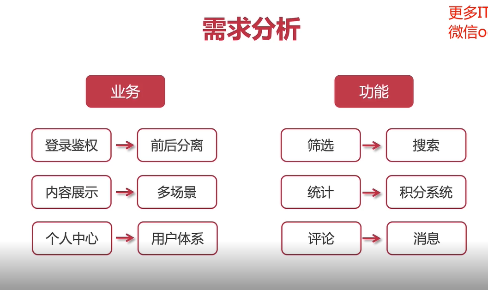
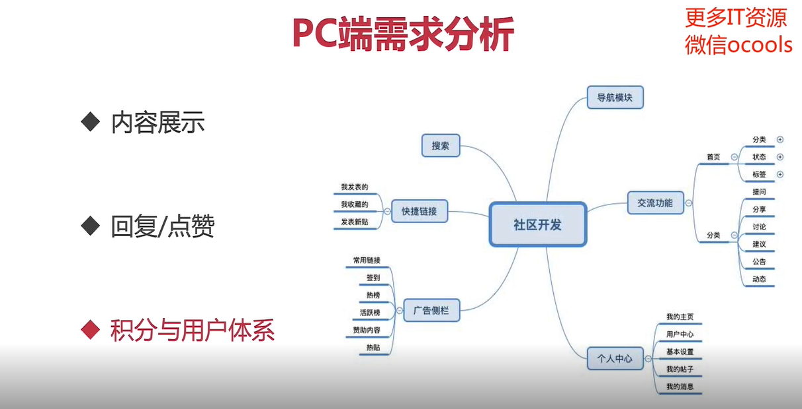
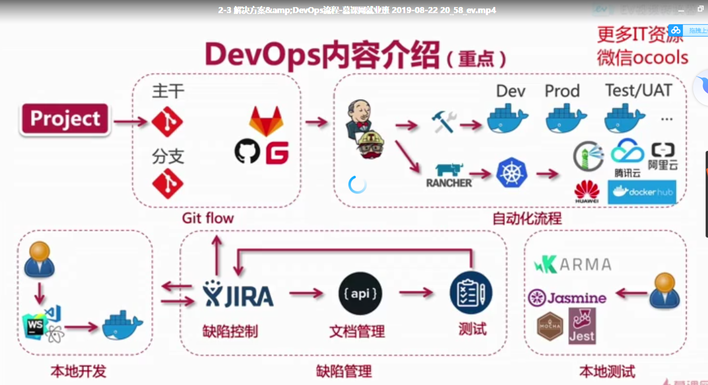

# 一、项目需求分析

## 1.1 常用工具

### 1.1.1 原型类

#### 1.1.1.1 Axure

#### 1.1.1.2 墨刀

#### 1.1.1.3 MockPlus

### 1.1.2 流程类

#### 1.1.2.1 Visio

#### 1.1.2.2 KeyNote

### 1.1.3 功能类

#### 1.1.3.1 脑图

## 1.2需求分析

### 1.2.1 需求分析

### 1.2.2需求变更

### 1.2.3 产品需求变更

### 1.2.4 核心业务需求分析

### 1.2.5 整体需求分析

## 1.3原型设计

**原型设计就是表达系统构想的过程**

### 1.3.1原型设计

### 1.3.2 原型设计的目标

## 1.4 网站推荐

花瓣

站酷

蓝色理想	

## 1.5**案例**

### 1.5.1 PC端需求分析

和 UI 沟通用户交互

和 后端 沟通安全与技术实现

### 1.5.2 PC端原型设计

使用 Axure 工具

### 1.5.3 PC端文档产出

### 1.5.4 服务端需求分析

可以推算出部分 **数据结构**  和 **接口**  从而推算出 工作量

### 1.5.5 WebApp/小程序需求分析

### 1.5.6 移动端原型设计

工具：墨刀

### 1.5.7 移动端文档产出

## 1.6 技术栈考量

### 1.6.1 技术栈的选择

## 1.7 需求分析工具

### 1.7.1 原型类

- Axure
  - 拖拽型使用
  - 样式修改
  - 安装软件使用
- Ps
- 墨刀
  - 在线网站可用
- 蓝湖

### 1.7.2 思维脑图

- Xmind
- MindNode(mac)
- MindManager

### 1.7.3 流程图

- Visio
- OmniGraffle(Mac)
- processOn

## 1.8 提问格式

向别人询问问题的方式

# 二、前端全栈痛点

## 2.1 工作中的痛点

### 2.1.2 项目各阶段及痛点

#### 2.1.2.1 项目定义阶段

#### 2.1.2.2 项目需求分析阶段

#### 2.1.2.3 项目开发阶段

#### 2.1.2.4 项目收尾

## 2.2 解决方案 DevOps 流程

### 2.2.1 解决方案

### 2.2.2 DevOps内容介绍

plan是开端

### 2.2.3 DevOps内容介绍2

# 三、项目环境搭建

## 3.1开发环境准备

## 3.2本地环境

## 3.3 Linux测试环境

设置Docker下载源

重启docker

具体的启动命令可以查看 docker官网

mongo  roob3T 图形连接工具

## 3.4 常用前端工具

### 3.4.1 nvm

可以通过 nvm 管理 node版本

### 3.4.2 yarn

可以前往 yarn官网学习使用

### 3.4.3 包管理工具

## 3.5 开发系统环境介绍

### 3.5.1 Vmware

### 3.5.2 Hyper-V

### 3.5.3 Parallels

### 3.5.4  系统资源介绍

#### 3.5.4.0 linux命令

#### 3.5.4.1 lsb_release -a  

#### 3.5.4.2 uname -a

#### 3.5.4.3 df 

#### 3.5.4.4 top

#### 3.5.4.4 目录

- home
- etc
- usr

# 四、 Linux常见命令

## 4.1 文档型

- mkdir	
  - mkdir 目录名
- touch
  - touch 文件名
- vi 
  - vi 文件名
  - i
  - :wq
  - :q!
- cat    （查看）
  - cat 文件名
- echo （追加/覆盖）
  - echo  追加内容 >> 文件名
  - echo  覆盖内容  >  文件名
- rm        
  - rm 文件名
  - rm  -r  目录名

## 4.2 硬件型

- ps
  - ps -ef | grep  赛选字段名
- kill
  - kill -9  指定pid
- service
  - service 服务名 status

## 4.3 功能型

- wget 
  
  - wget   资源url
  
- tar 
  
  - tar zxvf   文件名
  - z  代表 .gz 文件
  - x 代表解压
  - v 显示过程
  - f 使用归档文件名字
  
- tar  

  - tar zcvf   压缩后文件名  被压缩的文件

  

## 4.4 SSH 秘钥方式远程连接

略 查阅相关文档补充完整

# 五、Docker

## 5.1 容器化应用

## 5.2 Docker vs 虚拟机

虚拟机 不能共用用户操作系统 是建立在虚拟化平台的基础上的。 每个虚拟机会独享硬件设施，不与其他的虚拟机共享。

## 5.3 Docker主要特性

写时复制？

第二周

P2-4

