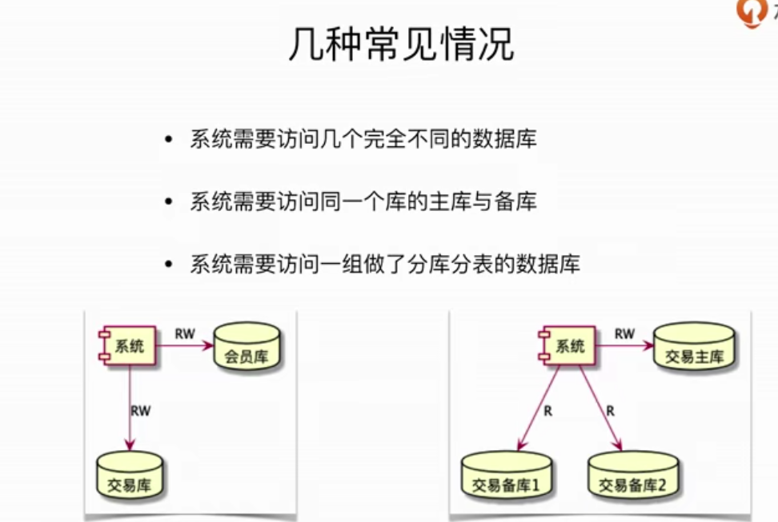
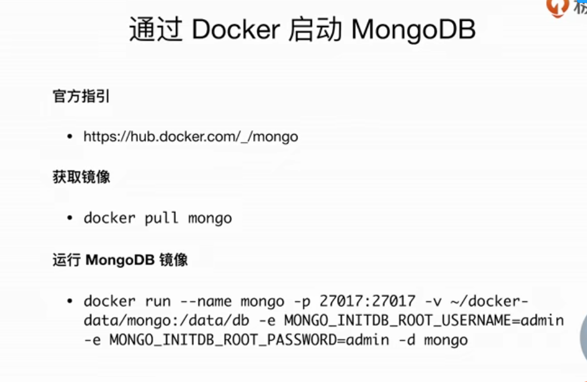
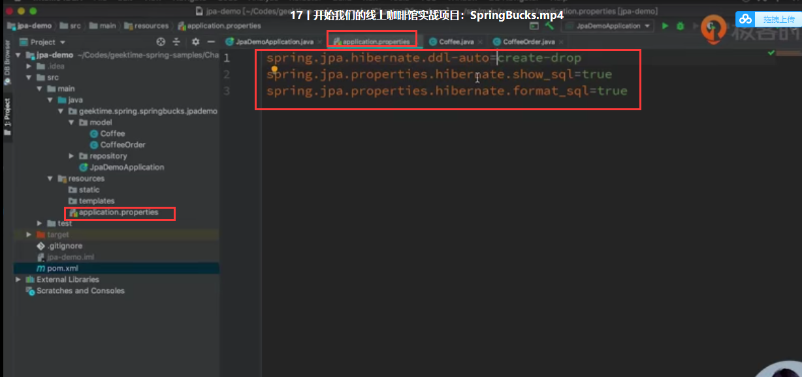

# 1.Spring Framework的历史

- 诞生与2002年，成型于2003年，最早的作者为Rod Johnson
    - 《Expert One-on-One J2EE Design and Development》
    - 《Expert One-on-One J2EE Development  without  EJB》
- 目前已经发展到了Spring 5.x版本，支持JDK 8-11 及 Java EE 8

# 2.数据部分操作

## 2.1 JDBC必知必会

案例一：

​	1.创建Spring项目

​		选择 web  jdbc  h2  Lombok   actuator  

​	注意：项目启动后 可以访问  http://localhost:8080/actuator/beans    

​				可以查看到Spring内容器中所有的bean

​	2.配置所需要的bean

​		**数据源相关**

- DataSource (根据选择的连接池实现决定)

    

    **事务相关（可选）**

- PlatformTransactionManager( 实际对象  DataSourceTransactionManag )

- TransactionTemplate 

​		**操作相关（可选）**

- JdbcTemplate

​	

## 2.2连接池

### 2.2.1Hikaricp

### 2.2.2 Alibaba Druid

github:  alibaba.druid

## 2.3 Spring中的JDBC操作

## 2.4 Spring的事务抽象

### 2.4.1 一致的事务模型

### 2.4.2 事务抽象的核心接口

### 2.4.3 事务传播特性

3  会挂起原有事务

6 内部事务和外部事务 相对来说是独立的

### 2.4.4 事务隔离特性

代码中使用  -1 表示使用数据库的默认值

### 2.4.5 编程式事务

### 2.4.6 声明式事务

第一个方法插入成功

第二个方法被回滚

第三个方法插入成功 ，因为虽然调用了第二个方法，但第三个方法本身并没有标注事务，所以不会被代理

### 2.4.7 Spring 的JDBC异常抽象

**错误码**

**定制错误码**

## 2.?.答疑

### 2.?.1 Spring常用注解

@Autowired 按类型注入

@Qualifier 按名字注入

@Resource 按名字注入

### 2.?.2  actuator (健康监听)

*也可以替换成指定 名称

### 2.?.3多数据源

P13

### 2.?.4事务的本质

### 2.?.5 Alibab Druid 

#### 2.?.5.1 慢SQL日志

#### 2.?.5.2 druid 注意事项

责任链

## 2.5 Spring Data JPA

### 2.5.1 对象与关系的范式不匹配

### 2.5.2 Hibernate

### 2.5.3 JPA

可以理解为在ORM框架上做了一层抽象

### 2.5.4 Spring Data 	

又提高了一层抽象

### 2.5.5 JPA注解

	

### 2.5.6 Lombok 注解

### 2.5.7 操作数据库

#### 2.5.7.1 注解

@EnableJpaRepositories 写在Config类上

#### 2.5.7.2 根据方法名定义查询

#### 2.5.7.3 保存数据

#### 2.5.7.4 查找数据

### 2.5.8 Repository接口转换成bean

#### 2.5.8.1 Repository Bean 是如何创建的

#### 2.5.8.2 接口中的方法是如何被解释的

## 2.6 Mybatis

### 2.6.1 认识MyBatis

SQL 整体比较简单 可以使用JPA

SQL 比较复杂 可以使用Mybatis

### 2.6.2 Mybatis配置

### 2.6.3 Mapp的扫描

**案例**

### 2.6.4 看官方文档

### 2.7.5 MyBatis生成器

#### 2.7.5.1 MyBatis生成器

#### 2.7.5.2  运行MyBatis Generator的方式

#### 2.7.5.2 配置MyBatis Generator

配置都是在XML中的

xml

注解

xml 注解 混合配置

#### 2.7.5.3 生成时可以使用的插件

#### 2.7.5.4 使用生成的对象

**案例**

### 2.6.6 MyBatis PageHelper

#### 2.6.6.1 认识 MyBatis PageHelper

#### 2.6.6.2 查看官网文档

P22

## 2.7内容小结

# 3.docker 辅助开发

## 3.1 什么是容器

## 3.2 docker流程

## 3.3 docker的作用

## 3.4 Docker常用命令

## 3.5 docker run的常用选项

## 3.6 镜像下载地址

## 3.7通过Docker启动MongoDB

## 3.8 进入容器

P25

# 4.Spring 操作 MongoDB

## 4.1 Spring对MongoDB的支持

​	

## 4.2 Spring Data  MongoDB 的基本用法

## 4.3 初始化 MongoDB的库及权限

## 4.4 Spring Data MongoDB的MongoTemplate

通过 MongoDB template 操作数据库

## 4.5 Spring Data MongoDB的Repository

通过 MongoDB 的Repository 实现去 操作数据库

# 5.Spring 操作 Redis 

## 5.1 Spring对Redis的支持

## 5.2 Jedis客户端的简单使用

？？？

## 5.3 Jedis客户端的简单使用

## 5.4 通过Docker启动Redis

P26

# ?.线上咖啡馆

## ?.1项目目标

## ?.2 项目中的对象实体

## ?.3 引入依赖

joda-money、usertype 处理金额

## ?.4 实体

### **?.4.1 Coffee**

可以把上面的PersistentMoneyAmount 替换成 PersistentMoneyMinorAmount

有了BaseEntity 可以替换成一下内容

### **?.4.2 CoffeeDrder**

有了BaseEntity 可以替换成以下形式

### **?.4.3 BaseEntity**

## ?.5配置文件

