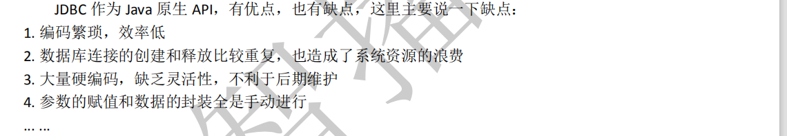
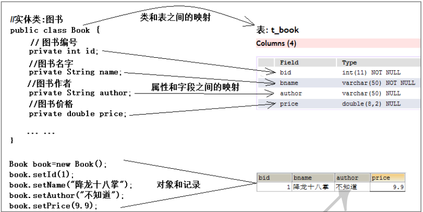
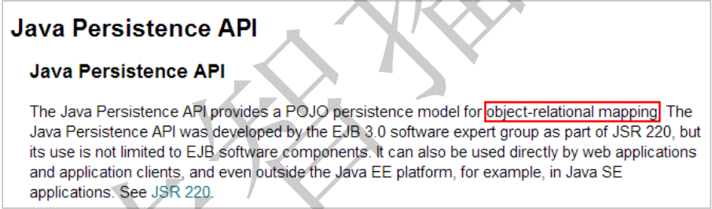

# 1.ORM思想

ORM(Object Relational Mapping)吸收了面向对象的思想，把对 sql 的操作转换为对象的操作，从而让程序员使用起来更加方便和易于接受。这种转换是通过对象和表之间的元数据映射实现的，这是实现 ORM 的关键。

***由于类和表之间以及属性和字段之间建立起了映射关系，所以，通过 sql 对表的操作就可以转换为对象的操作，程序员从此无需编写 sql 语句，由框架根据映射关系自动生成，这就是 ORM 思想。***


## 1.1 JDBC

​          目前，通过 Java 语言连接并操作数据库的技术或方式已经有很多了，例如：JDBC，

Hibernate，MyBatis，TopLink 等等。其中 JDBC 是 Java 原生的 API，支持连接并操作各种关系

型数据库。相信每个程序员都是从JDBC开始学起的，然后才接触到各种持久层框架：




正是因为 JDBC 存在着各种问题，所以才导致很多持久层框架应运而生，例如：Hibernate

和 MyBatis，这两个都是目前比较流行的持久层框架，都对 JDBC 进行了更高级的封装和优化，

相信大家对这两个框架都比较熟悉。


## 1.2 JDBC初步封装

很多程序员其实都亲自尝试过自己对 JDBC 进行封装和优化，设计并编写过一些 API，

每个程序员在做这个事情时，可能设计以及实现的思想都是不一样的，这些思想各有特点，

各有千秋，可以分为两大类：

### 第一类：工具类-API层抽取

着重对 JDBC 进行 API 层的抽取和封装，以及功能的增强，典型代表是 Apache 的

DbUtils。

程序员在使用 DbUtils 时仍然需要编写 sql 语句并手动进行数据封装，但是 API 的使用比 JDBC

方便了很多


### 第二类：ORM-借鉴面向对象的思想

借鉴面向对象的思想，让程序员以操作对象的方式操作数据库，无需编写 sql 语句，

典型代表是 ORM。ORM(Object Relational Mapping)吸收了面向对象的思想，把对 sql 的操作

转换为对象的操作，从而让程序员使用起来更加方便和易于接受。这种转换是通过对象和表

之间的元数据映射实现的，这是实现 ORM 的关键，如下图所示



类与表对应   

对象与记录对应

***由于类和表之间以及属性和字段之间建立起了映射关系，所以，通过 sql 对表的操作就可以转换为对象的操作，程序员从此无需编写 sql 语句，由框架根据映射关系自动生成，这就是 ORM 思想。***


目前比较流行的 Hibernate 和 MyBatis 都采用了 ORM 思想，

一般我们把 Hibernate 称之为全自动的 ORM 框架，

把 MyBatis 称之为半自动的 ORM 框架。

使用过这两个框架的程序员，对于 ORM 一定不会陌生。同时，ORM 也是 JPA(SUN 推出的持久层规范)的核心内容，如下图所示：




# 2. ORM的经典引用

## 2.1 hibernate

Hibernate 就是应用 ORM 思想建立的一个框架，一般我们把它称之为全自动的 ORM 框架，程序员在使用 Hibernate 时几乎不用编写 sql 语句，而是通过操作对象即可完成对数据库的增删改查。


### 2.1.1 引入依赖

引入hibernate-core依赖、引入Mysql-connection依赖、引入 junit依赖

注释中的版本号 是视频中使用的版本号

```xml
<?xml version="1.0" encoding="UTF-8"?>
<project xmlns="http://maven.apache.org/POM/4.0.0"
         xmlns:xsi="http://www.w3.org/2001/XMLSchema-instance"
         xsi:schemaLocation="http://maven.apache.org/POM/4.0.0 http://maven.apache.org/xsd/maven-4.0.0.xsd">
    <modelVersion>4.0.0</modelVersion>

    <groupId>org.example</groupId>
    <artifactId>orm_hibernate</artifactId>
    <version>1.0-SNAPSHOT</version>


    <dependencies>

        <!--  引入Hibernate 依赖  5.2.17.Final -->
        <!-- https://mvnrepository.com/artifact/org.hibernate/hibernate-core -->
        <dependency>
            <groupId>org.hibernate</groupId>
            <artifactId>hibernate-core</artifactId>
            <version>5.4.10.Final</version>
        </dependency>

        <!--   引入   数据库连接  5.1.36  -->
        <!-- https://mvnrepository.com/artifact/mysql/mysql-connector-java -->
        <dependency>
            <groupId>mysql</groupId>
            <artifactId>mysql-connector-java</artifactId>
            <version>8.0.19</version>
        </dependency>

        <!--   引入junit     -->
        <!-- https://mvnrepository.com/artifact/junit/junit -->
        <dependency>
            <groupId>junit</groupId>
            <artifactId>junit</artifactId>
            <version>4.12</version>
            <scope>test</scope>
        </dependency>

    </dependencies>


</project>
```


//TODO 未完待续