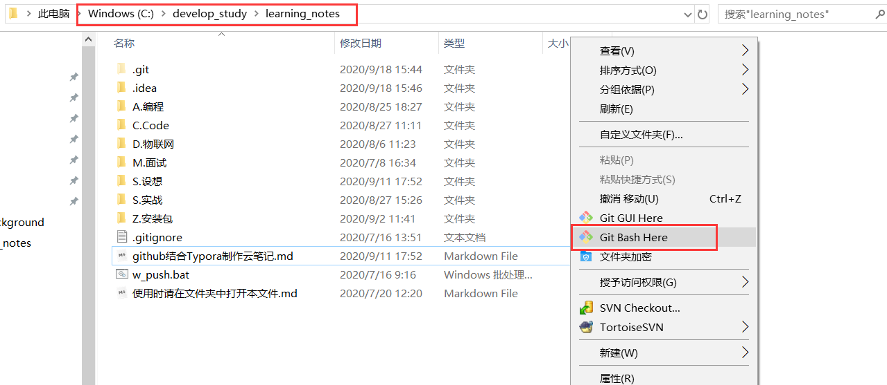
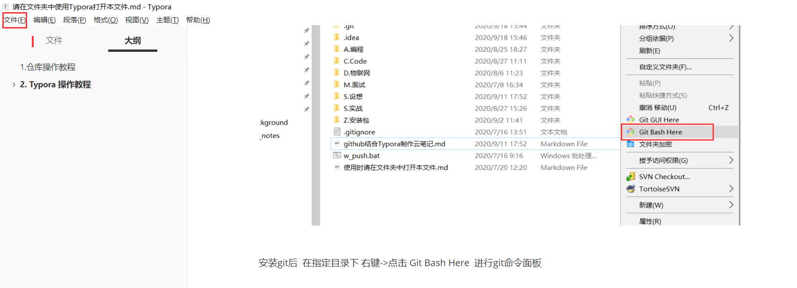
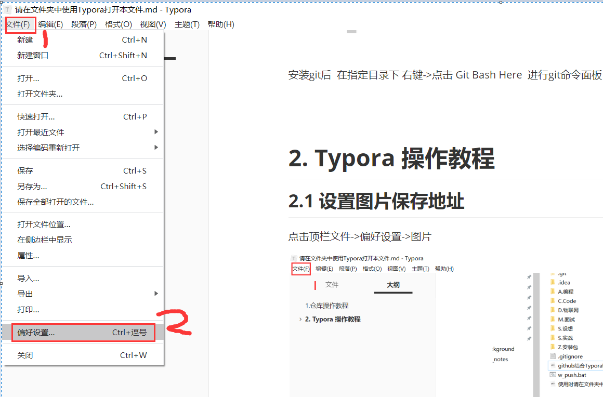
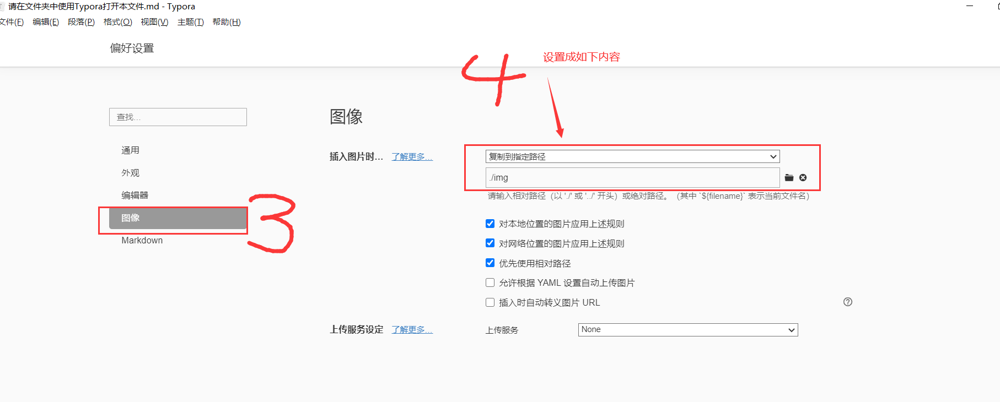
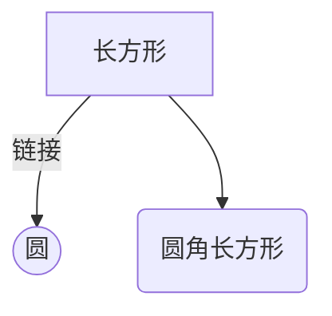
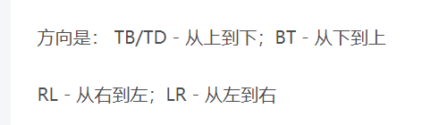

#  1.仓库操作教程

根据您获得的仓库地址使用 git或任意其他工具拉取分支代码

目前分支有

- master:     由管理员维护
- develop： 日常提交
- 可以自己创建其他分支，尽量使用公用分支

```
//克隆仓库
git  clone  仓库地址

//查看本地分支
git branch

//切换分支
git checkout  分支名

//创建本地分支
git branch 分支名

//代码提交类
git add .
git commit -m"提交信息"
git pull 远程地址名称  分支名称
git push 远程地址名称  分支名称

//合并     将指定分支 合并到当前所在分支
git merage 指定分支名    


```





安装git后  在指定目录下 右键->点击 Git Bash Here  进行git命令面板


# 2. Typora 操作教程

## 2.1 设置图片保存地址

点击顶栏文件->偏好设置->图片










## 2.2 Typora 其他操作

### 2.2.1 标题

ctr + 数字  

```
# 一级标题       ctr+1

## 二级级标题     ctr+2
```


### 2.2.2 加粗，斜体，下划线 , 删除线

- **加粗**     选中文字    ctr +B
- *斜体*      选中文字    ctr +I (英文I)
- <u>下划线</u>   选中文字    ctr + U 
- ~~删除线~~    选中文字    Alt + shift + 5 


### 2.2.3 待办事项

- [x] 已完成事项	
  - [ ] 子事项
- [ ] 待办事项

```
- [x] 已完成事项 
- []  代办事项
```


### 2.2.4 流程图

可以 ctrl + / 查看语法

**mermaid 语法**






**flow语法**

```flow
st=>start: kaishi
e=>end: 结束
op=>operation: 我的操作
cond=>condition: 确认?

st->op->cond
cond(yes)->e
cond(no)->op
```


